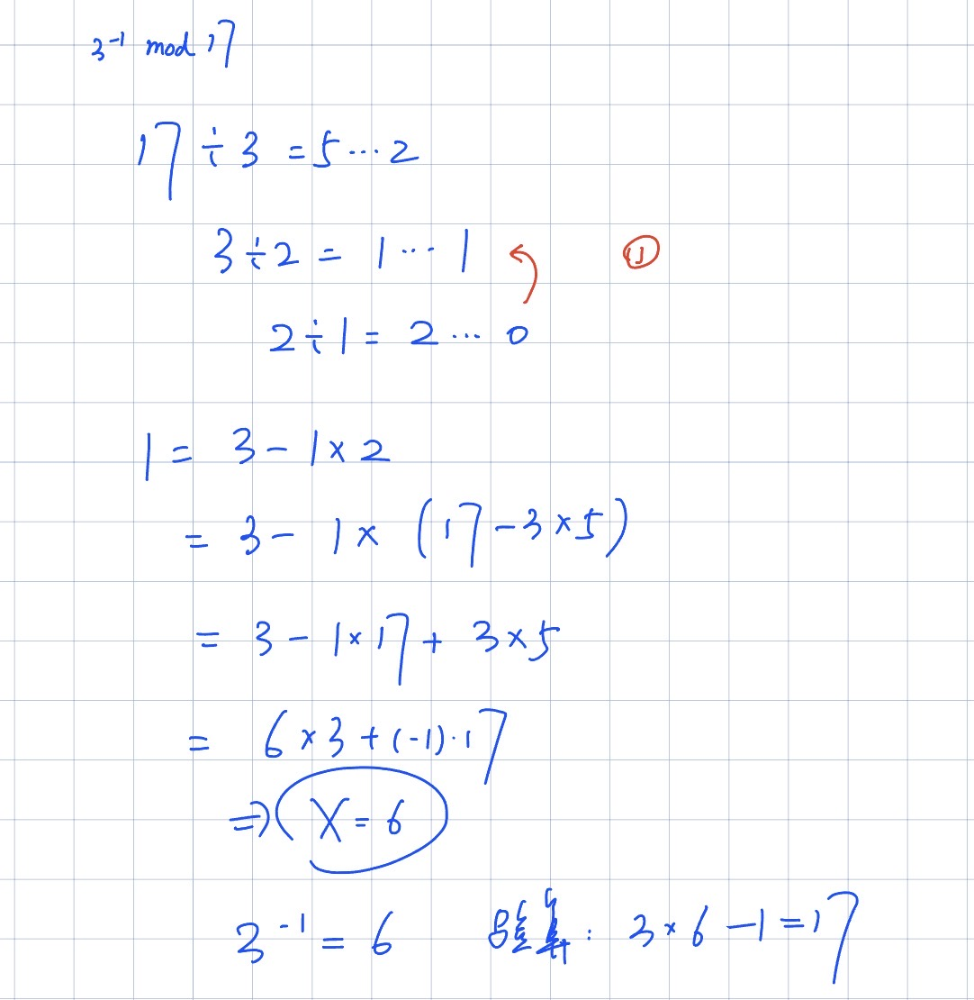
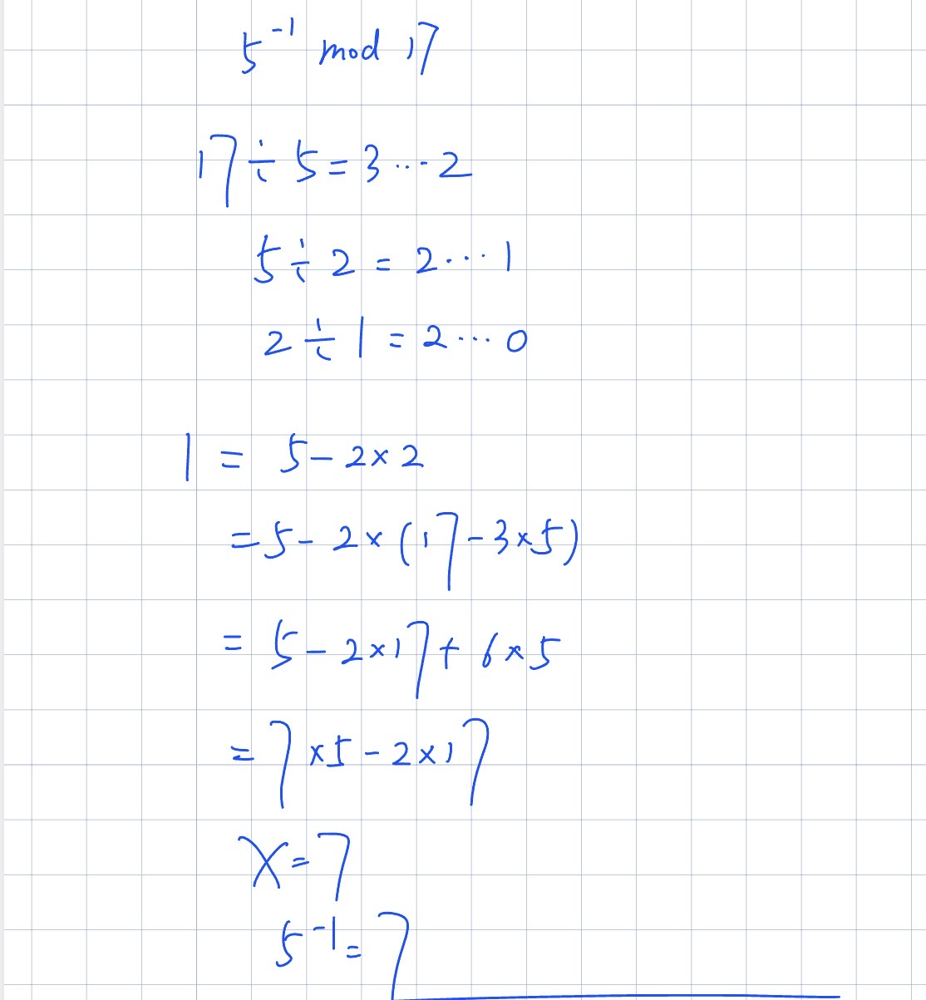
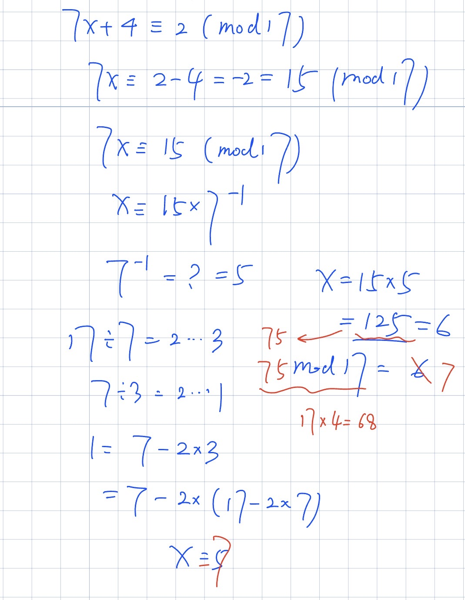

# Homework #1 — Practice Problems - Part1

> USC CSCI 556: Introduction to Cryptography, Fall 2026 \
> **Lecturer:** Prof. Shang-Hua Teng \
> **Student:** Fengcheng Yu \
> **USC ID:** `**********` \
> **Date:** Sep 06, 2026


## Instructions

- Write clear, legible solutions and justify every answer. Checking your reasoning is more important than recording an unsupported final answer.
- You may use results proved in lecture or in the assigned readings unless a problem explicitly asks for a proof.
- All arithmetic in $\mathbb{F}_p$ is modulo $p$. Show modular reductions and inverses used in your calculations.
- Unless explicitly stated otherwise, all random choices made by different algorithms or at different gates are mutually independent.
- The notation $X \xleftarrow{\$} S$ means that $X$ is sampled uniformly at random from $S$. When several variables are written with this notation, their samples are independent unless stated otherwise.
- In a security proof, identify what is fixed, what is random, the adversary's view, and why the view's distribution does or does not depend on the protected value.
- A probabilistic algorithm receives fresh internal random coins on each invocation. All message, key, and ciphertext spaces in this homework are finite.

### 中文翻译

- 解答要写得清楚、易读，并且对每一个答案都给出论证。==检查你的推理过程，比写下一个没有依据的最终答案更重要。==
- 除非题目明确要求你给出证明，否则可以直接引用课上或指定阅读材料里已经证明过的结论。
- $\mathbb{F}_p$ 中的所有运算都是模 $p$ 进行的。计算中用到的模约简（modular reduction）和逆元（inverse）都要写出来。
- 除非题目明确另作说明，否则不同算法、或不同 gate 处做出的所有随机选择都是相互独立（mutually independent）的。
- 记号 $X \xleftarrow{\$} S$ 表示 $X$ 是从集合 $S$ 中均匀随机（uniformly at random）抽取的。当多个变量都用这个记号书写时，除非另有说明，它们的抽样也是相互独立的。
- ==在 security proof 中，要明确指出四件事：什么是固定的、什么是随机的、adversary 的 view 是什么，以及这个 view 的分布为什么依赖（或不依赖）于被保护的值。==
- probabilistic algorithm 每次被调用时，都会拿到一组全新的内部随机 coins。本次作业中所有的 message space、key space 和 ciphertext space 都是有限的。


## Problem 1: Mathematical Background—Fields, Polynomials, and Probability

### Reading

> **Reading:** Mathematical background from lecture; Katz–Lindell Section 8.1.2, Section 13.3.1, and Appendices A.3 and A.5 as relevant.

> 书页码是印在纸面上的页码，本地 PDF 页码 = 书页码 + 21。

#### §8.1.2 Modular Arithmetic（书 p.289）→ 对应 (a)

**1. 记号。** $[a \bmod N]$ 表示 $a$ 除以 $N$ 的余数，规定 $0 \le [a \bmod N] < N$。把 $a$ 换成这个余数的动作叫 **reduction modulo $N$**（模约简）。

**2. 同余。** $a \equiv b \pmod N$ 意思是两者余数相同，等价于 $N \mid (a - b)$。

**3. 加减乘可以「先约简再算」。** 若 $a \equiv a' $、$b \equiv b'$，则 $a + b \equiv a' + b'$、$ab \equiv a'b'$。这能大幅简化计算。

**4. ==但除法不一定有意义。==** $ab \equiv cb \pmod N$ **不能**推出 $a \equiv c$。书上 Example 8.6：模 $24$ 时 $3 \cdot 2 = 6 = 15 \cdot 2$，但 $3 \not\equiv 15$。

**5. 可逆的定义。** 若存在 $c$ 使 $bc \equiv 1 \pmod N$，就说 $b$ **可逆**，$c$ 是它的 inverse，记 $b^{-1}$（取 $\{1,\ldots,N-1\}$ 中那个唯一代表元）。只有 $b$ 可逆时，"除以 $b$"才被定义为"乘以 $b^{-1}$"。

**6. 主定理 —— PROPOSITION 8.7：**

> ==$b$ 模 $N$ 可逆 $\iff \gcd(b, N) = 1$==


gcd 就是最大公因数（greatest common divisor）。gcd = 1 也叫互素（coprime）。

这条的价值：不用真去乘一遍，看一眼就知道有没有逆元。

b和N互素，那么b就肯定有逆元。

**7. 怎么求逆（证明里给出的算法）。** 由 $\gcd(b,N) = 1$，Bézout 定理给出整数 $X, Y$ 使

$Xb + YN = 1$

$X\cdot b + Y \cdot N \equiv 1 \pmod N$

两边模 $N$，含 $N$ 的项消失，得 $Xb \equiv 1 \pmod N$，所以 $b^{-1} \equiv X$。具体求 $X, Y$ 用 **Extended Euclidean Algorithm**（先辗转相除，再逐层回代）。

具体如何计算：

```
分两个阶段。拿 7⁻¹ mod 17 做例子。

阶段一：辗转相除（大的除小的，一直除到余数为 0）


17 = 2 × 7 + 3      ← 17 除以 7，商 2 余 3
 7 = 2 × 3 + 1      ← 7 除以 3，商 2 余 1
 3 = 3 × 1 + 0      ← 余 0，停
最后一个非零余数是 1，说明 gcd(7,17) = 1，确实可逆。

阶段二：回代（从倒数第二行往回推，把 1 表示成 7 和 17 的组合）

先把余数 1 单独拎出来（用第二行）：


1 = 7 − 2 × 3
现在式子里有个 3，它不是我们要的（我们只想要 7 和 17）。从第一行知道 3 = 17 − 2 × 7，代进去：


1 = 7 − 2 × (17 − 2 × 7)
  = 7 − 2 × 17 + 4 × 7
  = 5 × 7 − 2 × 17
```

**8. 书上 Example 8.8 用的正是模 17：** 取 $b = 11$，$N = 17$，由 $(-3)\cdot 11 + 2 \cdot 17 = 1$ 得 $11^{-1} = [-3 \bmod 17] = 14$，验算 $14 \cdot 11 \equiv 1 \pmod{17}$。==(a) 就是把这个做法套到 $3, 5, 7$ 上。==

---

#### Appendix A.5 *Finite Fields（书 p.544）→ (a)(b) 的地基

**DEFINITION A.17（field）：** 集合 $\mathbb{F}$ 配两个运算 $+, \cdot$，满足

- $\mathbb{F}$ 关于 $+$ 是 abelian group，单位元记 $0$；
- ==$\mathbb{F} \setminus \{0\}$ 关于 $\cdot$ 是 abelian group==，单位元记 $1$；
- 分配律 $a(b+c) = ab + ac$。

第二条的实际含义就是：**每个非零元素都有乘法逆元**，所以域里可以放心做除法。

**Example A.18：** 对任意**素数** $p$，$\{0, 1, \ldots, p-1\}$ 配上模 $p$ 的加乘构成有限域，记作 $\mathbb{F}_p$。这就是 $\mathbb{F}_{17}$ 的来历。

**==警告==：** $q$ 不是素数时，$\{0,\ldots,q-1\}$ 模 $q$ **不是**域。书上举例：$q = 9$ 时 $3$ 没有乘法逆元。所以整道题选 $17$（素数）不是随意的——换成 $15$ 或 $16$，(a) 的逆元可能不存在，(b) 的结论也会垮掉。

**THEOREM A.19：** 有限域的阶必是素数幂 $q = p^r$；反之每个素数幂都恰好对应一个域（同构意义下唯一）。

**THEOREM A.21：** $\mathbb{F}_q \setminus \{0\}$ 关于乘法是**循环群**，阶为 $q - 1$。

---

#### §13.3.1 Secret Sharing（书 p.501）→ (b)(c) 的出处

**多项式背景（书上原话）：**

- $x \in \mathbb{F}$ 是多项式 $p$ 的 **root（根）**，若 $p(x) = 0$。
- 书上写道："We use the **well-known fact** that any nonzero, degree-$t$ polynomial over a field has at most $t$ roots."
  ==注意：这条书上没有证，直接当已知事实用了 —— 而这正是 (b) 的第一问要你补的。==
- **COROLLARY 13.15：** 任意两个不同的 $t$ 次多项式 $p, q$ 至多在 $t$ 个点上取值相同。
  **证明（书上只有一句）：** 否则非零多项式 $p - q$ 就会有超过 $t$ 个根，矛盾。==这就是 (b) 的第二问。==


```
1. 根（root）是什么

x 是多项式 p 的根，就是把 x 代进去算出 0
例子（普通实数）：p(X) = X² − 1，代 X=1 得 0，代 X=−1 得 0。所以根是 1 和 −1，2 个。

在 F₁₇ 里同一个多项式：

1² − 1 = 0        ✓ 是根
16² − 1 = 255 = 15×17 + 0   ✓ 是根   （16 就是 −1）
也是 2 个根。次数是 2，根的个数不超过 2。

2. 「t 次多项式最多 t 个根」

1 次（直线）：  最多 1 个根   一条斜线只穿过 X 轴一次
2 次（抛物线）：最多 2 个根
3 次：          最多 3 个根
这个在实数里很直观。在 F₁₇ 里也成立——==但前提是「域」==。

不是域就会崩。 看 Z₈（模 8，不是域）上的 X² − 1：


1² − 1 = 0    ✓
3² − 1 = 8    ✓  (8 ≡ 0)
5² − 1 = 24   ✓  (24 = 3×8)
7² − 1 = 48   ✓  (48 = 6×8)
==一个 2 次多项式冒出了 4 个根！== 因为 Z₈ 有零因子（2×4=0），乘积为零不能推出某个因子为零，「最多 t 个根」的论证就断了。

这就是 (b) 第一问要你证的东西，也是为什么题面特意写 "over a field F"。
```

**插值唯一性：** 给定 $t$ 组 $(x_i, y_i)$（$x_i$ 互不相同），存在**唯一**的 $(t-1)$ 次多项式 $p$ 使 $p(x_i) = y_i$。

- **存在性**靠 Lagrange 插值：令 $\delta_i(X) = \prod_{j \ne i} \dfrac{X - x_j}{x_i - x_j}$，则 $\delta_i(x_j) = 0\ (j \ne i)$、$\delta_i(x_i) = 1$，于是 $p(X) = \sum_{i=1}^{t} \delta_i(X)\, y_i$ 即为所求。
  （==注意分母 $x_i - x_j$ 要能做除法，这里又用到了「$\mathbb{F}$ 是域」。==）
- **唯一性**就是 Corollary 13.15。

**Shamir $(t,N)$-threshold scheme：**

| 阶段 | 做法 |
| --- | --- |
| Sharing | dealer 取均匀随机的 $a_1,\ldots,a_{t-1} \in \mathbb{F}$，令 $p(X) = s + \sum_{i=1}^{t-1} a_i X^i$，把 $s_i := p(x_i)$ 发给 $P_i$ |
| Reconstruction | 任意 $t$ 人用插值还原出唯一的 $p$，秘密即 $p(0) = s$ |

**保密性（对应 (c)）：** 书上论证任意 $t-1$ 个人手上的 share **jointly uniform**——即"share 的分布与秘密 $s$ 完全无关"。==这就是 perfect secrecy 的表述方式，(c) 是它在最简单情形（单个随机掩码）下的版本。==

---

#### Appendix A.3 Basic Probability（书 p.538）→ (c) 的语言

- **独立：** $\Pr[E_1 \wedge E_2] = \Pr[E_1] \cdot \Pr[E_2]$
- **Union bound：** $\Pr[E_1 \vee E_2] \le \Pr[E_1] + \Pr[E_2]$
- **条件概率：** $\Pr[E_1 \mid E_2] = \dfrac{\Pr[E_1 \wedge E_2]}{\Pr[E_2]}$（要求 $\Pr[E_2] \ne 0$）
- **Bayes：** $\Pr[E_1 \mid E_2] = \dfrac{\Pr[E_2 \mid E_1] \cdot \Pr[E_1]}{\Pr[E_2]}$
- **全概率公式：** 若 $\{E_i\}$ 两两互斥且并为全集，则 $\Pr[F] = \sum_i \Pr[F \wedge E_i] = \sum_i \Pr[F \mid E_i]\Pr[E_i]$

(c) 要证 $X = s - R$ 均匀，本质上就是算 $\Pr[X = x]$，说明它恒等于 $1/|\mathbb{F}|$ 且**与 $s$ 无关**。

---

> **三小问的设计逻辑：**(a) 练模运算工具 → (b) 证 Shamir 的**正确性/唯一性**依据 → (c) 证 Shamir 的**保密性**依据。合起来正好是 Problem 2 的全部前置知识。

### (a) Finite-field arithmetic

Work over $\mathbb{F}_{17}$.

1. Compute $3^{-1}$ and $5^{-1}$.
2. Solve
   $7x + 4 \equiv 2 \pmod{17}.$

Show your calculations.

#### 解答

<div style="display:flex; gap:10px; align-items:flex-start;">
  
  
  
</div>

| $3^{-1} \bmod 17$ | $5^{-1} \bmod 17$ | 解 $7x + 4 \equiv 2$ |
| :---: | :---: | :---: |
| $3^{-1} = 6$ | $5^{-1} = 7$ | $x \equiv 7$ |

### (b) Roots of a polynomial

Let $d \ge 0$. Prove that if $f(X)$ is a nonzero polynomial of degree at most $d$ over a field $\mathbb{F}$, then $f$ has at most $d$ distinct roots in $\mathbb{F}$.

Then prove that two distinct polynomials of degree at most $d$ cannot agree at more than $d$ distinct field elements.

设 $d \ge 0$。证明：若 $f(X)$ 是域 $\mathbb{F}$ 上次数不超过 $d$ 的非零多项式，则 $f$ 在 $\mathbb{F}$ 中至多有 $d$ 个不同的根。

进而证明：两个次数不超过 $d$ 的不同多项式，在域中至多只有 $d$ 个相同的取值点。


#### 解答

```
【准备】砖 1：域里没有零因子
  设 x·y = 0 且 x ≠ 0。因 F 是域，x 有逆元 x⁻¹。
  两边乘 x⁻¹：y = 1·y = x⁻¹·(x·y) = x⁻¹·0 = 0。
  故 x·y = 0 ⟹ x = 0 或 y = 0。

【准备】砖 2：两个非零多项式相乘，次数相加
  设 f 为 m 次、首项系数 a ≠ 0，g 为 n 次、首项系数 b ≠ 0。
  f·g 中 X^(m+n) 项的系数为 a·b，由砖 1 知 a·b ≠ 0，且无更高次项。
  故 f·g 非零，且 deg(f·g) = m + n。

【引理】因式定理
  若 a 是 f 的根，则 f(X) = (X − a)·g(X)，且 deg g = deg f − 1。

  证：X − a 是首一多项式，可作长除：
      f(X) = (X − a)·g(X) + r(X)，其中 deg r < deg(X − a) = 1，
  故 r 是常数 c。代入 X = a：
      f(a) = (a − a)·g(a) + c = 0·g(a) + c = c。
  已知 f(a) = 0，故 c = 0，即 f(X) = (X − a)·g(X)。
  又 f 非零 ⟹ g 非零；由砖 2，deg f = 1 + deg g，故 deg g = deg f − 1。∎

【Claim 1】f 非零且 deg f ≤ d ⟹ f 在 F 中至多有 d 个不同的根
  对 d 作数学归纳。

  基础 d = 0：
    次数 ≤ 0 的非零多项式是非零常数 c，对任意 x 有 f(x) = c ≠ 0，
    故 f 无根，0 ≤ 0 成立。

  归纳步：设结论对 d − 1 成立，证对 d 成立。设 f 非零，deg f ≤ d。
    若 f 无根，则 0 ≤ d，成立。
    否则取 f 的一个根 a。由因式定理：
        f(X) = (X − a)·g(X)，  g 非零，  deg g = deg f − 1 ≤ d − 1。
    任取 f 的另一个根 b（b ≠ a），代入：
        0 = f(b) = (b − a)·g(b)。
    因 b ≠ a，有 b − a ≠ 0；由砖 1 得 g(b) = 0。
    故 f 除 a 之外的每个根都是 g 的根。
    由归纳假设，g 至多有 d − 1 个不同的根，
    因此 f 至多有 1 + (d − 1) = d 个不同的根。∎

【Claim 2】f ≠ g 且 deg f, deg g ≤ d ⟹ f 与 g 至多在 d 个不同元素上取值相同
  令 h(X) = f(X) − g(X)。
    (1) f 与 g 作为多项式不同 ⟹ 至少一个系数不同 ⟹ h 非零。
    (2) deg f ≤ d 且 deg g ≤ d ⟹ 高于 d 次的项系数均为 0 − 0 = 0 ⟹ deg h ≤ d。
    (3) 若 f(x) = g(x)，则 h(x) = f(x) − g(x) = 0，即 x 是 h 的根。
        故「f 与 g 取值相同的点集」⊆「h 的根集」。
    (4) 由 Claim 1，h 至多有 d 个不同的根。
  因此 f 与 g 至多在 d 个不同元素上取值相同。∎

【备注】「F 是域」这一条件用在两处，且均通过砖 1：
  (1) 砖 2 中，用于证首项系数之积 a·b ≠ 0；
  (2) Claim 1 归纳步中，用于由 (b − a)·g(b) = 0 推出 g(b) = 0。
  若 F 含零因子则结论不成立：在 Z₈ 上，X² − 1 是 2 次多项式，
  却有 1, 3, 5, 7 共 4 个根（因 2·4 = 0，第 (2) 步失效）。

【推论】Claim 2 给出多项式插值的唯一性：
  至多存在一个次数 ≤ d 的多项式通过 d + 1 个横坐标互异的给定点。
  这正是 Shamir (t, N) 方案中任意 t 个持份者还原出同一秘密的保证。
```

### (c) A random mask

Let $R$ be uniformly distributed over a finite field $\mathbb{F}$, let $s \in \mathbb{F}$ be fixed, and define

$X = s - R.$

Prove that, for every fixed $s$, the random variable $X$ is uniformly distributed over $\mathbb{F}$. In particular, show that this distribution is the same for every choice of $s$. Briefly explain why this fact is useful in secret sharing.

#### 解答

```
【设定】记 q = |F|（F 有限）。
  固定的：秘密 s ∈ F，它是一个定死的值，不是随机的。
  随机的：R 在 F 上均匀分布，即对每个 r ∈ F 有 Pr[R = r] = 1/q。
  待考察：X = s − R，因 R 随机故 X 是随机变量。

【第一部分】对每个固定的 s，X 在 F 上均匀分布

  任取 x ∈ F，考察事件 X = x：
      X = x  ⟺  s − R = x  ⟺  R = s − x。
  s 与 x 均为 F 中固定元素，故 s − x 是 F 中唯一确定的一个元素。
  于是
      Pr[X = x] = Pr[R = s − x] = 1/q。
  该式对任意 x ∈ F 成立，即 X 取 F 中每个值的概率都是 1/q，
  故 X 在 F 上均匀分布。∎

  （等价说法：映射 φ(R) = s − R 是 F 到 F 的双射，
    其逆映射为 φ⁻¹(X) = s − X；双射把均匀分布映为均匀分布。）

【第二部分】该分布对 s 的每一种取值都相同

  上式算得 Pr[X = x] = 1/q，右端是常数，其中不含 s。
  故对任意两个秘密 s, s′ ∈ F，由 X = s − R 与 X′ = s′ − R 得到的
  分布完全一致，都是 F 上的均匀分布：
      对一切 x ∈ F，  Pr[X = x] = Pr[X′ = x] = 1/q。
  即 X 的分布与 s 无关。∎

  例（F₁₇）：
    s = 10 时，R = 0,1,...,16 依次给出 X = 10,9,...,0,16,15,...,11；
    s = 3  时，R = 0,1,...,16 依次给出 X = 3,2,1,0,16,...,4。
    两种情形下 X 都恰好取遍 0~16 各一次，分布相同。

【第三部分】这在 secret sharing 中为何有用

  按 Instructions 的要求逐项指明：
    什么是固定的：秘密 s。
    什么是随机的：掩码 R，在 F 上均匀且独立于 s。
    敌手的 view：单个 share，即 X = s − R。
    view 的分布是否依赖被保护值：不依赖。由第二部分，
      无论 s 取何值，X 的分布恒为 F 上的均匀分布。

  由此得到 2-out-of-2 的秘密共享（即 Lec3 的 AND gate）：
      share_A = R,   share_B = s − R = X
  正确性：两人合作可还原，share_A + share_B = R + (s − R) = s。
  保密性：任一方单独持有的 share 均匀分布且与 s 无关，
      故敌手看到 share 之后对 s 的后验分布与先验分布相同，
      即该 share 不携带关于 s 的任何信息。

  这属于 perfect / information-theoretic secrecy：
  并非"计算上难以破解"，而是所需信息在概率意义下根本不存在，
  因此即使敌手拥有无限算力也无法获得任何优势。

  同一思想的推广即 Shamir 方案中「任意 t−1 个 share 联合均匀、
  与 s 无关」这一论断，(c) 是其最简单的单掩码情形。
```

---

## Problem 2: Shamir Secret Sharing

### 速查：$\mathbb{F}_{17}$ 乘法逆元表

| $b$ | 1 | 2 | 3 | 4 | 5 | 6 | 7 | 8 | 9 | 10 | 11 | 12 | 13 | 14 | 15 | 16 |
| :---: | :-: | :-: | :-: | :-: | :-: | :-: | :-: | :-: | :-: | :-: | :-: | :-: | :-: | :-: | :-: | :-: |
| $b^{-1}$ | 1 | 9 | 6 | 13 | 7 | 3 | 5 | 15 | 2 | 12 | 14 | 10 | 4 | 11 | 8 | 16 |

**互逆配对**（$b^{-1} = c \iff c^{-1} = b$）：

| 配对 | 验算 |
| :---: | :--- |
| $2 \leftrightarrow 9$ | $2 \times 9 = 18 = 1\times17 + 1$ |
| $3 \leftrightarrow 6$ | $3 \times 6 = 18 = 1\times17 + 1$ |
| $4 \leftrightarrow 13$ | $4 \times 13 = 52 = 3\times17 + 1$ |
| $5 \leftrightarrow 7$ | $5 \times 7 = 35 = 2\times17 + 1$ |
| $8 \leftrightarrow 15$ | $8 \times 15 = 120 = 7\times17 + 1$ |
| $10 \leftrightarrow 12$ | $10 \times 12 = 120 = 7\times17 + 1$ |
| $11 \leftrightarrow 14$ | $11 \times 14 = 154 = 9\times17 + 1$ |

**自逆元**（$b^{-1} = b$）：只有 $1$ 和 $16$。$16 \equiv -1$，而 $(-1) \times (-1) = 1$。

> 常用负数代表元：$-1 \equiv 16$，$-2 \equiv 15$，$-3 \equiv 14$，$-4 \equiv 13$，$-5 \equiv 12$，$-6 \equiv 11$，$-7 \equiv 10$，$-8 \equiv 9$。
>
> ==交作业时逆元仍需用 Extended Euclidean Algorithm 写出推导过程==（Instructions 要求 show inverses used），本表仅供计算时自检。

### Reading

> **Reading:** Shamir, *How to Share a Secret*; Katz–Lindell Section 13.3.1, with Section 8.1.2 and Appendix A.5 as relevant.

> §13.3.1、§8.1.2、Appendix A.5 已在 [Problem 1 的 Reading](#reading) 整理过，此处只补 **Shamir 原论文**（1979, CACM 22(11), pp. 612–613，全文仅 2 页）。

#### Shamir, *How to Share a Secret*（1979）

**1. 出发点：Liu 的储物柜难题**

> 11 位科学家共同研究一个机密项目，文件锁在一个柜子里，要求==有且仅有 6 人以上到场时才能打开==。最少需要几把锁？每人最少带几把钥匙？

答案是 **462 把锁、每人 252 把钥匙**。人数增加时呈指数爆炸，完全不实用。Shamir 这篇论文就是把这个问题一般化并给出高效解法。

**2. $(k, n)$ threshold scheme 的定义**（论文原文的两条要求）

> (1) 任意 $k$ 个或更多 $D_i$ 使 $D$ 容易计算；
> (2) 任意 $k-1$ 个或更少 $D_i$ 使 $D$ ==完全不确定==（in the sense that **all its possible values are equally likely**）。

注意第 (2) 条的措辞：不是"难以计算"，而是"所有可能取值等概率"。==这正是 perfect secrecy，也正是 Problem 2(c) 要证的东西。==

**3. 为什么有用：密钥管理**

| 做法 | 问题 |
| --- | --- |
| 密钥只存一处 | 一次意外（宕机、猝死、破坏）就永久丢失 |
| 多处备份 | 每多一份就多一个泄露点 |
| $(k,n)$ 门限，取 $n = 2k-1$ | ==两全==：毁掉 $k-1$ 份仍能恢复；泄露 $k-1$ 份仍无法重建 |

论文举的例子：公司支票需三人签字 → 用 $(3, n)$ 方案，每位高管拿一张磁卡，签名设备收到任意 3 张即可临时重建密钥并随后销毁。**设备本身不含任何秘密，因此无需防护**；一个不忠的高管必须再拉拢两个同谋才能伪造签名。

**4. 方案本体**

> 基于多项式插值：给定平面上 $k$ 个横坐标互异的点，==有且仅有一个==次数为 $k-1$ 的多项式 $q(x)$ 穿过它们。

- 取随机的 $k-1$ 次多项式 $q(x) = a_0 + a_1x + \cdots + a_{k-1}x^{k-1}$，令 $a_0 = D$
- 分发 $D_i = q(i)$，$i = 1, \ldots, n$
- 任意 $k$ 份插值还原 $q$，秘密即 $D = q(0)$

**5. 为什么必须模素数**（论文原话）

> The set of integers modulo a prime number $p$ forms **a field in which interpolation is possible**.

取素数 $p > D$ 且 $p > n$，系数 $a_1, \ldots, a_{k-1}$ 从 $[0, p)$ 上**均匀随机**抽取。==这就是本作业用 $\mathbb{F}_{17}$ 的理由，也对应 Appendix A.5。==

**6. 论文的安全性论证 = Problem 2(c)**

> For each candidate value $D'$ in $[0,p)$ he can construct **one and only one** polynomial $q'(x)$ of degree $k-1$ such that $q'(0) = D'$ and $q'(i) = D_i$ for the $k-1$ given arguments. By construction, these $p$ possible polynomials are **equally likely**, and thus there is **absolutely nothing** the opponent can deduce about the real value of $D$.

==这段话逐字对应 Problem 2(c) 的两小问：==

| 论文原文 | 对应 |
| --- | --- |
| "one and only one polynomial $q'$" | **(c) 第 1 问**：每个候选 $s'$ 恰好一对 $(a,b)$ |
| "these $p$ polynomials are equally likely" | **(c) 第 2 问**：分布与 $s'$ 无关 |
| "absolutely nothing the opponent can deduce" | 后验 $=$ 先验 |

作业等于让你把 Shamir 这两句话补成严格证明。

**7. 论文列出的四条实用性质**

1. **每份 share 的大小不超过原始数据**（对比 Liu 方案的 252 把钥匙）
2. $k$ 固定时，==share 可动态增删==（高管入职/离职），不影响其他人手上的份额
3. ==可以在不改变 $D$ 的前提下换掉全部 share==——只需换一个常数项相同的新多项式。频繁更换能大幅提升安全性：不同"版本"泄露的碎片无法累积拼凑
4. 给不同人分配**多个**多项式取值，即可实现**分级授权**。例：总裁给 3 个值、副总裁各 2 个、高管各 1 个，则 $(3,n)$ 方案下支票可由「任意 3 名高管」或「1 名副总裁 + 1 名高管」或「总裁一人」签发

**8. 实现细节**

- 存在 $O(n \log^2 n)$ 的求值与插值算法，但朴素的平方级算法在实际密钥管理中已足够快
- $D$ 很长时应切成小块分别处理，避免多精度运算
- 块不能太小：$p$ 至少要 $n+1$（需要 $n+1$ 个不同的横坐标）。16 位模数即可支持多达 64,000 份 share
- 脚注：多项式可以换成任何"易求值、易插值"的函数族
- 同期 G. R. Blakley 提出了另一种（效率稍低的）门限方案

### 题面设定

Consider a $(3, 5)$-threshold Shamir secret-sharing scheme over $\mathbb{F}_{17}$. To share a secret $S = s$, the dealer samples $A, B \xleftarrow{\$} \mathbb{F}_{17}$ independently and uniformly, with this randomness independent of $S$, and defines the degree-at-most-two polynomial

$Q(X) = s + AX + BX^2.$

Participant $P_i$ receives the share $Q(i)$, for $i \in \{1, 2, 3, 4, 5\}$.

For parts (a) and (b), suppose $s = 9$ and the sampled polynomial is

$q(X) = 9 + 4X + 2X^2.$

### (a) Generate the shares

Compute $q(1), q(2), q(3), q(4), q(5)$.

#### 解答


| $i$ | $q(i) = 9 + 4i + 2i^2$ | 约简 | share |
| :---: | :---: | :---: | :---: |
| $1$ | $15$ | $15$ | $\mathbf{15}$ |
| $2$ | $25$ | $1\times17 + 8$ | $\mathbf{8}$ |
| $3$ | $39$ | $2\times17 + 5$ | $\mathbf{5}$ |
| $4$ | $57$ | $3\times17 + 6$ | $\mathbf{6}$ |
| $5$ | $79$ | $4\times17 + 11$ | $\mathbf{11}$ |

### (b) Reconstruction

Suppose $P_1, P_3, P_5$ combine their shares. Use Lagrange interpolation to compute $q(0)$ directly from these three shares. Explicitly compute $\lambda_1, \lambda_3, \lambda_5 \in \mathbb{F}_{17}$ satisfying

$q(0) = \lambda_1 q(1) + \lambda_3 q(3) + \lambda_5 q(5).$

#### 解答

<div style="display:flex; gap:10px; align-items:flex-start;">
  
  
  
</div>

思路：构造开关多项式 $\delta_i$，使其在另外两个节点处取 $0$、在自身节点处取 $1$，则 $\lambda_i = \delta_i(0)$。

| $i$ | $\delta_i(X)$ | 定 $\alpha_i$ 的条件 | $\alpha_i$ | $\lambda_i = \delta_i(0)$ |
| :---: | :---: | :---: | :---: | :---: |
| $1$ | $\alpha_1(X-3)(X-5)$ | $\alpha_1(1-3)(1-5) = 8\alpha_1 = 1$ | $8^{-1} = 15$ | $15 \cdot 15 = 225 \equiv \mathbf{4}$ |
| $3$ | $\alpha_3(X-1)(X-5)$ | $\alpha_3(3-1)(3-5) = 13\alpha_3 = 1$ | $13^{-1} = 4$ | $4 \cdot 5 = 20 \equiv \mathbf{3}$ |
| $5$ | $\alpha_5(X-1)(X-3)$ | $\alpha_5(5-1)(5-3) = 8\alpha_5 = 1$ | $8^{-1} = 15$ | $15 \cdot 3 = 45 \equiv \mathbf{11}$ |

**结果：** $\lambda_1 = 4,\ \lambda_3 = 3,\ \lambda_5 = 11$

**验算一（系数和）：** $\lambda_1 + \lambda_3 + \lambda_5 = 4 + 3 + 11 = 18 = 17 + 1 \equiv 1$ ✓

**验算二（还原秘密）：**

$q(0) = 4 \cdot 15 + 3 \cdot 5 + 11 \cdot 11 = 60 + 15 + 121 = 196 = 11 \times 17 + 9 \equiv 9 = s$ ✓

### (c) Perfect privacy

Fix two distinct participant indices $i, j \in \{1, 2, 3, 4, 5\}$. Suppose an adversary observes

$Q(i) = y_i, \qquad Q(j) = y_j.$

1. Prove that, for every candidate secret $s' \in \mathbb{F}_{17}$, there is exactly one pair $(a, b) \in \mathbb{F}_{17}^2$ for which

   $q'(X) = s' + aX + bX^2$

   is consistent with both observed shares.

2. For each fixed $s' \in \mathbb{F}_{17}$, consider the experiment that sets $S = s'$ and samples $A$ and $B$ as specified above. Prove that the resulting distribution of $(Q(i), Q(j))$ is the same for every $s'$. Conclude that, for any prior distribution on $S$, every $s' \in \mathbb{F}_{17}$, and every observation having positive probability,

   $\Pr[S = s' \mid Q(i) = y_i,\ Q(j) = y_j] = \Pr[S = s'].$

#### 解答

```
【设定与记号】
  q = |F₁₇| = 17。参与者编号 i, j ∈ {1,2,3,4,5}，i ≠ j。
  固定的：候选秘密 s′ ∈ F₁₇。
  随机的：系数 A, B 在 F₁₇ 上均匀、相互独立，且与 S 独立（题目给定）。
  敌手的 view：两个 share (Q(i), Q(j))。

  下文反复用到 i, j 的两条性质：
    (i)  i ≠ 0 且 j ≠ 0     （因 i, j ∈ {1,...,5}）
    (ii) i ≠ j              （题目给定）


─────────────────────────────────────────────
第 1 问：对每个 s′ ∈ F₁₇，恰好存在一对 (a,b) ∈ F₁₇² 使
        q′(X) = s′ + aX + bX² 同时满足 q′(i) = yᵢ 与 q′(j) = yⱼ
─────────────────────────────────────────────

〖证法一：化为三点插值〗

  由 q′(0) = s′ + a·0 + b·0² = s′ 知：
      「q′ 的常数项为 s′」 ⟺ 「q′ 的图像过点 (0, s′)」。

  于是所求条件等价于：q′ 是次数至多为 2 的多项式，且同时过三点
      (0, s′),   (i, yᵢ),   (j, yⱼ)。

  三个横坐标两两不同：由性质 (ii) 有 i ≠ j；由性质 (i) 有 0 ≠ i、0 ≠ j。

  存在性：由 Lagrange 插值，存在次数 ≤ 2 的多项式通过这三点。
  唯一性：由 Problem 1(b) 的 Claim 2，两个不同的次数 ≤ 2 的多项式
          至多在 2 个点上取值相同；若有两条不同的曲线同时过这 3 个点，
          就会在 3 个点上重合，矛盾。

  故这样的 q′ 恰有一条，其系数即为唯一的一对 (a, b)。∎


〖证法二：化为二元一次方程组〗

  条件 q′(i) = yᵢ、q′(j) = yⱼ 写开并移项：
      a·i + b·i² = yᵢ − s′
      a·j + b·j² = yⱼ − s′
  这是关于未知量 (a, b) 的二元一次方程组，系数矩阵为
      M = | i   i² |
          | j   j² |
  其行列式
      det M = i·j² − j·i² = i·j·(j − i)。

  由性质 (i)(ii) 知 i ≠ 0、j ≠ 0、j − i ≠ 0；
  又 F₁₇ 是域、无零因子（Problem 1(b) 砖 1：非零 × 非零 ≠ 0），
  故三者之积 det M ≠ 0，即 M 可逆（满秩）。

  可逆矩阵对应的方程组对任意右端项有且仅有一组解，
  而 s′ 只出现在右端、不影响 M，故对每个 s′ 都恰有一组 (a, b)。∎

  （例：i = 1, j = 3 时 det M = 1·3·(3−1) = 6 ≠ 0。）


─────────────────────────────────────────────
第 2 问：对每个 s′，(Q(i), Q(j)) 的分布相同；进而后验 = 先验
─────────────────────────────────────────────

〖第一步：构造双射〗

  固定 s′，定义映射
      φ_{s′} : F₁₇² → F₁₇²,   (a, b) ⟼ (q′(i), q′(j))，
  其中 q′(X) = s′ + aX + bX²。

  第 1 问表明：对任意目标 (yᵢ, yⱼ) ∈ F₁₇²，恰好存在一个 (a,b) 使
  φ_{s′}(a,b) = (yᵢ, yⱼ)。故 φ_{s′} 既是单射又是满射，即为双射。

〖第二步：双射把均匀分布映为均匀分布〗

  A, B 均匀且独立 ⟹ (A, B) 在 F₁₇² 的 17² = 289 个点上均匀分布，
  每点概率 1/289。φ_{s′} 是双射，故对任意 (yᵢ, yⱼ)：

      Pr[ Q(i) = yᵢ, Q(j) = yⱼ | S = s′ ]
          = Pr[ (A,B) = φ_{s′}⁻¹(yᵢ, yⱼ) ]
          = 1/289。

〖第三步：结果与 s′ 无关〗

  上式右端为常数 1/289，其中不含 s′。故对任意 s′, s″ ∈ F₁₇ 与任意观测：

      Pr[ 观测 | S = s′ ] = Pr[ 观测 | S = s″ ] = 1/289，

  即 (Q(i), Q(j)) 的分布对每个 s′ 都相同（均为 F₁₇² 上的均匀分布）。∎

〖第四步：由此推出后验 = 先验〗

  设 S 服从任意先验分布，观测 (yᵢ, yⱼ) 的概率为正。由 Bayes 公式：

                          Pr[观测 | S = s′] · Pr[S = s′]
      Pr[S = s′ | 观测] = ────────────────────────────────
                                   Pr[观测]

  分母由全概率公式：
      Pr[观测] = Σ_{s″∈F₁₇} Pr[观测 | S = s″] · Pr[S = s″]
               = Σ_{s″} (1/289) · Pr[S = s″]        （第三步：每项条件概率相同）
               = (1/289) · Σ_{s″} Pr[S = s″]
               = (1/289) · 1  =  1/289。

  代入：
      Pr[S = s′ | 观测] = ( (1/289)·Pr[S = s′] ) / (1/289) = Pr[S = s′]。∎


─────────────────────────────────────────────
【结论与说明】
─────────────────────────────────────────────

  按 Instructions 要求逐项指明：
    什么是固定的：秘密 s′。
    什么是随机的：系数 A, B，在 F₁₇ 上均匀、互相独立且独立于 S。
    敌手的 view：两个 share (Q(i), Q(j))。
    view 的分布是否依赖被保护值：不依赖。由第 2 问第三步，
      无论 s′ 取何值，view 都在 F₁₇² 上均匀分布。

  因此任意 2 个参与者合谋后对秘密的后验分布与先验分布完全相同，
  即这 2 个 share 不携带关于 S 的任何信息。这属于
  perfect / information-theoretic secrecy：并非"计算上难以破解"，
  而是可用于区分的信息在概率意义下根本不存在，
  故即使敌手拥有无限算力也无法获得任何优势。

  ★ 注意「A, B 均匀且独立于 S」是必要前提，不可省略：
    第 1 问只给出「17 个候选秘密 ↔ 17 条抛物线」这一一一对应关系
    （可能性层面，说明无候选被排除）；
    要把它升级为「17 种秘密等概率」（概率层面），
    必须依赖 dealer 随机数的均匀性。
    若 dealer 的抽样有偏，第 1 问仍成立，但保密性不再成立。
```

---

## Problem 3: General Secret Sharing and Access Structures

> ⚠️ 本题在 $\mathbb{F}_{11}$ 上作业，**不是** $\mathbb{F}_{17}$。

### Reading

> **Reading:** Benaloh–Leichter, *Generalized Secret Sharing and Monotone Functions*.

> Benaloh & Leichter, *Advances in Cryptology — CRYPTO '88*, LNCS 403, pp. 27–35。本地 PDF 为扫描版，无文字层。

#### 1. 论文要解决什么问题

Shamir / Blakley 的 threshold scheme 只能表达 $k\text{-out-of-}n$。但很多现实权限规则不是这个形状，摘要里给的例子就是：

> 把秘密分给 $A, B, C, D$，使得==「$A$ 与 $B$ 合作」或「$C$ 与 $D$ 合作」==可以恢复，其他组合不行。

论文证明 threshold scheme **即使允许加权（weighting）也做不到**（见下方 Theorem 1）。

**已有的替代方案（Ito–Saito–Nishizeki, 1987）** 能处理任意 access structure，但做法是：对 $\mathcal{A}$ 中**每一个**合法集合各做一次拆分。最坏情况下每个人要保管 $2^n$ 量级的 share，不实用。

**本文贡献：** 把 access structure 翻译成 **monotone formula**，然后沿公式树递归分发。share 数量与**公式规模**成正比，而非与集合个数成正比。

#### 2. Preliminaries：几个定义（§2）

**Monotone access structure（单调访问结构）：**

> $\mathcal{A} \subseteq 2^P$ 满足 $\quad A \in \mathcal{A},\ A \subseteq A' \subseteq P \implies A' \in \mathcal{A}$

论文原话：==很难想象一种有意义的秘密共享方式会不满足这条性质==（有权限的集合加人后不该突然失去权限）。

**Access structure defined by $F$：** 把每个参与者 $p$ 对应一个布尔变量 $v_p$；令 $T$ 中的人取 true，则 $F$ 为真的那些 $T$ 组成的族，就是 $F$ 定义的访问结构。

**$\mathcal{F}(\mathcal{A})$：** 所有能表达 $\mathcal{A}$ 的单调公式的集合。==同一个 $\mathcal{A}$ 可以有很多不同写法的公式，它们表示同一个函数，但公式规模可能差很多==——而 share 的数量和重建复杂度直接取决于公式规模。

**例（就用本题的右半边）：**

| 写法 | 公式 | $C$ 出现次数 | $C$ 拿到几份 share |
| :---: | :---: | :---: | :---: |
| 一（紧凑） | $C \wedge (D \vee E)$ | 1 | **1 份** |
| 二（分配律展开） | $(C \wedge D) \vee (C \wedge E)$ | 2 | **2 份** |

两种写法逻辑上完全等价，判定出的权限集合一模一样；但按 $\$(s,F)$ 递归分发时，写法二会让 $C$ 白白多背一份 share。

==作业给的正是写法一，因此本题中每个变量只出现一次，每人恰好拿到 1 份 share。== 这一点在写 (b) 时值得说明（也对应下方 Theorem 3 的讨论）。

#### 3. Theorem 1：threshold 方案确实不够用（§3）

> **Theorem 1** 存在一些 monotone access structure，不存在任何 threshold scheme 能实现它。

**证明（很短，值得看）：** 取 $\mathcal{A}$ 由 $(A \wedge B) \vee (C \wedge D)$ 定义。设 threshold 值为 $t$，$a, b, c, d$ 分别是四人持有的 share 数（即权重）。

- $A$ 与 $B$ 能恢复 $\implies a + b \ge t$
- $C$ 与 $D$ 能恢复 $\implies c + d \ge t$

不妨设 $a \ge b$、$c \ge d$（否则改名）。由 $a + b \ge t$ 且 $a \ge b$ 得 $2a \ge a+b \ge t$，故 $a \ge t/2$；同理 $c \ge t/2$。于是

$a + c \ge t$

==这意味着 $A$ 与 $C$ 也能恢复秘密，与访问结构矛盾。== $\blacksquare$

#### 4. 广义秘密共享的定义（§3）

> 给定 $P$ 和其上的 monotone access structure $\mathcal{A}$，一个 **generalized secret sharing scheme** 是把秘密 $s$ 分成若干 share $s_{i,j}$（第 $i$ 个人的第 $j$ 份），使得
>
> 1. $A \in \mathcal{A}$ 时，$A$ 中成员的全部 share 可以重建 $s$；
> 2. $A \notin \mathcal{A}$ 时，这些 share ==在信息论意义下==对 $s$ 不提供任何信息。

注意第 2 条又是 **perfect / information-theoretic secrecy**，和 Shamir 论文、Problem 2(c) 一脉相承。

#### 5. 构造本体：递归函数 $\$(s, F)$（§3）

设秘密域 $S = \{0, 1, \ldots, m-1\}$。论文把构造写成一个随机函数 $\$(s, F)$：

| 情形 | 规则 |
| --- | --- |
| $\$(s,\ v_p)$ | 把 $s$ 交给参与者 $p$ |
| $\$(s,\ A \vee B)$ | $= \$(s, A) \cup \$(s, B)$ ——==两边都收到同一个 $s$== |
| $\$(s,\ A \wedge B)$ | $= \$(s_1, A) \cup \$(s_2, B)$，其中 $s_1, s_2$ **均匀随机**且 $s = (s_1 + s_2) \bmod m$ |

==这就是作业题面里那两条规则==，也是你 Lec3 笔记的那句口诀：**OR 就复制；AND 就拆开。**

论文还给了多元推广（fan-in > 2）：

- $\$(s, \bigvee(F_1,\ldots,F_n)) = \bigcup_i \$(s, F_i)$
- $\$(s, \bigwedge(F_1,\ldots,F_n)) = \bigcup_i \$(s_i, F_i)$，其中 $s = \bigl(\sum_i s_i\bigr) \bmod m$
- 甚至可以直接放 $\mathrm{THRESHOLD}_k$ 门，用 Shamir 方案跨过该门

> 论文指出：OR 规则恰好等价于 Shamir 的 $(1,n)$ 门限；而 AND 的加法拆分**比 Shamir 的 $(n,n)$ 门限计算上更简单**，所以直接用这两条比处处套 Shamir 更划算。

**用论文自己的例子走一遍** $(A \wedge B) \vee (C \wedge D)$：先跨过 OR，秘密 $s$ 同时下发给 $AB$ 分支和 $CD$ 分支；再各跨一个 AND，得到 $s_A + s_B = s$、$s_C + s_D = s$。

#### 6. Theorem 2：正确性与保密性（§3）—— ==这是 Problem 3(c)(d) 的模板==

> **Theorem 2** 对任意 monotone access structure $\mathcal{A}$ 与任意 $F \in \mathcal{F}(\mathcal{A})$，$\$(s,F)$ 定义的方案是 $\mathcal{A}$ 的广义秘密共享方案。

**正确性**：论文一句带过——$A \in \mathcal{A}$ 时其成员的 share 足以重建 $s$。

**保密性**：==对公式中运算符的个数作归纳==。

- **基础（0 个运算符）：** 公式就是单个变量 $v_p$，$\$(s, v_p)$ 把 $s$ 只给 $p$，因此只有包含 $p$ 的集合能确定 $s$。
- **归纳步：** $d > 0$ 个运算符的公式可写成 $\circ(F_1,\ldots,F_n)$，其中 $\circ \in \{\vee, \wedge, \mathrm{THRESHOLD}_k\}$，各 $F_i$ 的运算符个数少于 $d$。
  - **$\circ = \vee$：** 由归纳假设，不合法的集合从每个 $\$(s,F_i)$ 中都得不到关于 $s$ 的信息；又因为 $i \ne j$ 时各分支的随机性**完全独立**，所以联合起来也得不到任何信息。
  - **$\circ = \wedge$：** 各 $s_i$ 均匀随机且满足 $s = \sum_i s_i$。对不合法集合 $A$，==必定存在某个 $i$ 使 $A$ 对 $s_i$ 一无所知==（否则 $A$ 就该是合法集合了）。既然各分支独立，该未知的 $s_i$ 使整个和 $s$ 完全不确定。
  - **$\circ = \mathrm{THRESHOLD}_k$：** $A$ 至多能触及少于 $k$ 个 $s_i$，由门限方案性质得不到信息。$\blacksquare$

==$\wedge$ 那一段的论证方式，正是 (d) 要写的东西==：找出那个"缺失的随机分量"，用它把秘密完全遮住。


**大白话版（这就是 (d) 要写的东西）：**

> ==这个归纳本质上就是递归==：构造是**自顶向下**沿公式树递归发 share，证明是**自底向上**沿同一棵树归纳。两者是镜像关系，所以证明的结构会和构造的结构长得一模一样。

```
【要证什么】
  不够格的一伙人凑在一起，对秘密一无所知。

【为什么用归纳】
  公式是一棵树，可能很大很复杂，没法一口气证。
  归纳法 = 先证最小的情况，再证"每加一个门也没问题"，
  这样任意大的树就都覆盖到了。论文对【门的个数】归纳。

              OR
             /  \
          AND    AND
          / \    /  \
         A   B  C    OR
                    /  \
                   D    E

【起点：一个门都没有】
  公式只剩一个变量，比如就是 A。规则说把秘密 s 直接给 A。
      A 有 s        → 能恢复      ✓
      其他人没有 s  → 什么都不知道 ✓
  显然成立。

【OR 门】规则：两边都收到同一个 s
  设一伙人 T 在整个公式下不够格。
      T 在左分支够格吗？不够 —— 只要有一边够，OR 就够了，T 就该够格。
      T 在右分支够格吗？同理也不够。
  ⟹ T 在【每一个】分支里都不够格。
  由归纳假设（分支更小，已证）：T 从每个分支各学到 0。
  又因为不同分支用的随机数【完全独立】，
  两个"零信息"拼在一起还是零信息。            ✓

【AND 门】规则：把 s 随机拆成 s₁ + s₂ = s
  设一伙人 T 在整个公式下不够格。关键推理：
      若 T 在左分支够格，且在右分支也够格，
      那 AND 就被满足，T 就该是够格的 —— 矛盾。
  ⟹ ★必定存在某个分支，T 对那一份 sᵢ 一无所知。★

  设 T 不知道 s₁：
      s = s₁ + s₂
      s₂ 也许 T 知道；
      s₁ 完全不知道，而且是均匀随机的。
  一个均匀随机的未知数加上去，s 就被完全遮住了。
  （这正是 Problem 1(c) 的 X = s − R：R 均匀未知 ⟹ X 均匀 ⟹ 零泄露，
    也就是 one-time pad 的原理。）        ✓

【用本题公式走一遍】 F = (A∧B) ∨ (C∧(D∨E))

  发 share：
    顶层 OR：       s 同时给左右两个分支
    左边 A∧B：      抽随机数 r  →  A 拿 r，B 拿 s−r
    右边 C∧(D∨E)：  抽随机数 t  →  C 拿 t，(D∨E) 分支拿 s−t
      里层 OR：                  →  D 拿 s−t，E 也拿 s−t

  取一伙不够格的人 T = {A, D, E}：
    左分支 (A∧B)：T 只有 A 的 r，缺 B 的 s−r
                  → 缺一半，s 被 s−r 完全遮住      学到 0 ✓
    右分支：      T 有 D、E 的 s−t，缺 C 的 t
                  → 缺一半，s 被 t 完全遮住        学到 0 ✓
    顶层 OR：     两边各学到 0，且 r 与 t 独立抽取
                  → 合起来仍是 0                   ✓

  T 手上有 r 和 s−t 两个数，但两个都均匀随机，与 s 是几完全无关。

【一句话总结】
  OR 门：不够格的人在每个分支都不够格 → 每分支学到 0 → 独立 → 合起来还是 0
  AND 门：不够格的人至少缺一个分支    → 那份随机数遮住秘密 → 学到 0
  两种门都不漏，从叶子一层层往上推，整棵树就都不漏。
```

#### 7. Theorem 3：有些结构必须给某人"更大"的 share（§3）

> **Theorem 3** 存在一些访问结构，任何广义秘密共享方案都必须给某个参与者一个**比秘密域更大**的 share 域（即需要多份 share）。

论文用 $(A \wedge B) \vee (B \wedge C) \vee (C \wedge D)$ 证明：若 $C$ 只有一份与秘密同域的 share，可推出 $A$ 的 share 完全决定 $C$ 的 share，于是 $A$ 与 $D$ 联手就能恢复秘密——违反访问结构。

**与本题的关系：** 本题的 $F = (A \wedge B) \vee \bigl(C \wedge (D \vee E)\bigr)$ 中，==每个变量只出现一次==（公式是一棵"读一次"的树），因此每人恰好拿到 **1 份** share，不会遇到 Theorem 3 的麻烦。

#### 8. §4 同态性质与 §5 结论

- **同态（homomorphism）：** 把秘密 $x$ 的各 share 与秘密 $y$ 的对应 share 相加，得到的就是 $(x+y) \bmod m$ 的合法 share。可用于**可验证秘密共享（VSS）** 和**容错的秘密投票选举**。
- **结论中的局限：** $n$ 变量单调函数总数是 $n$ 的**双指数**级，而规模不超过 $P(n)$ 的单调公式只有 $P(n)$ 的**单指数**级。==故绝大多数单调访问结构无法用多项式规模的 share 实现。== 本方案高效，但并非对所有结构都高效。

#### 9. 与本题四小问的对应

| 小问 | 论文出处 |
| --- | --- |
| **(a)** 列出极小合法集 / 极大非法集 | §2 的 monotone access structure 定义 |
| **(b)** 递归构造 share | §3 的 $\$(s, F)$ 三条规则 |
| **(c)** 正确性 | Theorem 2 前半 |
| **(d)** 完美保密 | ==Theorem 2 归纳证明中 $\wedge$ 的那一段== |

### 题面设定

There are five participants $A, B, C, D, E$. The desired monotone access policy is

$F = (A \wedge B) \vee \bigl(C \wedge (D \vee E)\bigr).$

For a participant set $T$, interpret a variable such as $A$ as true exactly when $A \in T$. The set $T$ is authorized exactly when this assignment makes $F$ true. The Benaloh–Leichter construction uses these recursive operations over a finite field:

- At an **OR** gate, pass the same input secret to both children.
- At an **AND** gate with input secret $t$, sample a fresh uniform field element $r$, independently of $t$ and of all randomness sampled earlier, and pass $r$ to one child and $t - r$ to the other.

Work over $\mathbb{F}_{11}$.

### (a) Access structure

List all minimal authorized sets and all maximal unauthorized sets.

#### 解答


**求极小授权集的步骤：**

1. 用分配律展开成 DNF
2. 每个与项对应一个集合
3. 划掉那些"包含了别的项"的
4. 剩下的就是全部极小授权集

展开：

$F = (A \wedge B) \vee \bigl(C \wedge (D \vee E)\bigr) = (A \wedge B) \vee (C \wedge D) \vee (C \wedge E)$

**极小授权集（minimal authorized sets）** —— 三个与项互不包含：

$\{A, B\},\qquad \{C, D\},\qquad \{C, E\}$

**极大非授权集（maximal unauthorized sets）** —— 令两个分支同时为假，再把可加的人塞满：

| 情况 | 分支一 $(A \wedge B)$ 为假 | 分支二 $\bigl(C \wedge (D \vee E)\bigr)$ 为假 | 塞满后 |
| :---: | :--- | :--- | :---: |
| ① $C \notin T$ | $A, B$ 不同时在 | 自动成立，$D, E$ 可都在 | $\{A,D,E\},\ \{B,D,E\}$ |
| ② $C \in T$ | $A, B$ 不同时在 | 需 $D, E$ 都不在 | $\{A,C\},\ \{B,C\}$ |

$\{A, C\},\qquad \{B, C\},\qquad \{A, D, E\},\qquad \{B, D, E\}$

**自检：** 每个极大非授权集都恰好卡住全部三个极小授权集（例如 $\{A,D,E\}$ 缺 $B$ 卡住 $\{A,B\}$、缺 $C$ 卡住 $\{C,D\}$ 与 $\{C,E\}$），且再加入任何一人都变为授权。

### (b) Construct the shares

Let the secret be $s \in \mathbb{F}_{11}$. Apply the recursive construction and state exactly what share or shares each participant receives. Name every independently and uniformly sampled field element that you use.

#### 解答


**记号.** 秘密 $s \in \mathbb{F}_{11}$，以下加减法均在 $\mathbb{F}_{11}$ 中进行。

**随机量.** 公式含 2 个 AND 门，每门抽取 1 个新元素，共 2 个：

$r_1,\ r_2 \xleftarrow{\$} \mathbb{F}_{11}$

二者==相互独立、均匀分布，且与 $s$ 独立==（题面要求 fresh、independent of $t$ and of all randomness sampled earlier）。

**递归过程.**

| 步骤 | 节点 | 门 | 输入 | 规则 | 输出 |
| :---: | :--- | :---: | :---: | :--- | :--- |
| ① | 根 | OR | $s$ | 复制给两个孩子 | $(A \wedge B) \gets s$；$\bigl(C \wedge (D \vee E)\bigr) \gets s$ |
| ② | $A \wedge B$ | AND | $s$ | 抽 $r_1$，拆成 $r_1$ 与 $s - r_1$ | $A \gets r_1$；$B \gets s - r_1$ |
| ③ | $C \wedge (D \vee E)$ | AND | $s$ | 抽 $r_2$，拆成 $r_2$ 与 $s - r_2$ | $C \gets r_2$；$(D \vee E) \gets s - r_2$ |
| ④ | $D \vee E$ | OR | $s - r_2$ | 复制给两个孩子 | $D \gets s - r_2$；$E \gets s - r_2$ |

**最终 share 分配.**

| 参与者 | $A$ | $B$ | $C$ | $D$ | $E$ |
| :---: | :---: | :---: | :---: | :---: | :---: |
| share | $r_1$ | $s - r_1$ | $r_2$ | $s - r_2$ | $s - r_2$ |

**说明.** 公式为 read-once（每个变量恰好出现一次），故每人恰好持有 1 份 share，且与秘密同域。约定 AND 门把 $r$ 分给左孩子、$t - r$ 分给右孩子，(c)(d) 沿用此约定。

> ==$r_1$ 与 $r_2$ 必须是两个独立的新随机数，不可复用。== 若令 $r_1 = r_2 = r$，则非授权集 $\{A,D\}$ 可算出 $r + (s-r) = s$，$\{B,C\}$ 亦然，方案立即被攻破。

### (c) Correctness

For every minimal authorized set from part (a), show explicitly how its members reconstruct $s$.

#### 解答


由 (b)，各参与者持有：

| 参与者 | $A$ | $B$ | $C$ | $D$ | $E$ |
| :---: | :---: | :---: | :---: | :---: | :---: |
| share | $r_1$ | $s - r_1$ | $r_2$ | $s - r_2$ | $s - r_2$ |

对 (a) 中的三个极小授权集，成员各自把手上的 share 在 $\mathbb{F}_{11}$ 中相加：

| 极小授权集 | 重建计算 | 结果 |
| :---: | :--- | :---: |
| $\{A, B\}$ | $r_1 + (s - r_1)$ | $s$ ✓ |
| $\{C, D\}$ | $r_2 + (s - r_2)$ | $s$ ✓ |
| $\{C, E\}$ | $r_2 + (s - r_2)$ | $s$ ✓ |

三者均能正确恢复秘密 $s$，故方案满足正确性。

由单调性，任何包含上述某个极小集的更大集合同样可以恢复 $s$（多余成员的 share 弃置不用即可），因此全体授权集都能重建秘密。

### (d) Perfect privacy

Prove that, for every unauthorized set and every two secrets $s_0, s_1 \in \mathbb{F}_{11}$, the complete joint distribution of that set's shares when the secret is $s_0$ is identical to its joint distribution when the secret is $s_1$.

#### 解答（中英对照）

> 引用块内为**英文正式版**（交作业照抄），其下为中文对照说明。

##### Setup

> By part (b), the shares are
>
> $A: r_1, \quad B: s - r_1, \quad C: r_2, \quad D: s - r_2, \quad E: s - r_2,$
>
> where $r_1, r_2 \xleftarrow{\$} \mathbb{F}_{11}$ are independent, uniform, and independent of the secret.

**中文.** 由 (b)，各人的 share 如上；$r_1, r_2$ 独立、均匀，且与秘密独立。

##### Step 1 — Reduction to maximal unauthorized sets

> Let $T$ be unauthorized and let $T' \subseteq T$. The view of $T'$ is a coordinate projection of the view of $T$, and this projection does not depend on the secret. Hence if the view of $T$ has the same distribution under $s_0$ and $s_1$, so does the view of $T'$.
>
> It therefore suffices to verify the claim for the four maximal unauthorized sets found in part (a):
>
> $\{A,C\}, \quad \{B,C\}, \quad \{A,D,E\}, \quad \{B,D,E\}.$

**中文.** 归约。子集的 view 是超集 view 的分量投影，且投影本身不依赖秘密；超集分布与秘密无关，子集自然也无关。故只需验证 (a) 里那 4 个极大非授权集。

==这是采分点：不说明为什么只查 4 个，就等于漏证了另外 11 个非授权集。==

##### Step 2 — The four views

> | $T$ | view |
> | :---: | :---: |
> | $\{A,C\}$ | $(r_1,\ r_2)$ |
> | $\{B,C\}$ | $(s - r_1,\ r_2)$ |
> | $\{A,D,E\}$ | $(r_1,\ s - r_2,\ s - r_2)$ |
> | $\{B,D,E\}$ | $(s - r_1,\ s - r_2,\ s - r_2)$ |
>
> Being unauthorized forces $T$ to contain at most one of $A, B$, and to contain either $C$ or a member of $\{D, E\}$, but not both. Hence each view contains exactly one quantity built from $r_1$ and one built from $r_2$.

**中文.** 写出四个 view。非授权意味着 $A, B$ 至多含其一，且 $C$ 与 $\{D,E\}$ 不可兼得——所以每个 view 里恰好有一个来自 $r_1$ 侧、一个来自 $r_2$ 侧的量。

##### Step 3 — Masking lemma

> **Lemma.** Let $R$ be uniform on $\mathbb{F}_{11}$ and independent of $s$. Then for every fixed $s$, both $R$ and $s - R$ are uniform on $\mathbb{F}_{11}$, and this distribution does not depend on $s$.
>
> *Proof.* The map $R \mapsto s - R$ is a bijection of $\mathbb{F}_{11}$ onto itself (its inverse is $X \mapsto s - X$), and a bijection maps the uniform distribution to the uniform distribution. The resulting distribution is uniform on $\mathbb{F}_{11}$, an expression in which $s$ does not occur. $\square$

**中文.** 掩码引理。均匀随机数减出来还是均匀，且结果里不含 $s$；证明靠「双射把均匀映成均匀」。==这就是 Problem 1(c)，只证一次、四处复用。==

##### Step 4 — Conclusion

> For each of the four sets, put
>
> $X = r_1 \ \text{or}\ s - r_1 \quad$ (according as $T$ contains $A$ or $B$),
> $Y = r_2 \ \text{or}\ s - r_2 \quad$ (according as $T$ contains $C$ or a member of $\{D,E\}$).
>
> By the lemma each of $X$ and $Y$ is uniform on $\mathbb{F}_{11}$, and since $r_1$ and $r_2$ are independent, the pair $(X, Y)$ is uniform on $\mathbb{F}_{11}^2$, with a distribution that does not depend on $s$.
>
> Each of the four views is a fixed function $g$ of $(X, Y)$ — namely $(X, Y)$ in the first two cases and $(X, Y, Y)$ in the last two — and $g$ itself does not involve $s$. Therefore, for all $s_0, s_1 \in \mathbb{F}_{11}$ and every value $v$,
>
> $\Pr[\text{view} = v \mid S = s_0] = \Pr[g(X,Y) = v] = \Pr[\text{view} = v \mid S = s_1].$
>
> The two complete joint distributions coincide. $\blacksquare$
>
> Hence for every unauthorized set $T$ and every pair of secrets $s_0, s_1$, the joint distribution of the shares held by $T$ is the same; $T$ cannot distinguish the two secrets, and the scheme achieves **perfect (information-theoretic) privacy**.

**中文.** 统一论证。把四个 view 都写成同一对 $(X,Y)$ 的函数：$(X,Y)$ 在 $\mathbb{F}_{11}^2$ 上均匀且与 $s$ 无关，而函数 $g$ 本身不含 $s$，所以 view 的分布与 $s$ 无关。==最后一句必须落在「两个联合分布相同」上，这正是题目 "is identical to" 要的表述。==

##### 英文写作对照表

| 中文意思 | 英文标准说法 |
| --- | --- |
| 只需验证…… 就够了 | It **suffices to** verify … |
| 由……可知 | By the lemma / By part (b) |
| 分量投影 | a **coordinate projection** |
| 视 $T$ 含 $A$ 还是 $B$ 而定 | **according as** $T$ contains $A$ or $B$ |
| 不依赖于 $s$ | does **not depend on** $s$ |
| 表达式中不含 $s$ | an expression in which $s$ **does not occur** |
| 两个分布相同 | the two distributions **coincide** |
| 证毕 | $\blacksquare$ 或 QED |
| 完美（信息论）保密 | perfect (information-theoretic) privacy |
