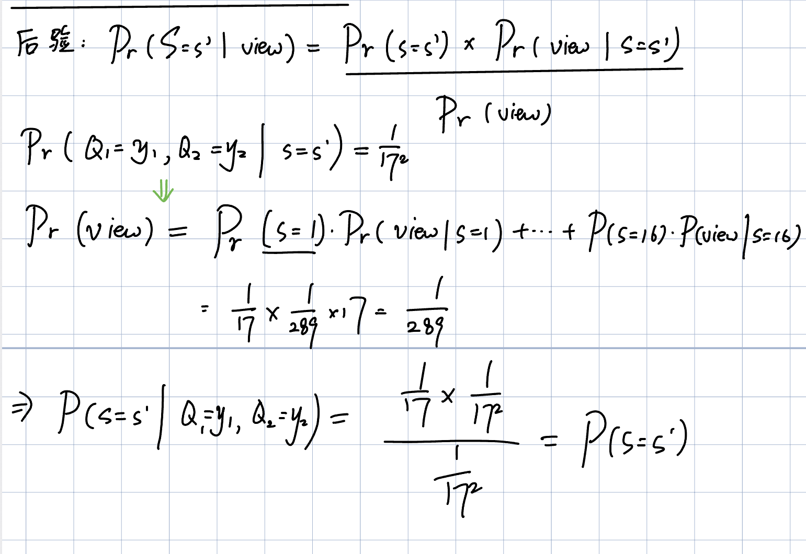

# HW1 复习

> 目标：10/05 Quiz。考题从作业里出，会有小改动，所以每题都要能**独立写出完整证明 / 计算**。\
> 对照材料：官方答案 `hw1_solutions.pdf`（本地）、自己的作业 [part1](hw1-fengcheng-private-part1.md)、[part2](hw1-fengcheng-private-part2.md)、[有限域笔记](notes-finite-fields.md)。\
> 复习方法：每一问先自己说思路 → 对照官方答案 → 记下**得分点**和**易错点**。

## 复习进度

- [x] **P1** 数学基础（Lec 2 前置）
  - [x] (a) 有限域运算：$\mathbb{F}_{17}$ 里求逆元、解方程
  - [x] (b) 多项式根的个数 ≤ 次数（归纳法证明）
  - [x] (c) 随机掩码：$s - R$ 是均匀分布，和 $s$ 无关
- [x] **P2** Shamir 秘密共享（Lec 2）
  - [x] (a) 生成 5 个 share
  - [x] (b) Lagrange 插值还原 $q(0)$
  - [x] (c) ⭐ 两个 share 看不出秘密（完美隐私的证明）
- [x] **P3** 广义秘密共享（Lec 3，Benaloh–Leichter）
  - [x] (a) minimal authorized / maximal unauthorized sets
  - [x] (b) 用 OR 复制、AND 拆分构造 share
  - [x] (c) 正确性
  - [x] (d) ⭐ 完美隐私：检查 4 个 maximal unauthorized sets
- [x] **P4** 私钥加密框架（Lec 4、Lec 6）
  - [x] (a) Gen / Enc / Dec 语法和正确性
  - [x] (b) 三种攻击类型
  - [x] (c) 正确 ≠ 安全（反例：$\mathrm{Enc}_k(m) = m$）
- [x] **P5** 完美保密（Lec 4）
  - [x] (a) ⭐ 定义：$\Pr[M = m \mid C = c] = \Pr[M = m]$
  - [x] (b) $\mathbb{Z}_3$ 上的 OTP 是完美保密的
  - [x] (c) 钥匙不均匀就不完美保密
  - [x] (d) ⭐ 证明 $\lvert \mathcal{M} \rvert \le \lvert \mathcal{K} \rvert$
- [x] **P6** OTP 钥匙重复使用的攻击（Lec 4）
  - [x] (a) $C_1 \oplus C_2 = M_1 \oplus M_2$
  - [x] (b) 用已知明文算出钥匙
  - [x] (c) 解出第二条消息
- [x] **Q7** 随机周期 Vigenère 不是完美不可区分的（Lec 4、Lec 7）
  - [x] (a) $\Delta(C)$ 和 $\Delta(M)$ 的关系
  - [x] (b) $b = 0$ 时的成功概率 $= 5/13$
  - [x] (c) ⚠️ $b = 1$ 时的成功概率 $= 37/39$（原作业没做完）
  - [x] (d) ⚠️ 四种情况汇总：$\Pr[b' = b] = 2/3 > 1/2$（原作业没做完）

## 和原作业对照的发现

- Q7 (c)(d) 当时留了"等标准答案下来再做"，**这次要补完**。
- 其余各问原作业都有解答，复习时重点核对证明是否完整、有没有漏掉官方答案的得分点。

---

## P1 数学基础

### Reading

> **Reading:** Mathematical background from lecture; Katz–Lindell Section 8.1.2, Section 13.3.1, and Appendices A.3 and A.5 as relevant.

### (a) Finite-field arithmetic

Work over $\mathbb{F}_{17}$.

1. Compute $3^{-1}$ and $5^{-1}$.
2. Solve

   $7x + 4 \equiv 2 \pmod{17}.$

Show your calculations.

#### Review

> [!note]
> 这一问很简单。辗转相除然后回代

$3^{-1} = 6, 5^{-1}=7$

### (b) Roots of a polynomial

Let $d \ge 0$. Prove that if $f(X)$ is a nonzero polynomial of degree at most $d$ over a field $\mathbb{F}$, then $f$ has at most $d$ distinct roots in $\mathbb{F}$.

Then prove that two distinct polynomials of degree at most $d$ cannot agree at more than $d$ distinct field elements.

#### Review

> [!note]
> 要证明两件事：
> 1. 一个非零多项式，根的个数不超过它的次数
> 2. 两个不同的多项式，最多在 d 个点上取值相同

**第一件：根的个数 ≤ d（对 d 做归纳）**

1. d = 0：次数 ≤ 0 的非零多项式就是一个非零常数，永远不等于 0，没有根。0 ≤ 0，成立。
2. 假设对 d − 1 成立，证明对 d 也成立。f 没有根的话直接成立；有根的话，取一个根 a。
3. 因式定理：a 是根，所以 f(X) = (X − a)·g(X)，而且 g 的次数 ≤ d − 1。
4. f 的其他根都是 g 的根：任取另一个根 b ≠ a，代进去 0 = f(b) = (b − a)·g(b)。因为 b − a ≠ 0，而域里没有零因子（两个非零数相乘不可能等于 0），所以 g(b) = 0。
5. 数一下：g 的根最多 d − 1 个（归纳假设），f 的根 = a 加上 g 的根，最多 1 + (d − 1) = d 个。∎

**第二件：两个不同的多项式最多在 d 个点上相等**

1. 令 h = f − g。f ≠ g，所以 h 非零；f、g 次数都 ≤ d，所以 h 次数也 ≤ d。
2. f、g 在某点相等，就是 h 在那点等于 0，即那点是 h 的根。
3. 由第一件，h 最多 d 个根，所以 f、g 最多在 d 个点上相等。∎

一句话：每找到一个根，就用因式定理把它"除掉"，次数降 1；降到 0 就没根了。

> [!tip]
> 这个其实很好理解。
> 1. 证明 root 的个数 <=d 就用归纳法
> 2. 然后证明最多在 d 个点上相等，就相减就行了

**Claim 1.**

1. $d=0$: a nonzero poly of degree $\le 0$ is a nonzero constant, so it has no roots.
2. Let $d \ge 1$ and assume the claim for degree $\le d - 1$. If $f$ has no root. then, we done.
   1. Otherwise, let $a$ be a root. Then $f(x) = (x-a)g(x)$ with $\deg g \le d - 1$.
3. If $b \ne a$ is another root, then $0 = f(b) = (b-a)g(b)$. since $b \ne a$, therefore, $g(b) = 0$. Therefore, the root of $f$ (other than $a$) is a root ob $g$, therefore, $g$ has at most $d-1$ roots
4. therefore, $f$ has at most $d - 1 + 1 = d$ roots.

**Claim 2.**

1. Let $h = f - g$, since $f$ has at most $d$ roots, as many as $g$, therefore $h$ has at most $d$ roots.
2. Assume $f - g = 0 = h$ at $x$, $x$ must be the root of $h$, therefore at most $d$.
3. Therefore, ...


### (c) A random mask

Let $R$ be uniformly distributed over a finite field $\mathbb{F}$, let $s \in \mathbb{F}$ be fixed, and define

$X = s - R.$

Prove that, for every fixed $s$, the random variable $X$ is uniformly distributed over $\mathbb{F}$. In particular, show that this distribution is the same for every choice of $s$. Briefly explain why this fact is useful in secret sharing.

#### Review

Fix any $x \in F$. The equation $x = s - r$ has the unique solution  $r = s-x$, therefore:

$$
\Pr[X = x] = \Pr[R = s - x] = 1/|\mathbb{F}|.
$$

This holds for every $x$ and every fixed $s$, so $X$ is uniform and its distribution does not depend on $s$. (Equivalently, $r \mapsto s - r$ is a bijection of $\mathbb{F}$.)

In additive secret sharing, one party receives the uniform mask $R$ and another receives $s-R$. Each share alone is uniform independently of $s$, while their sum reconstructs $s$.


> [!warning]
> 这题的关键是，一定要写出两个点：
> 1. 一一对应
> 2. 概率一样（这个很容易漏掉）

---

## P2 Shamir 秘密共享

### Reading

> **Reading:** Shamir, *How to Share a Secret*; Katz–Lindell Section 13.3.1, with Section 8.1.2 and Appendix A.5 as relevant.

Consider a $(3, 5)$-threshold Shamir secret-sharing scheme over $\mathbb{F}_{17}$. To share a secret $S = s$, the dealer samples $A, B \xleftarrow{\$} \mathbb{F}_{17}$ independently and uniformly, with this randomness independent of $S$, and defines the degree-at-most-two polynomial

$Q(X) = s + AX + BX^2.$

Participant $P_i$ receives the share $Q(i)$, for $i \in \{1, 2, 3, 4, 5\}$.

For parts (a) and (b), suppose $s = 9$ and the sampled polynomial is

$q(X) = 9 + 4X + 2X^2.$

### (a) Generate the shares

Compute $q(1), q(2), q(3), q(4), q(5)$.

#### Review

$q(1) = 15,\ q(2) = 8,\ q(3) = 5,\ q(4) = 6,\ q(5) = 11$


### (b) Reconstruction

Suppose $P_1, P_3, P_5$ combine their shares. Use Lagrange interpolation to compute $q(0)$ directly from these three shares. Explicitly compute $\lambda_1, \lambda_3, \lambda_5 \in \mathbb{F}_{17}$ satisfying

$q(0) = \lambda_1 q(1) + \lambda_3 q(3) + \lambda_5 q(5).$

#### Review

> [!important]
> $\lambda_i = \prod_{\substack{j \in \{1, 3, 5\} \\ j \ne i}} \frac{0 - j}{i - j}$ 最关键就是这个公式‼️ \
> 然后最后用  λ₁ + λ₃ + λ₅ = 4 + 3 + 11 = 18 ≡ 1  这个来验算

```
λ₁ = (0−3)(0−5) / ((1−3)(1−5)) = 15 / 8       8⁻¹ = 15（8×15 = 120 = 7×17 + 1）
   = 15 × 15 = 225 ≡ 4

λ₃ = (0−1)(0−5) / ((3−1)(3−5)) = 5 / (−4)     −4 ≡ 13，13⁻¹ = 4（13×4 = 52 = 3×17 + 1）
   = 5 × 4 = 20 ≡ 3

λ₅ = (0−1)(0−3) / ((5−1)(5−3)) = 3 / 8
   = 3 × 15 = 45 ≡ 11
```

```
q(0) = 4×15 + 3×5 + 11×11 = 60 + 15 + 121 = 196 = 11×17 + 9 ≡ 9     ✓ 就是秘密 s = 9
```


### (c) Perfect privacy

Fix two distinct participant indices $i, j \in \{1, 2, 3, 4, 5\}$. Suppose an adversary observes

$Q(i) = y_i, \qquad Q(j) = y_j.$

1. Prove that, for every candidate secret $s' \in \mathbb{F}_{17}$, there is exactly one pair $(a, b) \in \mathbb{F}_{17}^2$ for which

   $q'(X) = s' + aX + bX^2$

   is consistent with both observed shares.
2. For each fixed $s' \in \mathbb{F}_{17}$, consider the experiment that sets $S = s'$ and samples $A$ and $B$ as specified above. Prove that the resulting distribution of $(Q(i), Q(j))$ is the same for every $s'$. Conclude that, for any prior distribution on $S$, every $s' \in \mathbb{F}_{17}$, and every observation having positive probability,

   $\Pr[S = s' \mid Q(i) = y_i, Q(j) = y_j] = \Pr[S = s'].$

#### Analysis

**P2(c) 在证什么**

攻击者拿到了 2 个人的 share：Q(i) = yᵢ，Q(j) = yⱼ。要证明：他对秘密 S 什么都看不出来。

整体思路，两步：

1. 第 1 问：不管猜秘密是几，都正好有一个多项式和这两个 share 对得上
2. 第 2 问：所以不管秘密是几，看到这两个 share 的概率都一样
         → 看到它们不改变对秘密的判断（后验 = 先验）

**第 1 问：每个候选秘密 s′，正好对应一个 (a, b)**

1. 列方程：多项式 s′ + aX + bX² 要和两个 share 对上：
```
s′ + a·i + b·i² = yᵢ     →    a·i + b·i² = yᵢ − s′
s′ + a·j + b·j² = yⱼ     →    a·j + b·j² = yⱼ − s′
```
两个方程，两个未知数 a、b。

**2. 看系数矩阵的行列式（2×2 行列式 = 左上×右下 − 右上×左下）：**
```
| i   i² |
| j   j² |      行列式 = i·j² − j·i² = ij(j − i)
```

**3. 行列式不等于 0：**i、j 都是非零编号（1~5），而且 i ≠ j，所以 i、j、j − i 都不是 0。F₁₇ 是域，没有零因子，所以三个乘起来也不是 0。

**4. 结论：行列式非零，方程组有唯一解。所以每个 s′ 都正好对应一个 (a, b)。**

大白话：任何一个猜测的秘密，都能被恰好一个多项式"解释"。两个点 + 一个猜测的截距 = 三个点，正好唯一确定一个 2 次多项式（P1(b)）。

#### 先验 = 后验 题目的证明模版

- 先验（prior）Pr[S = s′]：还没看到 share 之前，你觉得秘密是 s′ 的概率。
- 后验（posterior）Pr[S = s′ | 看到 view]：看到 share 之后，你觉得秘密是 s′ 的概率。

bayes:
```
Pr[S = s′ | view] = Pr[S = s′] × Pr[view | S = s′] / Pr[view]
       后验            先验          似然                全概率
```

- 第 1 步：算似然 Pr[view | S = s′]，证明它对每个 s′ 都是同一个数 p。\
  这是唯一要动脑的一步，每道题不一样。P2(c) 里 p = 1/17²（第 1 问的唯一性 + A、B 均匀）。

- 第 2 步：算全概率 Pr[view]
```
Pr[view] = Σ_t Pr[S = t] × Pr[view | S = t] = Σ_t Pr[S = t] × p = p × 1 = p
```
所有先验加起来等于 1，所以结果就是 p。这一步每道题都一样。

- 第 3 步：代进贝叶斯公式
```
Pr[S = s′ | view] = Pr[S = s′] × p / p = Pr[S = s′]
```

p 约掉，后验 = 先验。这一步也每道题都一样。

***

用这个题目的数字走一遍：



**1. Unique $(a, b)$.** Consistency with the shares means
$ia + i^2 b = y_i - s'$ and $ja + j^2 b = y_j - s'$.
The coefficient matrix $\begin{pmatrix} i & i^2 \\ j & j^2 \end{pmatrix}$ has determinant $ij^2 - ji^2 = ij(j - i)$. Since $i, j, j - i$ are nonzero in the field $\mathbb{F}_{17}$, the determinant is nonzero, so the matrix is invertible and exactly one pair $(a, b)$ is consistent with $s'$ and the observed shares.

**2. Same distribution for every $s'$.** Fix $s'$. The pair $(A, B)$ is uniform over the $17^2$ coefficient pairs, and by part 1 exactly one of them yields the observed view, so
$\Pr[Q(i) = y_i, Q(j) = y_j \mid S = s'] = 1/17^2$, independent of $s'$.
For any prior, $\Pr[Q(i) = y_i, Q(j) = y_j] = \sum_t \Pr[S = t] \cdot 1/17^2 = 1/17^2$. By Bayes' rule,
$\Pr[S = s' \mid Q(i) = y_i, Q(j) = y_j] = \dfrac{\Pr[S = s'] \cdot 1/17^2}{1/17^2} = \Pr[S = s'].$


---

## P3 广义秘密共享

### Reading

> **Reading:** Benaloh–Leichter, *Generalized Secret Sharing and Monotone Functions*.

There are five participants $A, B, C, D, E$. The desired monotone access policy is

$F = (A \wedge B) \vee \big(C \wedge (D \vee E)\big).$

For a participant set $T$, interpret a variable such as $A$ as true exactly when $A \in T$. The set $T$ is authorized exactly when this assignment makes $F$ true. The Benaloh–Leichter construction uses these recursive operations over a finite field:

- At an OR gate, pass the same input secret to both children.
- At an AND gate with input secret $t$, sample a fresh uniform field element $r$, independently of $t$ and of all randomness sampled earlier, and pass $r$ to one child and $t - r$ to the other.

Work over $\mathbb{F}_{11}$.

### (a) Access structure

List all minimal authorized sets and all maximal unauthorized sets.

#### Review

**minimal authorized sets:**
- {A, B}
- {C, D}
- {C, E}

**maximal unauthorized sets:**
- {A, C}
- {B, C}
- {A, D, E}
- {B, D, E}


### (b) Construct the shares

Let the secret be $s \in \mathbb{F}_{11}$. Apply the recursive construction and state exactly what share or shares each participant receives. Name every independently and uniformly sampled field element that you use.

#### Review

> [!important]
> 这题最容易漏掉的，就是这个 Name every independently and uniformly sampled field element that you use. 必须写清楚才能拿满分 \
> ‼️: 要写清楚这个 $R_1 \xleftarrow{\$} \mathbb{F}_{11}$

The root is an OR gate, so both top-level children receive $s$.

- For the left child $A \wedge B$: sample $R_1 \xleftarrow{\$} \mathbb{F}_{11}$, send $R_1$ to $A$ and $s - R_1$ to $B$.
- For the right child $C \wedge (D \vee E)$: independently sample $R_2 \xleftarrow{\$} \mathbb{F}_{11}$, send $R_2$ to $C$ and $s - R_2$ to the OR gate $D \vee E$. That OR gate copies its input to both leaves, so $D$ and $E$ both receive $s - R_2$.

| Participant | Share |
| :---: | :---: |
| $A$ | $R_1$ |
| $B$ | $s - R_1$ |
| $C$ | $R_2$ |
| $D$ | $s - R_2$ |
| $E$ | $s - R_2$ |

Here R1 and R2 are independent and uniform over $F_{11}$ (and independent of s). D and E receive the same share intentionally, since they lie below an OR gate.


### (c) Correctness

For every minimal authorized set from part (a), show explicitly how its members reconstruct $s$.

#### Review

Each minimal authorized set reconstructs $s$ by addition in $\mathbb{F}_{11}$:

- $\{A, B\}$: $R_1 + (s - R_1) = s$
- $\{C, D\}$: $R_2 + (s - R_2) = s$
- $\{C, E\}$: $R_2 + (s - R_2) = s$

**Every authorized set contains at least one of these minimal sets, so it can run the same reconstruction.**

### (d) Perfect privacy

Prove that, for every unauthorized set and every two secrets $s_0, s_1 \in \mathbb{F}_{11}$, the complete joint distribution of that set's shares when the secret is $s_0$ is identical to its joint distribution when the secret is $s_1$.

#### Review

**P3(d) 在问什么**

**要证：** 任何一个不够格的集合（unauthorized set），把他们所有人的 share 放在一起看，分布和秘密 s 无关。秘密是 s₀ 还是 s₁，他们看到的分布一模一样。

**两个关键词：**

- complete joint distribution（完整联合分布）：要看这群人的 share 放在一起的分布，不能一个人一个人分开看。因为 share 之间可能有关联。反例：A 拿 R₁、B 拿 s − R₁，各自单独看都是均匀的，可放在一起一加就是 s。
- every unauthorized set：不够格的集合很多，不可能一个个查。

**思路**

第 1 步：只查 4 个 maximal unauthorized sets 就够了

任何不够格的集合，都包含在某个 maximal 里面（(a) 列出的那 4 个）。小集合看到的东西，只是大集合看到的东西的一部分。大集合整体的分布和 s 无关，它的任何一部分也和 s 无关。

**第 2 步：4 个 maximal 集合逐个检查（用 P1(c)：s − R 是均匀的，和 s 无关）**

```
{A, C}：     (R₁, R₂)                两个独立的均匀随机数        →  和 s 无关
{B, C}：     (s − R₁, R₂)            s − R₁ 均匀（P1(c)），
                                     和 R₂ 独立                   →  和 s 无关
{A, D, E}：  (R₁, s − R₂, s − R₂)     后两个永远相等
                                     形如 (x, t, t) 的组合概率都是 1/11²，
                                     其他组合概率都是 0            →  和 s 无关
{B, D, E}：  (s − R₁, s − R₂, s − R₂)  同理，形如 (u, t, t) 的概率都是 1/11²
                                                                 →  和 s 无关
```
{A, D, E} 那行的意思：D 和 E 拿的是同一个值，所以三个数里后两个一定相等。这不算漏信息，因为不管秘密是几，后两个都相等，这个规律和 s 无关。每种可能的 (x, t, t) 出现的概率都是 1/121，算式里没有 s。

It suffices to check the four maximal unauthorized sets from part (a): every unauthorized set is a subset of one of them, and its view is a marginal of that set's joint view.

- $\{A, C\}$: the view is $(R_1, R_2)$, uniform over $\mathbb{F}_{11}^2$ independently of $s$.
- $\{B, C\}$: the view is $(s - R_1, R_2)$. Since $s - R_1$ is uniform independently of $s$ and independent of $R_2$, the view is uniform over $\mathbb{F}_{11}^2$ independently of $s$.
- $\{A, D, E\}$: the view is $(R_1, s - R_2, s - R_2)$. For any $x, t \in \mathbb{F}_{11}$, $\Pr[\text{view} = (x, t, t)] = 1/11^2$, and any triple whose last two coordinates differ has probability $0$. These probabilities do not depend on $s$.
- $\{B, D, E\}$: the view is $(s - R_1, s - R_2, s - R_2)$. The two masked values are independent and uniform, so $\Pr[\text{view} = (u, t, t)] = 1/11^2$ for any $u, t$, again independently of $s$.

Thus every maximal unauthorized set has the same joint distribution for every secret; taking marginals proves the claim for every unauthorized set.


> [!tip]
> 考试的时候一定要记住怎么去写，the view is $(R_1, R_2)$, uniform over $\mathbb{F}_{11}^2$ independently of $s$, 然后其他的，都可以最后写成这个 F11的平方的形式


---

## P4 私钥加密框架

### Reading

> **Reading:** Katz–Lindell Sections 1.2, 1.4.1, and 2.1.

### (a) Syntax and correctness

A private-key encryption scheme consists of three algorithms. Give the syntax of

$\mathrm{Gen}, \quad \mathrm{Enc}, \quad \mathrm{Dec},$

including the input and output of each algorithm and which algorithms may be randomized. Then state the exact correctness requirement formally, including all quantifiers and randomness.

#### Review

> [!tip]
> 这里要分成两部分回答：
> 1. 语法（每一个算法写清楚：输入、输出、能不能随机）
> 2. 正确性（量词要写全）

- $\mathrm{Gen}$ is a probabilistic algorithm that takes no input and outputs a key $k \in \mathcal{K}$ according to the distribution defined by the scheme.
- $\mathrm{Enc}_k(m)$ takes a key $k \in \mathcal{K}$ and a message $m \in \mathcal{M}$, may be probabilistic, and outputs a ciphertext $c \in \mathcal{C}$.
- $\mathrm{Dec}_k(c)$ takes a key $k \in \mathcal{K}$ and a ciphertext $c \in \mathcal{C}$, is deterministic, and outputs a message in $\mathcal{M}.$

**Correctness.** For every $k \in \mathcal{K}$, every $m \in \mathcal{M}$, and every ciphertext $c \in \mathcal{C}$. Equivalently, for every fixed $k$ and $m$/, $\Pr[\mathrm{Dec}_k(\mathrm{Enc}_k(m)) = m] = 1$, where the probability is over the internal randomness of $\mathrm{Enc}$.


> [!tip]
> 这些一定要完全记住怎么写才行！

### (b) Types of attacks

Classify each situation as a ciphertext-only, known-plaintext, or chosen-plaintext attack, and briefly justify the classification.

1. Eve obtains several ciphertexts but no corresponding plaintexts.
2. Eve learns that a particular ciphertext $c$ encrypts a particular message $m$.
3. Eve selects messages $m_1, m_2, \ldots$ and obtains their encryptions.

#### Review

1. **Ciphertext-only attack.** Eve sees only ciphertexts and has no matching plaintext information.
2. **Known-plaintext attack.** Eve knows a plaintext–ciphertext pair $(m, c)$ that arose from encryption, but she did not choose $m$.
3. **Chosen-plaintext attack.** Eve chooses the plaintexts herself and obtains their encryptions, i.e., she has encryption-oracle access.


### (c) Correctness does not imply security

Assume that the message space $\mathcal{M}$ contains at least two distinct messages, set $\mathcal{C} = \mathcal{M}$, and let $\mathrm{Gen}$ be any key-generation algorithm over a nonempty key space $\mathcal{K}$. Consider the scheme

$\mathrm{Enc}_k(m) = m, \qquad \mathrm{Dec}_k(c) = c,$

where $k$ is generated but never used.

1. Prove that the scheme is correct.
2. Show that the ciphertext determines the plaintext and prove that the scheme is not perfectly secret. Explain what this example shows about the distinction between correctness and security.

#### Review

> [!note]
> 这个(c)也是非常简单的。
> 1. 正确性：这个方案是确定性的，直接写等式就行：对每个 k 和每个 m，Dec_k(Enc_k(m)) = Dec_k(m) = m。
> 2. 不完美保密：思路对，但要先把先验说清楚。"先验 = 1/2"不是自动成立的，要自己选一个分布：让 M 在两条不同的消息 m₀、m₁ 上均匀分布。然后：
```
后验：Pr[M = m₀ | C = m₀] = 1        （c = m，看到 m₀ 就知道是 m₀）
先验：Pr[M = m₀] = 1/2
1 ≠ 1/2，所以不完美保密
```

‼️题目还要你解释这说明了什么，别漏掉最后一句。

1. **Correctness.** For every key $k$ output by $\mathrm{Gen}$ and every $m \in \mathcal{M}$, $\mathrm{Dec}_k(\mathrm{Enc}_k(m)) = \mathrm{Dec}_k(m) = m$, so correctness holds with probability 1.

2. **Not perfectly secret.** The ciphertext equals the plaintext, so an Eves recovers $m$ by outputing $c$. Formally, let $m_0 \ne m_1$ and let $M$ be uniform on $\{m_0, m_1\}$. Since $C = M$,
    - $\Pr[M = m_0 \mid C = m_0] = 1 \ne \tfrac12 = \Pr[M = m_0],$
   so the scheme is not perfectly secret.

**Lesson.** Correctness guarantees that the legitimate receiver recovers the message; security restricts what an adversary can learn. A scheme can be perfectly correct and completely insecure.


## P5 完美保密

### Reading

> **Reading:** Katz–Lindell Chapter 2.

### (a) Definition

State the definition of perfect secrecy using conditional probabilities of the form

$\Pr[M = m \mid C = c].$

State the probability experiment, all required quantifiers, and the condition under which the conditional probability is defined.

#### Review

> [!note]
> 这题是一个定义题。
> (a) 就是让你把"完美保密"的定义完整写出来，不用证明任何东西，是一道背定义的题。
> 
> **完美保密是什么意思**（大白话）：攻击者看到密文之后，对消息的判断**和没看到时完全一样**。密文没有透露任何信息。 \
> **为什么题目要你写四样东西**：一个严格的定义，必须说清楚"在什么实验里、对谁成立、什么条件下"：
```
① 概率实验      概率是怎么来的？    消息按某个分布选，钥匙独立随机生成，再加密
② 定义式        要满足什么？        后验 = 先验：Pr[M = m | C = c] = Pr[M = m]
③ 全部量词      对谁都要成立？      每个消息分布、每条消息 m、每个密文 c
④ 有定义的条件   什么时候算得了？     Pr[C = c] > 0，不能对不可能出现的密文取条件
```

**每一样少了会怎样**：

- 少了 ①：不知道概率是对什么随机的。
- 少了 ③ 的"每个分布"：可能只对均匀分布成立，对别的分布不成立，那就不叫完美保密。
- 少了 ④：如果某个密文根本不可能出现，Pr[M = m | C = c] 要除以 0，没有意义。

**它在整题里的作用**：(b)(c)(d) 都要用这个定义。(b) 证明满足它，(c) 证明不满足它，(d) 从它推出 |K| ≥ |M|。所以 (a) 是后面三问的基础。

**Experiment.** Fix any distribution over $\mathcal{M}$. Choose $M$ according to it, independently generate $K \leftarrow \mathrm{Gen}$, and let $C = \mathrm{Enc}_K(M)$. (with fresh coins if $\mathrm{Enc}$ is randomized).

**Definition.** The scheme is perfectly secret if, for every distribution over $\mathcal{M}$, every $m \in \mathcal{M}$, and every $c \in \mathcal{C}$ with $\Pr[C = c] > 0$,

$\Pr[M = m \mid C = c] = \Pr[M = m].$

The condition $\Pr[C = c] > 0$ is needed so that the conditional probability is defined. The probability is over the choice of $M$, the key generation, and the encryption randomness.

### (b) A small one-time pad

Let

$\mathcal{M} = \mathcal{K} = \mathcal{C} = \mathbb{Z}_3.$

The key $K$ is uniform over $\mathbb{Z}_3$ and independent of $M$, and

$\mathrm{Enc}_k(m) = m + k \pmod 3, \qquad \mathrm{Dec}_k(c) = c - k \pmod 3.$

Prove correctness and perfect secrecy. The secrecy proof must hold for every distribution on $M$.

#### Review

> [!note]
> b貌似也是很简单的感觉。
> 
> 首先 correctness，列一下就好，然后对于所有m属于M，c属于C，都能得到 加密后的解密是 m
> 
> 然后 perfect secrecy, 先验，每一个都是1/3 \
> 后验，（这里不知道咋写，要写贝叶斯吗，还是直接写也是1/3就行了）
> 
> 然后proof must hold for every distriburtion of M, 是不是就是 m属于M，c属于C这几句

**correctness 对。perfect secrecy 有两处要纠正：**

**1. 先验不是 1/3**

"The secrecy proof must hold for every distribution on M" 这句话说的就是这个：消息的分布是任意的，不能假设每条消息概率 1/3。所以先验要写成一个任意的数：

```
p_m = Pr[M = m]       任意分布，不假设均匀
```

真正等于 1/3 的是**似然** Pr[C = c | M = m]：消息定了以后，只有一把钥匙 k = c − m 能把 m 变成 c，而钥匙是均匀的，所以概率是 1/3。

**2. 要写贝叶斯，就是 P2(c) 那个三步模板**

```
第 1 步  似然：     Pr[C = c | M = m] = Pr[K = c − m] = 1/3       每个 m 都一样
第 2 步  全概率：   Pr[C = c] = Σ_t p_t × 1/3 = 1/3
第 3 步  贝叶斯：   Pr[M = m | C = c] = p_m × (1/3) / (1/3) = p_m = Pr[M = m]
```

整个证明里，**先验 p_m 一直是个字母，没有代任何具体的数**，所以对任何分布都成立。这才是满足 "every distribution" 的写法。


**易错点**（官方答案）：只证"每个密文都可能出现"不够，必须算出**概率相等**。


前面三行都对，**错在最后一行：分子少乘了先验 pᵢ。**

贝叶斯公式是：

```
Pr[M = mᵢ | view] = Pr[M = mᵢ] × Pr[view | M = mᵢ] / Pr[view]
                       先验            似然
```

你只写了似然 1/3，漏了前面的先验 pᵢ。改成：

```
Pr[M = mᵢ | view] = pᵢ × (1/3) / Pr[view] = pᵢ × (1/3) / (1/3) = pᵢ
```

最后得到 **pᵢ = Pr[M = mᵢ]，后验 = 先验**，证完。

**为什么分子要有先验**：分子其实是"消息是 mᵢ **并且**看到这个 view"的概率，要先选中 mᵢ（概率 pᵢ），再从这条消息加密出这个 view（概率 1/3），两个相乘。

**一个小的写法建议**：这题里的 view 就是密文，正式写的时候把 "view" 换成 **C = c**：

```
Pr[M = mᵢ | C = c] = pᵢ × (1/3) / (1/3) = pᵢ
```

**Correctness.** For every $m, k \in \mathbb{Z}_3$: $\mathrm{Dec}_k(\mathrm{Enc}_k(m)) = (m + k) - k = m \pmod 3$.

**Perfect secrecy.** Let $p_m = \Pr[M = m]$ be an arbitrary distribution. Fix $m, c \in \mathbb{Z}_3$.

1. Conditioned on $M = m$, the event $C = c$ occurs exactly when $K = c - m \pmod 3$. There is exactly one such key and $K$ is uniform, so $\Pr[C = c \mid M = m] = \tfrac13$.
2. Hence $\Pr[C = c] = \sum_{t \in \mathbb{Z}_3} p_t \cdot \tfrac13 = \tfrac13$.
3. Also $\Pr[M = m, C = c] = p_m \cdot \tfrac13$, so
   $\Pr[M = m \mid C = c] = \dfrac{p_m / 3}{1/3} = p_m = \Pr[M = m].$

The proof made no assumption about the distribution of $M$, so the scheme is perfectly secret.


### (c) A biased key

Keep the scheme from part (b), but let the independent key satisfy

$\Pr[K = 0] = \tfrac12, \qquad \Pr[K = 1] = \Pr[K = 2] = \tfrac14.$

Assume $M$ is uniform over $\mathbb{Z}_3$. Compute

$\Pr[M = 0 \mid C = 0],$

compare it with $\Pr[M = 0]$, and determine whether the scheme is perfectly secret.

> [!tip]
> 首先这个c和b的关系在于：\
> **这一问的消息分布是已知的**
> - 题目写了 "Assume M is uniform over Z₃"，所以先验是 Pr[M = 0] = Pr[M = 1] = Pr[M = 2] = 1/3。
> 
> 这和 (b) 正好相反：
> - (b) 要证"是"完美保密    →  必须对每个分布都成立，所以先验用任意的 pₘ 
> - (c) 要证"不是"完美保密   →  只要找到一个分布不成立就够了，题目直接给了均匀分布

> [!warning]
> 另外，按照直觉来说，钥匙不平均，肯定是不能完美保密的，但是这个也不一定。
> 
> 这一题为什么准确：这题 |M| = |K| = |C| = 3，钥匙个数正好等于消息个数。这种情况下有一个定理，香农定理（Shannon's theorem，K&L Theorem 2.12，Lec 7 提过）：
> - 当 |M| = |K| = |C| 时，完美保密 ⟺ ① 钥匙均匀分布，并且 ② 每对 (m, c) 正好有一把钥匙把 m 加密成 c。
> 
> 所以这题里"钥匙不均匀 ⟹ 不完美保密"是对的，正是香农定理的一个方向。
> 
> 一般情况为什么不一定：钥匙比消息多的时候，可能有几把钥匙效果一样，单把钥匙不均匀也没关系。反例：
> - 消息 m ∈ Z₃，钥匙 k ∈ Z₆，Enc_k(m) = m + k mod 3
> - 钥匙分布：Pr[k=0] = Pr[k=1] = Pr[k=2] = 1/3，Pr[k=3] = Pr[k=4] = Pr[k=5] = 0 钥匙在 Z₆ 上明显不均匀（一半的钥匙概率是 0），但真正起作用的是 k mod 3，它在 {0, 1, 2} 上是均匀的，所以照样完美保密。
> 
> 一句话：直觉的准确版本是"起作用的那部分钥匙必须均匀"。钥匙和消息一样多时，每把钥匙都起作用，所以就是"钥匙必须均匀"。


最后：Pr[M = 0 | C = 0] = 1/2  ≠  1/3 = Pr[M = 0]，所以不是完美保密。


#### Review


### (d) A lower bound on the key space

Let $\Pi = (\mathrm{Gen}, \mathrm{Enc}, \mathrm{Dec})$ be a perfectly correct and perfectly secret encryption scheme with finite, nonempty message and key spaces $\mathcal{M}$ and $\mathcal{K}$. Assume decryption is deterministic. Prove that

$|\mathcal{K}| \ge |\mathcal{M}|.$

#### Review

```
反设 |K| < |M|
  ↓
取 M 上均匀分布，取一个出现概率为正的密文 c
  ↓
M(c) = 用所有钥匙去解 c，能解出的消息集合
Dec 确定性 ⟹ 一把钥匙至多解出一个 ⟹ |M(c)| ≤ |K| < |M|
  ↓
==必有某条消息 m₀ 解不出来==
  ↓
Pr[M = m₀ | C = c] = 0，但先验 Pr[M = m₀] = 1/|M| > 0
  ↓
后验 ≠ 先验，违反完美保密 ⟹ 矛盾
```


## P6 OTP 钥匙重复使用

### Reading

> **Reading:** Katz–Lindell Section 2.2.

Let $M_1, M_2 \in \{0, 1\}^{64}$ be plaintext byte strings, each representing exactly eight ASCII characters, with one 8-bit byte per character. A key $K \xleftarrow{\$} \{0, 1\}^{64}$ is sampled uniformly once. The messages are encrypted bytewise as $C_i = M_i \oplus K$, but the same key $K$ is incorrectly reused for both messages. The corresponding ciphertexts, written as hexadecimal bytes, are

$C_1 = \texttt{E7 55 1A 76 80 31 27 CC}$

and

$C_2 = \texttt{E7 55 1A 76 80 30 36 CC}.$

You also know that

$M_1 = \texttt{MEET@8PM}.$

### (a) Information leakage

Prove that reusing an OTP key gives

$C_1 \oplus C_2 = M_1 \oplus M_2.$

#### Review

With the same key $K$, $C_1 = M_1 \oplus K$ and $C_2 = M_2 \oplus K$. Using associativity, commutativity, and $K \oplus K = 0$:

$C_1 \oplus C_2 = (M_1 \oplus K) \oplus (M_2 \oplus K) = M_1 \oplus M_2 \oplus (K \oplus K) = M_1 \oplus M_2.$


### (b) Recover the key

Convert $M_1$ to ASCII hexadecimal and recover all eight key bytes. Show every bytewise XOR.

#### Review

Since $K = C_1 \oplus M_1$, convert each character of $M_1$ to its ASCII byte and XOR:

| Pos | Char | ASCII | $C_1$ | Key byte |
| :-: | :-: | :-: | :-: | :-: |
| 1 | M | 4D | E7 | E7 ⊕ 4D = AA |
| 2 | E | 45 | 55 | 55 ⊕ 45 = 10 |
| 3 | E | 45 | 1A | 1A ⊕ 45 = 5F |
| 4 | T | 54 | 76 | 76 ⊕ 54 = 22 |
| 5 | @ | 40 | 80 | 80 ⊕ 40 = C0 |
| 6 | 8 | 38 | 31 | 31 ⊕ 38 = 09 |
| 7 | P | 50 | 27 | 27 ⊕ 50 = 77 |
| 8 | M | 4D | CC | CC ⊕ 4D = 81 |

Hence $K = \texttt{AA 10 5F 22 C0 09 77 81}$.


### (c) Recover the second message

Recover all eight bytes of $M_2$, convert them to ASCII, and explain why this attack does not contradict the perfect-secrecy theorem for the one-time pad.

#### Review

Compute $M_2 = C_2 \oplus K$ bytewise:

| Pos | $C_2$ | Key | Plaintext hex | ASCII |
| :-: | :-: | :-: | :-: | :-: |
| 1 | E7 | AA | 4D | M |
| 2 | 55 | 10 | 45 | E |
| 3 | 1A | 5F | 45 | E |
| 4 | 76 | 22 | 54 | T |
| 5 | 80 | C0 | 40 | @ |
| 6 | 30 | 09 | 39 | 9 |
| 7 | 36 | 77 | 41 | A |
| 8 | CC | 81 | 4D | M |

Thus $M_2 = \texttt{MEET@9AM}$. Check: $C_1 \oplus C_2 = \texttt{00 00 00 00 00 01 11 00} = M_1 \oplus M_2$.

**No contradiction.** The one-time pad is perfectly secret only when each message is encrypted under a fresh, independent, uniform key. Here the key is reused, which is outside the theorem's hypotheses: a known plaintext reveals $K$ and therefore decrypts the other ciphertext; equivalently, the two ciphertexts leak $M_1 \oplus M_2$.


> [!tip]
> 这一题主要是这里最后的解释：\
> 第 2 部分：为什么不和 OTP 的完美保密矛盾（题目要的那个解释）

OTP 完美保密的定理有一个前提：每条消息都用一把新的、独立、均匀随机的钥匙。这题把同一把钥匙用了两次，已经不满足定理的前提，定理自然管不到。

具体出事的地方：

- 已知 M₁（known-plaintext），就能算出 K = C₁ ⊕ M₁，再用 K 解开 C₂。
- 就算不知道 M₁，两个密文一异或也直接泄露了 M₁ ⊕ M₂。

---

## Q7 随机周期 Vigenère

### Reading

> **Reading:** Katz–Lindell Sections 1.3 and 2.1, especially Example 2.7 (page 32).

Identify the alphabet with $\mathbb{Z}_{26}$ using $a = 0, b = 1, \ldots, z = 25$, and perform all letter arithmetic modulo 26. The message and ciphertext spaces are the four-letter strings over this alphabet.

The key-generation algorithm proceeds in the following order:

1. Choose the period $T$ according to $\Pr[T = 1] = \tfrac13$, $\Pr[T = 2] = \tfrac23$.
2. Conditional on $T = t$, sample $K_1, \ldots, K_t$ independently and uniformly from $\mathbb{Z}_{26}$. The key is $(T, K_1, \ldots, K_t)$.

For $M = M_1 M_2 M_3 M_4$, encryption produces $C = C_1 C_2 C_3 C_4$, where

$C_j = M_j + K_{1 + ((j-1) \bmod T)} \pmod{26}$ for $j \in \{1, 2, 3, 4\}$.

Decryption subtracts the same repeated key character in each position, modulo 26. Thus a period-one key uses $K_1$ in all four positions, while a period-two key alternates $K_1, K_2, K_1, K_2$.

In the perfect-indistinguishability experiment, an adversary outputs two messages $m_0, m_1$. The challenger independently generates a key as above and samples $b \xleftarrow{\$} \{0, 1\}$, then returns $C = \mathrm{Enc}_K(m_b)$. The adversary outputs $b' \in \{0, 1\}$ and succeeds when $b' = b$. A scheme is perfectly indistinguishable if every adversary, even a computationally unbounded one, succeeds with probability exactly $1/2$.

Analyze the following deterministic adversary $A$:

1. It chooses $m_0 = \texttt{math}$, $m_1 = \texttt{test}$.
2. For any four-letter string $x = x_1 x_2 x_3 x_4$, define $\Delta(x) = x_1 - x_2 + x_3 - x_4 \pmod{26}$. After receiving $C$, the adversary outputs $b' = 0$ if $\Delta(C) = \Delta(m_0)$, and outputs $b' = 1$ otherwise.

### 中文思路

#### 第 1 块：这个加密方案是什么

**字母换成数字**：a = 0，b = 1，……，z = 25，加法都 mod 26（超过 25 就绕回来）。

```
math  →  12  0  19  7
```

**钥匙怎么生成，分两步**：

```
① 先随机选周期 T：     T = 1 的概率 1/3，T = 2 的概率 2/3
② 再随机选钥匙字母：    T = 1 选一个 K₁；T = 2 选两个 K₁、K₂（每个都在 0~25 里均匀随机）
```

**加密**：明文每个字母加上对应的钥匙字母。

```
T = 1：四个位置都加 K₁              （就是凯撒密码，整体平移）
T = 2：四个位置依次加 K₁ K₂ K₁ K₂     （两把钥匙轮流用）
```

**例子**：加密 math（12 0 19 7）

```
T = 1，K₁ = 3：              12+3   0+3   19+3   7+3   =  15  3  22  10
T = 2，K₁ = 3，K₂ = 5：       12+3   0+5   19+3   7+5   =  15  5  22  12
```

#### 第 2 块：这道题的"猜谜游戏"

**游戏怎么玩**（就是 Lec 7 的不可区分实验）：

```
① 攻击者先挑两条消息：     m₀ = math，m₁ = test
② 裁判偷偷抛一枚硬币 b：   0 或 1，各一半概率
③ 裁判随机生成钥匙：       先选 T，再选 K（第 1 块那样）
④ 裁判加密 m_b，把密文 C 交给攻击者
⑤ 攻击者看着 C，猜 b′：     b′ = b 就算赢
```

**完美不可区分**（perfect indistinguishability）：**任何**攻击者（哪怕算力无限）赢的概率都**正好是 1/2**。看了密文和没看一样，只能瞎猜。

**这道题要证"不是"完美不可区分**：只要找到**一个**攻击者，赢的概率 ≠ 1/2 就够了。题目已经给好了攻击者 A，我们只需要**算出 A 赢的概率**（最后是 2/3）。

**攻击者 A 的招数**：给每个四字母串算一个"指纹"

```
Δ(x) = x₁ − x₂ + x₃ − x₄     （mod 26）
```

拿到密文 C 后：**Δ(C) 等于 Δ(math) 就猜 0，否则猜 1。**

**为什么挑这个指纹**：T = 1 时四个位置加的是同一个 K₁，在 Δ 里一加一减正好全部抵消，所以 Δ(C) = Δ(明文)，**指纹直接把明文暴露了**。

#### 第 3 块：(a) 算指纹 $\Delta$

**① 两条消息的指纹**（字母换成数字，按 + − + − 算）：

```
math = 12  0  19  7     Δ = 12 − 0 + 19 − 7   = 24
test = 19  4  18  19    Δ = 19 − 4 + 18 − 19  = 14
```

24 ≠ 14，两条消息的指纹不一样，这是 A 能分辨它们的基础。

**② T = 1**：四个位置都加 $K_1$

```
Δ(C) = (M₁ + K₁) − (M₂ + K₁) + (M₃ + K₁) − (M₄ + K₁)
     = (M₁ − M₂ + M₃ − M₄) + (K₁ − K₁ + K₁ − K₁)
     = Δ(M)                                          钥匙两加两减，全部抵消
```

**③ T = 2**：依次加 $K_1, K_2, K_1, K_2$

```
Δ(C) = (M₁ + K₁) − (M₂ + K₂) + (M₃ + K₁) − (M₄ + K₂)
     = Δ(M) + (K₁ − K₂ + K₁ − K₂)
     = Δ(M) + 2(K₁ − K₂)                             没抵消干净，多出一个随机量
```

**用第 1 块的例子验证**（math，$\Delta = 24$）：

```
T = 1，K₁ = 3：         密文 15 3 22 10，Δ = 15 − 3 + 22 − 10 = 24        ✓ 等于 Δ(M)
T = 2，K₁ = 3，K₂ = 5：  密文 15 5 22 12，Δ = 15 − 5 + 22 − 12 = 20
                        公式：24 + 2(3 − 5) = 20                           ✓
```

**小结**：

```
T = 1：  Δ(C) = Δ(M)                  指纹原样暴露
T = 2：  Δ(C) = Δ(M) + 2(K₁ − K₂)     指纹被一个随机量打乱
```

#### 第 4 块：(b) $b = 0$ 时，A 猜对的概率

$b = 0$：加密的是 math，$\Delta(M) = 24$。A 的规则是"$\Delta(C) = 24$ 就猜 0"，所以 **A 猜对 ⟺ $\Delta(C) = 24$**。

**情况 1：$T = 1$**。$\Delta(C) = \Delta(M) = 24$，永远等于 24，A 一定猜对：

```
Pr[猜对 | b = 0, T = 1] = 1
```

**情况 2：$T = 2$**。$\Delta(C) = 24 + 2(K_1 - K_2)$，猜对要求 $2(K_1 - K_2) \equiv 0 \pmod{26}$。

记 $d = K_1 - K_2$（mod 26）：

```
26 | 2d   ⟺   13 | d   ⟺   d = 0 或 d = 13
```

> [!caution] 最容易漏
> **$d = 13$ 也满足**：$2 \times 13 = 26 \equiv 0$。只写 $d = 0$ 会把概率算成 $1/26$。

数满足的对数：$K_2$ 有 26 种；$K_2$ 定了以后，$K_1 = K_2$ 或 $K_2 + 13$，有 2 种。

```
满足的对数 = 26 × 2 = 52，总对数 = 26 × 26 = 676，概率 = 52/676 = 1/13
```

这就是 counting note 在提醒的：每一对的概率是 $1/26^2$，但满足方程的有 52 对，要全部数上。

```
Pr[猜对 | b = 0, T = 2] = 1/13
```

**合起来**（按 $T$ 的概率加权）：

```
Pr[猜对 | b = 0] = 1/3 × 1 + 2/3 × 1/13 = 13/39 + 2/39 = 15/39 = 5/13
```

**直觉**：$T = 1$ 时指纹原样暴露，A 稳赢；$T = 2$ 时指纹被打乱，A 只有 1/13 的运气猜对。

### (a)

Compute $\Delta(m_0)$ and $\Delta(m_1)$. Derive $\Delta(C)$ in terms of $\Delta(M)$ and the key characters separately for $T = 1$ and $T = 2$.

#### Review

$\Delta(\texttt{math}) = 12 - 0 + 19 - 7 = 24$, $\Delta(\texttt{test}) = 19 - 4 + 18 - 19 = 14 \pmod{26}$.

- $T = 1$: $\Delta(C) = (M_1 + K_1) - (M_2 + K_1) + (M_3 + K_1) - (M_4 + K_1) = \Delta(M)$.
- $T = 2$: $\Delta(C) = (M_1 + K_1) - (M_2 + K_2) + (M_3 + K_1) - (M_4 + K_2) = \Delta(M) + 2(K_1 - K_2)$.

A outputs $0$ iff $\Delta(C) \equiv 24$.


### (b)

Conditioned on $b = 0$, calculate the exact probability that $A$ succeeds. Analyze the cases $T = 1$ and $T = 2$ separately.

#### Review

$b = 0$: $M = \texttt{math}$, $\Delta(M) = 24$; A succeeds iff $\Delta(C) \equiv 24$.

- $T = 1$: $\Delta(C) = 24$ always, success probability $1$.
- $T = 2$: success iff $2(K_1 - K_2) \equiv 0 \pmod{26}$, i.e. $K_1 - K_2 \equiv 0$ or $13$. Each $K_2$ gives 2 values of $K_1$, so $52$ of $26^2$ pairs: probability $\tfrac{52}{26^2} = \tfrac1{13}$.

$\Pr[b' = 0 \mid b = 0] = \tfrac13 \cdot 1 + \tfrac23 \cdot \tfrac1{13} = \tfrac{5}{13}.$


### (c)

Conditioned on $b = 1$, calculate the exact probability that $A$ succeeds. Again analyze both possible periods separately.

#### Review


$b = 1$: $M = \texttt{test}$, $\Delta(M) = 14$; A succeeds iff $\Delta(C) \not\equiv 24$.

- $T = 1$: $\Delta(C) = 14 \ne 24$ always, success probability $1$.
- $T = 2$: A fails iff $14 + 2(K_1 - K_2) \equiv 24$, i.e. $2(K_1 - K_2) \equiv 10 \pmod{26}$, i.e. $K_1 - K_2 \equiv 5$ or $18$. Again $52$ pairs: failure $\tfrac1{13}$, success $\tfrac{12}{13}$.

$\Pr[b' = 1 \mid b = 1] = \tfrac13 \cdot 1 + \tfrac23 \cdot \tfrac{12}{13} = \tfrac{37}{39}.$

### (d)

Consider the four cases $(b, T) \in \{(0, 1), (0, 2), (1, 1), (1, 2)\}$. For a case $(b, T) = (\beta, t)$, state the condition under which $A$ is correct and compute $\Pr[b' = b \mid b = \beta, T = t]$. Multiply by $\Pr[b = \beta, T = t]$ to obtain the branch contribution $\Pr[b = \beta, T = t, b' = b]$. Present all four cases in a probability tree or table, sum their contributions to calculate $\Pr[b' = b]$ exactly as a fraction, compare the result with $1/2$, and conclude whether the scheme is perfectly indistinguishable.

> **Important counting note:** Conditioned on $T = 2$, any one specified ordered pair $(K_1, K_2) = (u, v)$ has probability $1/26^2$. An equation relating $K_1$ and $K_2$ may be satisfied by many ordered pairs, so its probability must account for all satisfying pairs.

#### Review

Since $b$ and $T$ are independent, $\Pr[b = \beta, T = t] = \tfrac12 \Pr[T = t]$.

| $b$ | $T$ | A correct iff | $\Pr[b' = b \mid b, T]$ | Contribution |
| :-: | :-: | :-- | :-: | :-: |
| 0 | 1 | always ($\Delta(C) = 24$) | $1$ | $\tfrac12 \cdot \tfrac13 \cdot 1 = \tfrac16$ |
| 0 | 2 | $2(K_1 - K_2) \equiv 0$ | $\tfrac1{13}$ | $\tfrac12 \cdot \tfrac23 \cdot \tfrac1{13} = \tfrac1{39}$ |
| 1 | 1 | always ($\Delta(C) = 14 \ne 24$) | $1$ | $\tfrac12 \cdot \tfrac13 \cdot 1 = \tfrac16$ |
| 1 | 2 | $2(K_1 - K_2) \not\equiv 10$ | $\tfrac{12}{13}$ | $\tfrac12 \cdot \tfrac23 \cdot \tfrac{12}{13} = \tfrac4{13}$ |

$\Pr[b' = b] = \tfrac16 + \tfrac1{39} + \tfrac16 + \tfrac4{13} = \tfrac{52}{78} = \tfrac23 > \tfrac12.$

So the scheme is **not perfectly indistinguishable** (and hence, by equivalence, not perfectly secret).

> [!caution] 丢分点
> 1. $1/26^2$ 只是**某一对**钥匙的概率，不能当成整个方程的概率；方程 $2d \equiv 0$ 或 $2d \equiv 10$ 都有**两个解**，各 52 对。
> 2. 别忘了加权：$T$ 分别乘 $\tfrac13$、$\tfrac23$，$b$ 还要乘 $\tfrac12$。
> 3. $b = 1$ 时逻辑反过来：A 要 $\Delta(C) \ne 24$ 才猜对。
> 4. $\Delta(C)$ 里是 $2(K_1 - K_2)$，不是 $2(K_2 - K_1)$。
