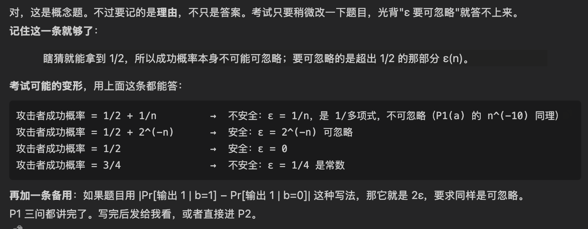

# Homework #2

> USC CSCI 556: Introduction to Cryptography, Fall 2026 \
> **Lecturer:** Prof. Shang-Hua Teng \
> **Student:** Fengcheng Yu \
> **USC ID:** `**********` \
> **Date:** Sep 30, 2026

## Coverage and readings

This homework draws on Lectures 6–10 in the Fall 2026 course outline. Relevant readings are listed with each problem. The principal textbook is Jonathan Katz and Yehuda Lindell, *Introduction to Modern Cryptography*, second edition. Page references below are the book's printed page numbers, not the PDF viewer's page numbers. Problems are adapted or developed from the cited material.

## Instructions

- Justify every answer. For a security claim, give a reduction; for a claim that a construction is not necessarily secure, give a counterexample or an explicit attack.
- All algorithms used in security definitions are probabilistic polynomial-time (PPT), unless stated otherwise.
- Let $U_n$ denote the uniform distribution on $\{0, 1\}^n$. All random samples are independent unless stated otherwise.
- Write $\Vert$ for concatenation and $\oplus$ for bitwise XOR. The security parameter is $n$; $1^n$ is its unary encoding.
- A nonnegative function $\mu(n)$ is negligible if, for every positive integer $c$, there is $n_c$ such that $\mu(n) < n^{-c}$ for all $n \ge n_c$.

### 中文翻译

- **每个答案都要给出论证。说一个构造是安全的，要给出归约（reduction）；说一个构造不一定安全，要给出反例（counterexample）或具体攻击。**
- 除非另有说明，安全定义里的所有算法都是概率多项式时间（PPT）的。
- $U_n$ 表示 $\{0, 1\}^n$ 上的均匀分布。除非另有说明，所有随机抽样相互独立。
- $\Vert$ 表示拼接（concatenation），$\oplus$ 表示按位异或（XOR）。安全参数是 $n$，$1^n$ 是它的一进制编码。
- 非负函数 $\mu(n)$ 是可忽略的（negligible）：对每个正整数 $c$，都存在 $n_c$，使得所有 $n \ge n_c$ 都有 $\mu(n) < n^{-c}$。


## Problem 1: Computational Security and Negligible Probabilities

### Reading

> **Reading:** Katz–Lindell §§3.1.2 and 3.2.1; Exercise 3.1.

### (a) Classification

Determine which of the following functions are negligible. Prove each conclusion.

$\mu_1(n) = n^{-10}, \qquad \mu_2(n) = 2^{-\sqrt{n}}.$

#### Solution

> [!important]
> 对每个正整数 $c$，都存在 $n_c$，使得所有 $n \ge n_c$ 都有 $\mu(n) < n^{-c}$。\
> 证明不可忽略，就找反例。证明可忽略，就用定义


$n^{-10}$ is not negligible. Choose $c=11$. For every $n>1$, we have $n^{-10} > n^{-11}$, contradicting the requried eventual bound for this $c$.

$2^{-\sqrt{n}}$ is negligible. Fix any positive int $c$, we have $-\sqrt n < -c\log n$, therefore $2^{-\sqrt{n}} < 2^{-c \log n} = n ^{-c}$.


### (b) Polynomially many attempts

An attacker makes at most $q(n)$ attempts, where $q$ is polynomially bounded in the security parameter $n$: that is, there exist constants $k \ge 0$ and $n_0$ such that $q(n) \le n^k$ for all $n \ge n_0$. Let $E_i$ be the event that attempt $i$ succeeds, and suppose $\Pr[E_i] \le \mu(n)$ for each attempt, where $\mu$ is negligible. Prove that the probability that at least one attempt succeeds is negligible. Do you need the events $E_i$ to be independent?

#### Solution

> An attacker makes at most $q(n)$ attempts, where $q$ is polynomially bounded in the security parameter $n$: that is, there exist constants $k \ge 0$ and $n_0$ such that $q(n) \le n^k$ for all $n \ge n_0$.

> [!important]
> 首先这个前半句的意思是：$q(n)$ 一定是多项式内的，也就是这个 attacker 一定还能做多项式次尝试。\
> 另外，$1 / q(n)$ 的意思，**不是**说 $1/q(n)$ 是可忽略的，这个是不可忽略的，和 $n^{-10}$ 一样。$1/q(n)$ 在密码学里的意思正好相反：如果攻击者的成功概率有 $1/q(n)$ 那么大，就叫不可忽略的优势，方案被攻破了。

$$
\operatorname{Pr}\left[\bigcup_{i=1}^{q(n)} E_{i}\right] \leq \sum_{i=1}^{q(n)} \operatorname{Pr}\left[E_{i}\right] \leq q(n) \mu(n) 
$$
这个公式的易懂写法：

$$
\operatorname{Pr}[E_1 \vee E_2 \vee E_3 ... \vee E_q] \le \operatorname{Pr}[E_1] + ... + \operatorname{Pr}[E_q] \le q(n)\cdot \mu(n)
$$

几件事至少发生一件的概率，不超过它们各自概率之和。 重叠的部分被多算了，所以只会算多、不会算少。

> [!tip]
> 其实到这里其实已经很好看出来了。因为 $\mu(n)$ 是可忽略的，所以他可以压住任一个多项式，使得 $q(n)\cdot\mu(n)$ 是 negligible. \
> 但是，考试还是需要证明一下这句话。\
> 可忽略的定义是：对每个正整数 $c$，都存在 $n_c$，使得所有 $n \ge n_c$ 都有 $\mu(n) < n^{-c}$

We choose any $c$. Let $d = c + k + 1$

we have, when $n \ge n_d$, $\mu(n) \le n^{-d} = n^{-(c + k + 1)}$

therefore, $q(n)\mu(n) \le n^{k}\cdot n^{-(c + k + 1)} = n^{-c-1} \le n^{-c}$

therefore $q(n)\mu(n)$ is negligible.

> [!warning]
> 这里有两处非常容易扣分的地方漏掉：
> 1. 漏了$n_0$: $q(n) \le n^k$ 只在 $n \le n_0$ 时成立，所以最后那步要求 $n$ 同时过两个门槛，写 $n \ge \max{(n_0, n_d)}$。
> 2. 不等号要严格：定义写的是 $μ(n) < n^{−c}$，所以 $μ(n) < n^{−d}$ 要用 <。最后一步的 $n^{−c−1} < n^{−c}$ 本来就是严格的（$n > 1$）。


### (c) Guessing advantage

In an encryption indistinguishability experiment, a PPT attacker guesses a uniformly random challenge bit $b$. Its success probability is $1/2 + \varepsilon(n)$, where $\varepsilon(n) \ge 0$. Which quantity must be negligible for computational security: the success probability or $\varepsilon(n)$? Explain why.

#### Solution

- For computational security, every PPT attacker must have negligible $\varepsilon(n)$, its excess success probability over random guessing.
- An attacker can always achieve success probability 1/2 by guessing, so the success probability itself cannot be required to be negligible. 
- Under a convention that defines advantage as twice the excess, the requirement is equivalent because multiplying by a constant preserves negligibility.

> [!tip]
> 最后第三点这里，记住一句这个 (Doubling ε to define advantage gives an equivalent requirement.) 就可以了。




## Problem 2: One-Way-Function Constructions

### Reading

> **Reading:** Katz–Lindell §7.1.1; Exercises 7.2 and 7.8.

Let $f, g : \{0, 1\}^* \to \{0, 1\}^*$ be length-preserving one-way functions; $f$ and $g$ need not be distinct. These functions must be polynomial-time computable. The inversion requirement is that, for every PPT algorithm $A$,

$\Pr_{x \leftarrow U_n}\big[f(A(1^n, f(x))) = f(x)\big]$

is negligible, where the probability includes the randomness of $A$ and success requires an $n$-bit output from $A$; the analogous definition applies to $g$. An inverter need only find some preimage, not necessarily the original input.

In parts (a) and (c), determine whether the construction is necessarily one-way for arbitrary $f$ and $g$. Give a proof or a counterexample. Part (b) supplies a construction for you to analyze. Counterexamples may use an assumed length-preserving one-way function; no unconditional construction of one-way functions is requested.

> 在第 (a) 部分和第 (c) 部分中，请判断对于任意的 $f$ 和 $g$，该构造是否必然构成单向函数。请给出证明或反例。第 (b) 部分提供了一个供你分析的构造。在构造反例时，可以使用假设存在的保长单向函数；无需给出单向函数的无条件构造。

### (a)

$h(x) = f(x) \oplus g(x).$

> [!note]
> 首先我们先来研究一下题目。
> 1. f,g 都是“保长”的单向函数 (length-preserving): 输入 n 位，输出也是 n 位。
> 2. f,g 可以是同一个函数
> 3. $\Pr_{x \leftarrow U_n}\big[f(A(1^n, f(x))) = f(x)\big]$, 这个就是 Lec10第五节，单向函数的定义。x随机选，把 f(x) 交给攻击者 A, A 吐出一个预测 x'，检查 f(x')=f(x)吗？这个概率可以忽略。
> 4. 后面那句 "An inverter need only find some preimage" 就是 Lecutre9 Section6 的细节1: 找到任意一个原像就算赢，不用找回原来的x。
> 5. 要你做什么："necessarily one-way for arbitrary f and g"，对任意的 f、g，构造出来的东西一定是单向的吗？

> - 回答"一定是"   →  要对所有 f、g 都成立：给归约（用倒推 h 的人去倒推 f 或 g）
> - 回答"不一定"   →  只要找到一组 f、g（它们本身是单向的），让 h 不是单向的：给反例

#### Anaysis

$h(x) = f(x) \oplus g(x).$

```
答案：不一定是单向的。
反例：题目说 f、g 可以相同，那就取 f = g = F（F 是任意一个单向函数）：

h(x) = F(x) ⊕ F(x) = 0ⁿ          对所有 x 都一样
一个数和自己异或，每一位都变成 0，比如 1011 ⊕ 1011 = 0000。

倒推它：攻击者拿到的永远是 0ⁿ。随便输出一个 n 位的串，比如 0ⁿ，h(0ⁿ) = 0ⁿ，就是一个合法的原像。成功概率 = 1，远远不是可忽略的，所以 h 不是单向的。

- 注意：h 仍然好算、仍然保长，坏掉的只有"难倒推"这一条。

大白话：两个单向函数异或起来可能互相抵消，最极端的情况是抵消成常数，常数函数谁都能倒推。
```

#### Solution

Choose $f = g = F$ for any length-preserving one-way function F. Then we have:

$$
h(x) = f(x) \oplus g(x) = 0^n
$$

- On the only possible challeng 0^n, an inverter returns 0^n as an input reimage. It succeeds with probability one, because $h(0^n) = 0^n$. 
- It does not need to recover the original input. The function $h$ is poly-time and length-preserving, so only one-wayness fails; 
- every $x \in \{0,1\}^n$ is a preimage of $0^n$.


### (b) Guided counterexample for self-composition

Let $F$ be a length-preserving one-way function. For input length $L \ge 4$, set $k = \lfloor L/2 \rfloor$ and $t = L - k - 1$. Parse the input as $u \Vert b \Vert x$, where $|u| = k$, $|b| = 1$, and $|x| = t$ (the bit $b$ is ignored by $g$; it only fixes the output length). Define

$$
g(u \Vert b \Vert x) = \begin{cases} 0^L, & u = 0^k, \\ 0^k \Vert 1 \Vert F(x), & u \ne 0^k. \end{cases}
$$

At smaller input lengths, define $g$ to be the identity.

1. Compute the probability that a uniform $L$-bit input takes the first branch. Explain why every valid preimage of $0^k \Vert 1 \Vert F(x)$ must take the second branch.
2. Prove that $g$ is one-way by reducing inversion on the second branch to inversion of $F$. You may use that $L$ and $t$ are within constant factors and that the two possible lengths for a fixed $t$ are $L = 2t + 1$ and $L = 2t + 2$.
   *Hint:* Bound the total inversion probability by the first-branch probability plus the conditional success probability on the second branch.
3. Compute $g(g(z))$ for arbitrary $z \in \{0, 1\}^L$. Conclude whether self-composition necessarily preserves one-wayness, and explain why this does not contradict the one-wayness of $g$ (which concerns uniform inputs, not inputs drawn from $g(U_L)$).

#### Anaysis

**第 0 段：这题到底想说明什么**

> 要说明的结论：g 是单向的，不代表 g∘g（套用两次，叫自复合，self-composition）也是单向的。

做法：专门造一个"怪函数" g，让它同时满足两点：

1. g 本身是单向的                      第 2 问证
2. g 套用两次，结果永远是全 0           第 3 问算

结果永远是全 0，就是常数函数，谁都能倒推，所以 g∘g 不是单向的。第 1 问是给第 2 问做准备。

**第 1 段：先看懂 g 长什么样**

输入切成三段：
```
输入（L 位） =   u      ‖   b    ‖    x
                前 k 位    1 位     剩下 t 位
k = ⌊L/2⌋（L 的一半，向下取整），t = L − k − 1
```
两个分支：
```
u 全是 0（u = 0^k）   →  输出 0^L                    全 0
u 不全是 0           →  输出 0^k ‖ 1 ‖ F(x)          k 个 0，一个 1，再接 F(x)
```

带数字看：L = 7，那么 k = 3，t = 7 − 3 − 1 = 3。

```
输入 000 ‖ 1 ‖ 110   →   u = 000，走第一个分支   →   0000000
输入 101 ‖ 0 ‖ 110   →   u ≠ 000，走第二个分支   →   000 ‖ 1 ‖ F(110)
```

b 是干嘛的：g 完全不看 b。它的作用只是占一个位置：第二个分支的输出是 k 个 0、1 位的 "1"、t 位的 F(x)，一共 k + 1 + t = L 位，和输入一样长，这样 g 才是保长的。

> [!note]
> 到这里还是比较好理解的，这个函数确实可以看懂了 \
> **大白话**：g 几乎就是"把后半段 x 过一遍 F"，只是在输出前面贴了一个固定的标签 0^k ‖ 1。

这两段看懂了吗？懂了我就讲第 2 问，那是整题的核心，一个归约证明。


#### Solution for Q1

> [!note]
> Compute the probability that a uniform $L$-bit input takes the first branch. Explain why every valid preimage of $0^k \Vert 1 \Vert F(x)$ must take the second branch. 
> 
> 这里其实就是在问两件事
> 1. 一个随机输入走第一个分支的概率
> 2. 为什么 0^k ‖ 1 ‖ F(x) 的 preimage 一定走第二个分支
> 
> 这个很简单，首先，是 L 位置的，走第一分支的的条件就是前k个位置，都是0。所以概率就是 2^-k。这个应该非常好理解。
>
> 然后为什么 valid preimage of $0^k \Vert 1 \Vert F(x)$ must take the second branch 这不是废话吗题目都说了，k+1位置是1的，只能是第二分支。


$$
g(u \Vert b \Vert x) = \begin{cases} 0^L, & u = 0^k, \\ 0^k \Vert 1 \Vert F(x), & u \ne 0^k. \end{cases}
$$

```
Pr[first branch] = Pr[u = 0^k] = 2^(−k).

The first branch always outputs 0^L, whose (k+1)th bit is 0, while 0^k ‖ 1 ‖ F(x) has a 1 in position k+1. SO every preimage of it must take the second branch.
```

#### Solution for Q2

> Prove that $g$ is one-way by reducing inversion on the second branch to inversion of $F$. You may use that $L$ and $t$ are within constant factors and that the two possible lengths for a fixed $t$ are $L = 2t + 1$ and $L = 2t + 2$.

> *Hint:* Bound the total inversion probability by the first-branch probability plus the conditional success probability on the second branch.

> [!important]
> 这里确实比较难，需要好好捋顺这个思路。
> 1. 要证 g 是单向的，即：任何攻击者 A 倒推 g 的成功概率都可忽略。
> 2. g 的输入有两种情况：走分支 1，或者走分支 2。A 的成功概率 ≤ 走分支 1 的概率 + A 在分支 2 上成功的概率（记作 β）
> 3. 走分支 1 的概率是 2^(−k)，本来就可忽略。所以只要证 β 也可忽略。
> 4. 反证：假设 β 不可忽略，也就是 A 在分支 2 上经常能成功。
> 5. 分支 2 的输出是 0^k ‖ 1 ‖ F(x)，就是在 F(x) 前面贴了个标签。
> 6. 那就造一个 B 来倒推 F：拿到 F(x)，贴上标签交给 A；A 解出来后，撕掉前面的部分，剩下的 x′ 就满足 F(x′) = F(x)。
> 7. A 经常成功，所以 B 也经常成功，也就是 B 经常能倒推 F。
> 8. 但 F 是单向函数，没人能经常倒推它，矛盾。
> 9. 所以 β 可忽略。第 2 步的两项都可忽略，加起来还是可忽略，所以 g 是单向的。


1. **Goal.** Let $A$ be any PPT inverter for $g$, with success probability $\alpha(L)$. We show $\alpha(L)$ is negligible. ($g$ is clearly poly-time computable.)

2. **Split by branch.** Let $\beta(L)$ be $A$'s success probability conditioned on the second branch. Then $\alpha(L) \le 2^{-k} + \beta(L)$.

3. **First term.** $2^{-k}$ is negligible, so it suffices to show $\beta(L)$ is negligible.

4. ‼️**Assume for contradiction** that $\beta(L)$ is non-negligible.

5. **Second-branch output.** It is $0^k \Vert 1 \Vert F(x)$ with $x \leftarrow U_t$ ($x$ stays uniform, since the branch depends only on $u$).

6. **Reduction $B$ for $F$.** Given $y = F(x)$ with $x \leftarrow U_t$: set $L = 2t+1$, $k = t$; run $A$ on $0^k \Vert 1 \Vert y$ with $1^L$; output the last $t$ bits of $A$'s answer. (For even $L$, use $L = 2t+2$, $k = t+1$.)

7. **$B$ succeeds whenever $A$ does.** $A$'s input has exactly the distribution of $g(U_L)$ on the second branch, so $A$ succeeds with probability $\beta(L)$. Its answer $u' \Vert b' \Vert x'$ must have $u' \ne 0^k$, because the first branch outputs only $0^L$ while the target has a $1$ in position $k+1$. Hence $F(x') = y$. So $B$ inverts $F$ with probability $\beta(L)$.

> [!tip]
> 这一步也不用记这么复杂，这里就是要记住 same distribution 就行了。

8. **Contradiction.** If $\beta(L)$ were non-negligible for infinitely many $L$, it would be so for infinitely many $L$ of one parity, and the corresponding $B$ would invert $F$ with non-negligible probability. This contradicts the one-wayness of $F$. ($L$ and $t$ differ by a constant factor.)

9.  **Conclusion.** So $\beta(L)$ is negligible, hence $\alpha(L) \le 2^{-k} + \beta(L)$ is negligible, and $g$ is one-way.


#### Solution for Q3

Compute $g(g(z))$ for arbitrary $z \in \{0, 1\}^L$. Conclude whether self-composition necessarily preserves one-wayness, and explain why this does not contradict the one-wayness of $g$ (which concerns uniform inputs, not inputs drawn from $g(U_L)$).

> [!note]
> 1. 算 g(g(z))
> 2. 分析 g(g(z)) \
> 第 3 问分三件事：**算出 g(g(z))**、**下结论**、**解释为什么不矛盾**。

先把这个东西算出来
```
分支 1 输出：0^L            = 0^k ‖ 0 …         开头是 k 个 0
分支 2 输出：0^k ‖ 1 ‖ F(x)                     开头也是 k 个 0
```

不管走哪个分支，g 的输出开头都是 k 个 0。

**‼️把这个输出再喂给 g：它的 u（前 k 位）是 0^k，所以走分支 1，输出全 0：**
```
g(g(z)) = 0^L        对所有 z 都成立
```
> [!tip]
> 到这里还是都很好理解的

g∘g 是常数函数，永远输出 0^L。倒推它太容易了：任何 L 位的串都是 0^L 的原像，随便输出一个就成功，概率是 1。

**‼️结论就是：所以 g 是单向的，g∘g 却不是。自复合不一定保持单向性（self-composition does not necessarily preserve one-wayness）。**

3. 为什么和"g 是单向的"不矛盾

单向的定义只保证：**‼️输入是随机的时候**，倒推很难。

- 第一次 g：输入 z 是随机的，没问题。
- 第二次 g：输入是 g(z)，**‼️不是随机的**，它开头永远是 0^k。

而开头是 0^k 的输入，恰好是 g 的"软肋"分支 1。对随机输入，碰到它的概率只有 2^(−k)，单向的定义允许这么一点点漏洞。可是第一次 g 的输出专门把输入送到了这个软肋上，所以第二次 g 一点也不难。


1. Every output of $g$ begins with $0^k$ (both $0^L$ and $0^k \Vert 1 \Vert F(x)$ do). So the second application of $g$ always takes the first branch: $g(g(z)) = 0^L$ for every $z \in \{0,1\}^L$.

2. Thus $g \circ g$ is constant and trivially invertible: any $L$-bit string is a preimage of $0^L$. So self-composition does not necessarily preserve one-wayness.

3. This does not contradict the one-wayness of $g$, which only concerns uniformly random inputs. The input to the second $g$ is drawn from $g(U_L)$, which always starts with $0^k$, exactly the first-branch inputs that occur with only probability $2^{-k}$ under the uniform distribution.

### (c)

For independent $x_1, x_2 \leftarrow U_n$, analyze

$h(x_1 \Vert x_2) = g(x_1) \Vert f(x_2).$

Consider the family with input length $2n$; the split into two $n$-bit blocks is known to the inverter.

#### Anaysis

h 的样子：输入 2n 位，切成两半，各算各的，再拼起来：

```
输入：   x₁ ‖ x₂               各 n 位，独立随机
输出：   g(x₁) ‖ f(x₂)          前半过 g，后半过 f
```

L = 6 的例子（n = 3）：输入 `101 ‖ 011`，输出 `g(101) ‖ f(011)`。

问题：h 一定是单向的吗？ 答案：一定是。

**为什么和 (a) 不一样**

```
(a) h(x) = f(x) ⊕ g(x)          两个结果混在一起，可能互相抵消（f = g 时抵消成全 0）
(c) h(x₁‖x₂) = g(x₁) ‖ f(x₂)     两个结果并排放，互不干扰，抵消不了
```

想倒推 h，就得找到 x₁′ ‖ x₂′，使 g(x₁′) ‖ f(x₂′) 等于给定的输出。这就要求 g(x₁′) = g(x₁)，也就是必须倒推 g，而 g 是单向的，倒推不了。

**大白话**：要打开两把锁才能进门，单是第一把锁就打不开。

**证明思路**（和 (b) 第 2 问是同一个套路，但简单得多）：

假设有个 A 能倒推 h，用它造一个倒推 g 的 B：

```
B 拿到 g 的题目 y = g(x₁)：
  ① 自己随机选一个 x₂，算出 f(x₂)          后半段 B 自己造
  ② 把 y ‖ f(x₂) 交给 A                    看起来和真正的 h 输出一模一样
  ③ A 返回 x₁′ ‖ x₂′，B 输出前半段 x₁′      g(x₁′) = y，倒推成功
```

A 经常成功 → B 也经常成功 → 和 g 单向矛盾。

**比 (b) 简单的地方：没有分支，不用贴标签，也不用拆概率；B 只要自己补上后半段。**

**一个小发现**（答案最后一句）：证明只用到了"g 是单向的"和"f 好算"（B 要自己算 f(x₂)）。f 是不是单向的根本没用上，题目给的条件比需要的强。


#### Solution

**Claim.** $h$ is necessarily one-way.

1. **Goal.** $h$ is clearly poly-time computable. Let $A$ be any PPT inverter for $h$ with success probability $\varepsilon(n)$ on a uniform $2n$-bit input. We show $\varepsilon(n)$ is negligible.

2. **Reduction $B$ for $g$.** Given $y = g(x_1)$ for uniform unknown $x_1 \in \{0,1\}^n$:
   - sample $x_2 \leftarrow U_n$ independently and compute $f(x_2)$;
   - run $A$ (input length $2n$) on $y \Vert f(x_2)$;
   - if $A$ returns two $n$-bit blocks $x_1' \Vert x_2'$, output $x_1'$; otherwise fail.

3. **Same distribution.** Since $x_1, x_2$ are independent and uniform, $A$'s input has exactly the distribution $h(U_{2n})$. So $A$ succeeds with probability $\varepsilon(n)$.

4. **$B$ succeeds whenever $A$ does.** If $A$ succeeds, then $g(x_1') \Vert f(x_2') = g(x_1) \Vert f(x_2)$. Comparing the first $n$ bits gives $g(x_1') = g(x_1)$. So $B$ inverts $g$ with probability at least $\varepsilon(n)$.

5. **Conclusion.** $B$ is PPT. Since $g$ is one-way, $\varepsilon(n)$ is negligible (and since $2n$ differs from $n$ by a constant factor, also negligible in $h$'s input length). Hence $h$ is one-way.

*Remark.* The reduction uses only that $g$ is one-way and $f$ is efficiently computable; the assumptions are stronger than necessary.

> [!warning]
> 准确地说，要满足两个条件：
> 1. 两半的输入独立、各自随机（x₁、x₂ 互不相关）。
> 2. 另一半的函数是好算的，B 要能自己算出那一半，才能把题目补完整。\
> 
> 满足这两点，哪一半是单向的都行。如果单向的是后半的 f，B 就把题目放在后半段，前半段自己补，道理一模一样。
> 
> 考试可能的变形：两半用同一个 x，h(x) = g(x) ‖ f(x)\
> 这时候就不一定了。反例：取 f(x) = x（恒等函数，好算但不单向），那 h(x) = g(x) ‖ x，输出里直接露出了 x，谁都能倒推。
> 
> 区别在于：两半独立时，另一半露得再多也和这一半无关；同一个 x 时，另一半漏的东西会直接出卖这一半。


## Problem 3: Combining Pseudorandom Generators

### Reading

> **Reading:** Katz–Lindell §§3.3.1–3.3.2.

Let $G : \{0, 1\}^n \to \{0, 1\}^{n+1}$ be a pseudorandom generator (PRG). Thus $G$ is deterministic and polynomial-time computable, and for every PPT distinguisher $D$,

$\big|\Pr[D(1^n, G(U_n)) = 1] - \Pr[D(1^n, U_{n+1}) = 1]\big|$

is negligible. Measure negligibility as a function of $n$; negligibility in $n$ and in $2n$ are equivalent. A distinguisher for $G$ receives $1^n$; a distinguisher for $G'$ in part (a) receives $1^{2n}$. Distinct occurrences of $U_n$ below represent independent samples unless a seed is explicitly reused.

### (a)

Define

$G'(r_1 \Vert r_2) = G(r_1) \Vert G(r_2), \qquad r_1, r_2 \in \{0, 1\}^n.$

Prove that $G'$ is a PRG with seed length $2n$ and output length $2n + 2$. Give the intermediate distributions and the reductions explicitly, using a hybrid argument.

证明 $G'$ 是一个种子长度为 $2n$、输出长度为 $2n + 2$ 的伪随机生成器（PRG）。请利用混合论证（hybrid argument），明确给出中间分布及归约过程。

#### Anaysis

**(a) 独立种子：用混合论证（hybrid argument）**

难点：PRG 的定义只管"一个 G(r) 像随机的"，现在有两个。

办法：在"两个都是 G"和"两个都是真随机"之间，插一个中间状态，一次只换一个：

```
H0 = G(r₁) ‖ G(r₂)      ← G′ 的真实输出
H1 =   S₁  ‖ G(r₂)      ← 只把前半换成真随机
H2 =   S₁  ‖   S₂       ← 两半都是真随机
```

1. 要证 D 分不出 H0 和 H2。
2. H0 和 H1 只差前半：如果 D 能分出它们，就能用 D 去分辨"一个 G(r)"和"一个真随机串"，和 G 是 PRG 矛盾。所以差距可忽略。
3. H1 和 H2 只差后半：同理，差距也可忽略。
4. H0 到 H2 的差距 ≤ 两段差距之和（三角不等式），两个可忽略的数相加还是可忽略，所以 D 分不出 H0 和 H2，G′ 是 PRG。

大白话：从"全假"走到"全真"，每一步只换一块；每一步都看不出区别，走完全程也看不出区别。

> [!warning]
> (a) 思路对，但还不够：题目明确要求 "Give the intermediate distributions and the reductions explicitly"，所以 B₁、B₂ 必须写出来，只说"同理"会扣分。

#### Solution

1. **Basics.** $G'$ is deterministic, poly-time, and maps $2n$ bits to $2n+2$ bits. It remains to show pseudorandomness.

2. **Hybrids.** Let $R_1, R_2 \leftarrow U_n$ and $S_1, S_2 \leftarrow U_{n+1}$ be independent:
   - $H_0 = G(R_1) \Vert G(R_2)$ (output of $G'$)
   - $H_1 = S_1 \Vert G(R_2)$
   - $H_2 = S_1 \Vert S_2$ (uniform on $2n+2$ bits)
   - Fix any PPT distinguisher $D$ for $G'$ and let $p_i = \Pr[D(1^{2n}, H_i) = 1]$.

3. **$|p_0 - p_1|$ is negligible.** Given a challenge $z \in \{0,1\}^{n+1}$, $B_1$ samples $r \leftarrow U_n$ and outputs $D(1^{2n}, z \Vert G(r))$. If $z = G(U_n)$, $D$ sees $H_0$; if $z = U_{n+1}$, $D$ sees $H_1$. So $B_1$'s distinguishing gap for $G$ is $|p_0 - p_1|$, which is negligible since $G$ is a PRG.

4. **$|p_1 - p_2|$ is negligible.** Given $z$, $B_2$ samples $w \leftarrow U_{n+1}$ and outputs $D(1^{2n}, w \Vert z)$. Its two cases give $H_1$ and $H_2$, so $|p_1 - p_2|$ is negligible. Both $B_1, B_2$ are PPT because $D$ is.

5. **Conclusion.** By the triangle inequality, $|p_0 - p_2| \le |p_0 - p_1| + |p_1 - p_2|$, a sum of two negligible functions, hence negligible. So $G'$ is a PRG.


### (b)

Instead define

$\tilde{G}(r) = G(r) \Vert G(r).$

Is $\tilde{G}$ a PRG? Give an efficient distinguisher and compute the absolute difference between its acceptance probabilities on $\tilde{G}(U_n)$ and $U_{2n+2}$.

#### Anaysis

> [!note]
> 这个就简单一些

(b) 先做简单的：同一个种子用两次
攻击（区分器 D）：把输入切成前后两半，两半一模一样就输出 1，否则输出 0。

```
输入是 G̃(r)：     两半永远相同                      →  D 输出 1 的概率 = 1
输入是真随机串：  两半是两个独立的 n+1 位随机串，
                  正好相同的概率                    →  2^(−(n+1))
差 = 1 − 2^(−(n+1))       接近 1，远远不可忽略  →  G̃ 不是 PRG
```
大白话：真随机的串前后两半几乎不可能一样，G̃ 却永远一样，一眼就露馅。

#### Solution

> [!important]
> 证明不是 PRG 的话，就要找一个 distinguisher, 区分器

1. **Distinguisher.** $D$ splits its $(2n+2)$-bit input into two $(n+1)$-bit halves and outputs 1 iff they are equal. This runs in linear time.

2. **On $\tilde{G}(U_n)$:** the halves are always equal, so $\Pr[D = 1] = 1$.

3. **On $U_{2n+2}$:** the halves are independent and uniform, so $\Pr[D = 1] = 2^{-(n+1)}$.

4. **Conclusion.** The gap is $1 - 2^{-(n+1)}$, which is not negligible. So $\tilde{G}$ is not a PRG, even though each half alone is pseudorandom.

## Problem 4: Chinese Remainder Theorem and RSA Correctness

### Reading

> **Reading:** Katz–Lindell §8.1.5; Exercise 8.10.

### (a)

Let $p, q \ge 2$ be coprime integers. Prove that for every pair of integers $a, b$, there is exactly one residue class modulo $pq$ satisfying

$x \equiv a \pmod p, \qquad x \equiv b \pmod q.$

Give an explicit formula for a solution using integers $u, v$ satisfying $up + vq = 1$, and prove uniqueness modulo $pq$.


#### Anaysis

> [!note]
> there is exactly one residue class modulo $pq$  satisfying $x \equiv a \pmod p, \qquad x \equiv b \pmod q.$

首先下面那句话是可以不要的，由 Bézout's identity:
- p,q 互素 -> 一定存在整数 u,v 使得 `up + vq = 1`


一、证明存在 

1. p,q 互素，所以 `up + vq = 1`
2. 看两个数 vq 和 up:
   1. vq % p = 1, 因为 vq = 1 - up
   2. up % q = 1, 因为 up = 1 - v1
3. 令 x = a vq + b up
   1. 此时有: x % p = a
   2. x % q = b
4. 所以解存在 x = avq + bup

二、证明唯一

1. 要证明 x = avq + bup (mod pq) 下是唯一的
2. 假设有两个数: x,y 都满足这个要求
3. x % p = a, y % p = a, 所以. (x - y) % p = 0, 
4. 所以 x-y 是 p 的倍数， x-y = pj
5. 现在要证明 j 是 q 的倍数，这样 x-y 就是 pq 的倍数了
6. 显然 j = (up + vq) j = jup + jvq
7. 显然 jp = x-y 是 q的倍数，所以 j = u(x-y) + jvq 是 q 的倍数
8. 所以 j 是 q 的倍数
9. x-y 是 pq 的倍数
10. 所以x,y,x-y是同一个数

#### Solution

Because gcd(p,q)=1, Bezout identity gives int u,v that satisfy up+vq=1. Define:

$$
x = avq + bup \pmod p
$$

obviously: $x \equiv a \pmod p$ and $x \equiv b \pmod q$. This proves existence.

If x and y (two of them) both solve the system, we have $x \equiv a \pmod p$ and $y \equiv a \pmod p$, therefore $x-y \equiv0 \pmod p$, $x - y = pj$.

Same, we have. $q | x-y$ as well.

$$
x - y = pj \\
      = pj(vq+up) = p(ujp+jvq) \\
\text{we have:} \ \ \ jp = x-y \ \text{and} \ \ q \ | \ x-y \\
\therefore pq \ | \ x-y
$$

Therefore proving uniqueness modulo pq.

### (b)

Now let $p$ and $q$ be distinct primes, let $N = pq$, and let $e, d$ be positive integers satisfying

$ed \equiv 1 \pmod{(p - 1)(q - 1)}.$

Note that $(p - 1)(q - 1) = \varphi(N)$. Using part (a), prove that textbook RSA decrypts correctly for every $m \in \mathbb{Z}_N$:

$(m^e)^d \equiv m \pmod N.$

Your proof must also cover messages for which $\gcd(m, N) \ne 1$.


#### Anaysis

(b) 要证什么：对 所有 m（包括和 N 不互素的），

(m^e)^d ≡ m (mod N)

> [!warning]
> 为什么不能直接用 Euler 定理：Euler 定理 m^φ(N) ≡ 1 只对和 N 互素的 m 成立（Lec 10 第 1 节就是这么证的）。像 m = p 这种，和 N 不互素，Euler 用不了。

思路：不在 mod N 下证，拆成 mod p 和 mod q 分别证，每个素数下面用费马小定理，最后用 (a) 拼回 mod N。

1. 把 ed 写开：ed ≡ 1 (mod (p−1)(q−1))，所以 ed = 1 + ℓ(p−1)(q−1)
2. 证 m^(ed) ≡ m (mod p)，分两种情况：
   1. p 整除 m：m ≡ 0 (mod p)，m^(ed) 也 ≡ 0（ed ≥ 1）。两边都是 0，相等。
   2. p 不整除 m：费马小定理 m^(p−1) ≡ 1 (mod p)，所以
3. m^(ed) = m · (m^(p−1))^(ℓ(q−1)) ≡ m · 1 = m      (mod p)
4. 同理 m^(ed) ≡ m (mod q)，也是分两种情况，把 p 换成 q。
5. 用 (a) 拼回 mod N：m^(ed) 和 m 都满足
6. x ≡ m (mod p)，  x ≡ m (mod q)， 而且 (a) 说这样的解模 pq 只有一个，所以 m^(ed) ≡ m (mod N)。

1. 最后一句：先 mod N 再求 d 次方，结果不变，所以 (m^e mod N)^d ≡ m (mod N)。∎

#### Solution

we have 
$$
ed \equiv 1 \pmod {(p-1)(q-1)} \\

\therefore ed = 1 + l(p-1)(q-1)
$$ 

2. **Modulo $p$.** 
   -  If $p \mid m$, both $m^{ed}$ and $m$ are $0 \bmod p$ (since $ed \ge 1$). 
   -  If $p \nmid m$, Fermat's little theorem gives $m^{p-1} \equiv 1 \pmod p$, so $m^{ed} = m\,(m^{p-1})^{\ell(q-1)} \equiv m \pmod p$.


3. **Modulo $q$.** The same argument gives $m^{ed} \equiv m \pmod q$.

4. **Combine.** Both $m^{ed}$ and $m$ solve $x \equiv m \pmod p$, $x \equiv m \pmod q$. By the uniqueness in part (a), $m^{ed} \equiv m \pmod N$.
5. Reducing modulo $N$ before raising to a positive power does not change the residue, so $(m^e \bmod N)^d \equiv m \pmod N$. Euler's theorem modulo $N$ would only cover units; the case split modulo each prime handles all $m$.


## Problem 5: RSA Moduli with a Shared Factor

### Reading

> **Reading:** Katz–Lindell §11.5.6; Algorithm 11.25.

Alice and Bob use RSA public keys $(e_1, N_1)$ and $(e_2, N_2)$. Each modulus is a product of two distinct primes, and each exponent satisfies $\gcd(e_i, \varphi(N_i)) = 1$. Suppose

$s = \gcd(N_1, N_2), \qquad 1 < s < \min(N_1, N_2).$

Thus $s$ is a proper divisor of both moduli.

> [!note] 生词
> - **modulus / moduli**：模数（单数 / 复数），就是 RSA 里的 $N$
> - **shared factor**：共用的因子
> - **product of two distinct primes**：两个不同素数的乘积
> - **exponent**：指数，这里指公钥指数 $e_i$；**private exponent** 是私钥指数 $d_i$
> - **proper divisor**：真因子，既不是 1 也不是它本身的因子
> - **recover**：（从公开信息里）算出来、恢复出来
> - **prime factors**：素因子
> - **valid**：有效的、能用的
> - **break**：攻破
> - **polynomial-time in the bit lengths**：运行时间是位数的多项式（Lec 8：快不快按位数算）

这题在说什么

背景：
```
Alice 的公钥：(e₁, N₁)，N₁ = p₁ × q₁
Bob   的公钥：(e₂, N₂)，N₂ = p₂ × q₂
两个人的指数都合法：gcd(eᵢ, φ(Nᵢ)) = 1，所以私钥 dᵢ 存在
```
出事的地方：
```
s = gcd(N₁, N₂)，而且 1 < s < min(N₁, N₂)
```
意思是：N₁ 和 N₂ 有一个共同的因子 s，它不是 1，也不是 N₁、N₂ 本身。也就是说，两个人生成钥匙时，碰巧用了同一个素数。

要你做什么：
- (a) 只用公开的 N₁、N₂，把两个模数都分解出来，再算出 φ(N₁)、φ(N₂)。
- (b) 再算出两个人的私钥 d₁、d₂，并说明为什么这就把两把钥匙都攻破了、为什么算得很快。

一句话：每个人单独看都很安全，可是两个人共用了一个素数，gcd 一算就全露馅了。

**这在现实里真的发生过**：2012 年有研究者收集了网上几百万个 RSA 公钥，两两算 gcd，结果分解出了几万个。原因是一些设备开机时随机数不够随机，生成了重复的素数。

### (a)

Show how to recover the prime factors of both moduli and compute $\varphi(N_1)$ and $\varphi(N_2)$.

#### Anaysis

**思路：**先证明 s 就是两边共用的那个素数，再用除法得到另一个素数，最后套公式算 φ。

**1. s 一定是 N₁ 的一个素因子**

N₁ = p₁ × q₁（两个不同的素数），它的因子只有四个：
```
1，p₁，q₁，N₁
```
题目说 s 整除 N₁，而且 1 < s < N₁，排除 1 和 N₁，s 只能是 p₁ 或 q₁，也就是一个素因子。

**2. 同理，s 也是 N₂ 的一个素因子**

所以 s 就是两个模数共用的那个素数。

**3. 用除法得到另一个素数**
```
t₁ = N₁ / s        t₂ = N₂ / s
```
t₁、t₂ 就是剩下的素因子，两个模数都分解完了：N₁ = s·t₁，N₂ = s·t₂。

**4. 算 φ（两个不同素数的乘积，Lec 9 第 3 节）**
```
φ(N₁) = (s − 1)(t₁ − 1)
φ(N₂) = (s − 1)(t₂ − 1)
```
#### Solution

1. Write $N_1 = p_1 q_1$ and $N_2 = p_2 q_2$, each a product of two distinct primes.

2. The divisors of $N_1$ are $1, p_1, q_1, N_1$. Since $s \mid N_1$ and $1 < s < N_1$, we get $s \in \{p_1, q_1\}$. Similarly $s \in \{p_2, q_2\}$. So $s$ is a prime factor of both moduli.

3. Let $t_1 = N_1 / s$ and $t_2 = N_2 / s$. These are primes distinct from $s$, and $N_i = s\, t_i$.

4. Hence $\varphi(N_1) = (s - 1)(t_1 - 1)$ and $\varphi(N_2) = (s - 1)(t_2 - 1)$.


### (b)

Show how to recover valid private exponents $d_1, d_2$. Explain why this breaks both RSA keys and why the computation is polynomial-time in the bit lengths of the public keys.

#### Anaysis

> [!note]
> 题目要你回答三件事：怎么算 d₁、d₂；为什么这就攻破了两把钥匙；为什么算得很快。

**1. 怎么算私钥**

和 Alice、Bob 自己生成钥匙时完全一样（Lec 10 第 1 节第 ③ 步）：
```
dᵢ = eᵢ⁻¹  mod φ(Nᵢ)        用扩展欧几里得算法（Lec 8 第 7 节）
```
逆元一定存在，因为题目给了 gcd(eᵢ, φ(Nᵢ)) = 1（Lec 8 第 6 节：互素 ⟺ 有逆元）。(a) 已经把 φ(Nᵢ) 算出来了，所以这一步直接就能做。

**2. 为什么这就攻破了**

有了 dᵢ，攻击者就能解密发给这个人的任何密文：cᵈⁱ mod Nᵢ = m。之所以对所有 m 都正确，是 P4(b) 证明的。

**两个小点（答案里提到了）：**

算出来的 dᵢ 不一定是主人存的那个数，但只要满足 eᵢ·dᵢ ≡ 1 (mod φ(Nᵢ))，就照样能解密，所以叫 "valid"。就算实际用的是加了随机填充的 RSA，也照样被破：有了 dᵢ 就能做解密运算，再把填充去掉就行。

**3. 为什么是多项式时间**

用到的每一步，按位数算都是多项式时间：

```
gcd(N₁, N₂)            欧几里得算法            Lec 8 第 4 节
N₁ / s、N₂ / s          整数除法
φ(Nᵢ) = (s−1)(tᵢ−1)    乘法
eᵢ⁻¹ mod φ(Nᵢ)          扩展欧几里得            Lec 8 第 7 节
cᵈ mod N               反复平方                 Lec 10 第 2 节
```
关键点：分解一个一般的 N 很难，但这里根本不用一般的分解。两个模数之间的关系（共用一个素数）让 gcd 直接把因子交了出来。


#### Solution


1. **Polynomial time.** The Euclidean algorithm, exact division, multiplication, modular inversion (extended Euclid), and modular exponentiation all run in time polynomial in the bit lengths. The attack does not solve a general factoring instance: the shared factor is revealed by a single gcd.


1. **Private exponents:** Using the extended Euclidean algorithm, compute $d_i = e_i^{-1} \pmod{\varphi(N_i)}$ for $i = 1,2$. These inverses exists because $\gcd(e_i, \varphi(N_i)) = 1$

2. **Why this breaks both keys:** The attacker can now decrypt any textbook RSA ciphertext as $c^{d_i} \bmod N_i$, which is correct by Problem 4. Each $d_i$ is a valid private exponent; it need not be the exact integer stored by the key owner. Even with a padded encrytion scheme, the attacker can perform the private operation and then remove the padding.

3. **Polynomial time:** The Euclidean algorithm, exact division, multiplication, modular inversion (extended Euclid), and modular exponentiation all run in poly-time in the bit lengths. The attack does not solve a general factoring instance: the shared factor is revealed by a single gcd.

## Problem 6: CPA and CCA Attacks on Textbook RSA

### Reading

> **Reading:** Katz–Lindell Definition 11.5, §§11.2.1 and 11.2.3; Construction 11.26.

### (a) Deterministic public-key encryption

Consider a deterministic public-key encryption scheme with perfect correctness. Assume its message space contains two efficiently selectable, distinct messages $m_0, m_1$ of equal length for every generated public key. In the IND-CPA experiment (Definition 11.5), an attacker knows the public key, chooses $m_0, m_1$, and receives an encryption of $m_b$ for a uniform bit $b$.

Construct an efficient attacker that recovers $b$ with probability 1. Prove, using perfect correctness, that $\mathrm{Enc}_{pk}(m_0) \ne \mathrm{Enc}_{pk}(m_1)$. State its excess success probability over random guessing, and explain why the result applies to textbook RSA with fixed-length message encodings. Does this attack require a decryption oracle?

> 考虑一个具有完全正确性的确定性公钥加密方案。假设对于每一个生成的公钥，它的消息空间都包含两条可以高效选出的、不同的、等长的消息 $m_0, m_1$。在 IND-CPA 实验（Definition 11.5）中，攻击者知道公钥，选择 $m_0, m_1$，并收到对 $m_b$ 的加密，其中 $b$ 是均匀随机的一位。
>
> 构造一个高效的攻击者，它能以概率 1 恢复出 $b$。利用完全正确性证明 $\mathrm{Enc}_{pk}(m_0) \ne \mathrm{Enc}_{pk}(m_1)$。说明它比随机猜测多出的成功概率，并解释为什么这个结论适用于采用定长消息编码的 textbook RSA。这个攻击需要解密 oracle 吗？

#### Anaysis

先认三个词：
- deterministic（确定性）：同一条消息，每次加密结果都一样。
- perfect correctness（完全正确）：解密永远拿回原文，Dec(Enc(m)) = m，没有一次出错。
- ‼️IND-CPA 实验（Lec 8 第 3 节的公钥版）：攻击者拿着公钥，自己挑两条消息 m₀、m₁；系统随机选 b，把 Enc(m_b) 交给他；他猜 b 是 0 还是 1。

**题目要你回答五件事**：
1. 造一个攻击者，百分之百猜对 b
2. 用完全正确性证明 Enc(m₀) ≠ Enc(m₁)
3. 他比瞎猜多出来的成功概率是多少
4. 为什么这适用于 textbook RSA
5. 需不需要解密 oracle

**1. 攻击者怎么做**

公钥谁都有，所以攻击者可以自己加密：
```
① 挑两条不同的消息 m₀、m₁，自己算 c₀ = Enc(m₀)，c₁ = Enc(m₁)
② 把 m₀、m₁ 交上去，拿到挑战密文 c
③ c = c₀ 就猜 0，否则猜 1
```
因为加密是确定性的，c 一定正好等于 c₀ 或 c₁，所以永远猜对。

**2. 为什么 c₀ ≠ c₁**

如果 c₀ = c₁，第 ③ 步就分不出来了，所以要证明它们不同。

反证：假设 c₀ = c₁。完全正确性要求解密它既得到 m₀，又得到 m₁。可是同一个密文只能解出一个结果，而 m₀ ≠ m₁，矛盾。

**3. 多出来的成功概率**
```
成功概率 = 1 = 1/2 + 1/2       →  ε = 1/2
```
1/2 是常数，不可忽略，所以**不是 CPA 安全的**。如果按 P1(c) 说的"优势 = 2ε"来算，优势就是 1。

**4. 为什么适用于 textbook RSA**

textbook RSA 满足这个攻击需要的两个条件：
- 确定性：c = m^e mod N，没有随机性。
- 完全正确：P4(b) 刚证明过，对所有 m 都能正确解密。

比如取 m₀ = 1、m₁ = 2（N 是奇数，1 和 2 都和 N 互素），按同样的长度编码就行。

**5. 需不需要解密 oracle**

不需要。攻击者只用了公钥和公开的加密算法，从头到尾没解密过任何东西。这就是 Lec 8 说的：公钥加密里，攻击者天然就能做 CPA。

#### Some Conclusion

> [!important]
> 结论就是：**确定性的公钥加密都挡不住 CPA，攻击者能百分之百猜出来。** 这一问的意义在三个地方：

**1. 它说的是所有确定性方案，不只是 RSA**

题目开头说的是"**任何**确定性、完全正确的公钥加密"。所以结论是：**不管你设计得多巧妙，只要加密是确定性的，就一定不是 CPA 安全的。** 这是一个一网打尽的结论（Lec 8 第 3 节，K&L Theorem 11.4）。

**2. 难倒推 ≠ 安全**

RSA 是单向的，攻击者倒推不出 m（Lec 10）。但这个攻击根本不用倒推，只要自己加密一下再比对就行。这和 Lec 10 第 6 步一样：单向只保证"整个推不回来"，不保证"什么都不漏"。这里漏的就是"是 m₀ 还是 m₁"这一位信息。

**3. 它推出了下一步要做什么**

既然确定性一定不行，安全的公钥加密就必须是随机的：同一条消息每次加密结果都不一样。这就是 Lec 11 讲的 probabilistic encryption，也是现实里的 RSA 一定要加随机填充（比如 RSA-OAEP）的原因。

#### Solution

1. **Attacker.** Given $pk$, select distinct equal-length messages $m_0, m_1$ and compute $c_0 = \mathrm{Enc}_{pk}(m_0)$ and $c_1 = \mathrm{Enc}_{pk}(m_1)$. Submit $(m_0, m_1)$, receive the challenge $c$, and output $0$ if $c = c_0$ and $1$ otherwise.

2. **$c_0 \ne c_1$.** If $c_0 = c_1$, perfect correctness would require decrypting this single ciphertext to return both $m_0$ and $m_1$ with probability 1, which is impossible since $m_0 \ne m_1$.

3. **Success.** Encryption is deterministic, so $c = c_b$ exactly; the attacker recovers $b$ with probability 1. Its excess over random guessing is $1 - \tfrac12 = \tfrac12$, which is not negligible (under the doubled convention, its advantage is 1).

4. **Textbook RSA.** It is deterministic and perfectly correct (Problem 4(b)). For example, $m_0 = 1$, $m_1 = 2$ with the same fixed-length encoding; both are units modulo the odd $N$. So textbook RSA is not IND-CPA secure, even if inverting RSA on random inputs is hard.

5. **No decryption oracle is needed:** the attacker uses only the public key and the public encryption algorithm.


### Setting for parts (b)–(d)

Let $N = pq$ be a product of distinct odd primes. Let $(e, N)$ be a valid RSA public key and let $d$ satisfy $ed \equiv 1 \pmod{\varphi(N)}$. For this problem, take the message and ciphertext spaces to be

$\mathbb{Z}^*_N = \{x \in \mathbb{Z}_N : \gcd(x, N) = 1\}.$

An attacker is given a target ciphertext $c = m^e \bmod N$, with unknown $m \in \mathbb{Z}^*_N$. The attacker may query a decryption oracle that returns $z^d \bmod N$ for any $z \in \mathbb{Z}^*_N$ other than $c$. Queries are compared as residue classes modulo $N$. In part (b), the attack must use one allowed query; parts (c) and (d) analyze that query.

### (b)

Construct an algorithm that recovers $m$ using a single allowed oracle query and polynomial-time computation. You may use that 2 is invertible modulo the odd integer $N$.

#### Solution

> [!note]
> 所以这个 b-d 的 setting的意思是，随便一个密文（z，c除外），可以告诉你 z^d mod N.
所以我们可以知道 2m = c'^d mod N, 让这个 c' = 2^e 乘 c
让 2m / 2 就是 m 了。这个除2这里有要求，能否除2？可以的，因为 2 一定和 N 互素，因为N是一个odd prime

> [!important]
> **记住一个特性：** 原文 × k   ⟺   密文 × k^e        (mod N)

**Idea.** Textbook RSA is multiplicative: multiplying the ciphertext by $2^e$ multiplies the plaintext by 2. So we turn $c$ into a different ciphertext that decrypts to $2m$, then divide by 2.

Since $N$ is odd, $\gcd(2, N) = 1$, so we can compute $a = 2^{-1} \bmod N$ with the extended Euclidean algorithm.

1. Compute $c' = c \cdot 2^e \bmod N$.
2. Query the oracle on $c'$ and receive $m' = (c')^d \bmod N$.
3. Output $a\,m' \bmod N$.

The algorithm uses one oracle query, and every step (modular exponentiation, multiplication, extended Euclid) runs in polynomial time. Part (c) shows that the query is allowed and that the output equals $m$.

### (c)

Prove that the query you construct differs from $c$ modulo $N$, and prove that the algorithm returns $m$.

#### Solution

(c) 是在检查 (b) 的算法真的行得通，要证两件事：

**1. 这次询问是允许的：c′ ≠ c**

oracle 唯一的规矩是不能问 c 本身。万一 c·2^e 碰巧等于 c，这次询问就被拒绝了，算法就失败了。所以要证明不会撞上。

**反证**：假设 c′ ≡ c，也就是 c·2^e ≡ c (mod N)。

```
两边乘 c⁻¹（c 在 Z*_N 里，有逆元）：   2^e ≡ 1
两边求 d 次方：                         2^(ed) ≡ 1
左边用 RSA 正确性（P4）：2^(ed) ≡ 2     所以 2 ≡ 1 (mod N)
```

> [!important]
> ‼️这个证明要记住！

N > 1 时 2 不可能 ≡ 1，矛盾。所以 c′ ≠ c。

**2. 算法输出的确实是 m**
```
oracle 返回：  m′ = (c·2^e)^d = c^d · 2^(ed) ≡ m · 2 = 2m
算法输出：     2⁻¹ · m′ ≡ 2⁻¹ · 2m = m       ✓
```
c^d ≡ m 和 2^(ed) ≡ 2 都是 RSA 正确性。


1. **The query is allowed.** Since $c$ and $2$ are units, $c' = c\, 2^e$ is a unit. Suppose $c' \equiv c \pmod N$. Multiplying by $c^{-1}$ gives $2^e \equiv 1 \pmod N$. Raising both sides to the $d$-th power and using RSA correctness for the message 2 gives $2 \equiv 2^{ed} \equiv 1 \pmod N$, which is impossible for $N > 1$. Hence $c' \ne c$ as residue classes, and the query is permitted.
2. **The output is $m$.** The oracle returns $m' \equiv (c\, 2^e)^d \equiv c^d\, 2^{ed} \equiv m \cdot 2 \pmod N$. Multiplying by $a = 2^{-1} \bmod N$ gives $a\,m' \equiv m \pmod N$.


### (d)

Explain which algebraic property makes this attack possible. Does the attack require factoring $N$ or recovering $d$? Explain why refusing to decrypt just the target ciphertext does not prevent it.

#### Solution

(d) 是解释题，不用证明，回答三个问题：

**1. 是哪个代数性质让攻击成立？**

**乘法同态**（multiplicative）：Enc(m₁) · Enc(m₂) ≡ Enc(m₁ · m₂)。正是它让攻击者不知道 m，也能把 c 改成 2m 的密文（Lec 10 第 7 节）。

**2. 需要分解 N 或者算出 d 吗？**

都不需要。攻击者只用了公钥 e、N，和 oracle 给的一次回答。

**3. 为什么"只拒绝解密目标密文"挡不住？**

oracle 只拦住了 c 这一个密文。但攻击者问的是另一个密文 c′，而 c′ 的明文 2m 和 m 有可以还原的关系，拿到 2m 就等于拿到了 m。只拦一个密文，拦不住这些"换了个样子的"密文。


1. **Property.** Textbook RSA is multiplicative: $\mathrm{Enc}(m_1)\,\mathrm{Enc}(m_2) \equiv \mathrm{Enc}(m_1 m_2) \pmod N$. This lets the attacker turn the target ciphertext into an encryption of $2m$ without knowing $m$.

2. **No factoring, no $d$.** The attacker uses only the public key $(e, N)$ and one oracle answer; it neither factors $N$ nor recovers $d$.

3. **Why refusing only $c$ fails.** The oracle blocks just the exact target ciphertext. A different ciphertext whose plaintext is algebraically related to $m$ (here $2m$) is still answered, and $m$ is recovered by reversing that relation. (This concerns textbook RSA; padded RSA is designed to destroy this structure.)