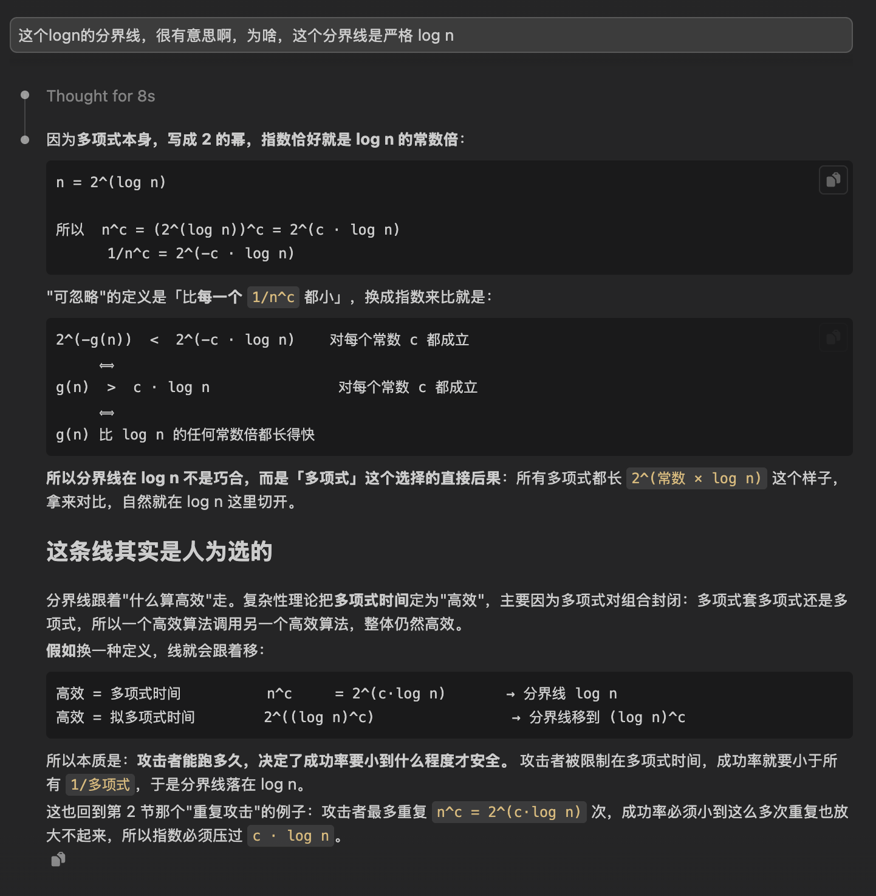

# Lecture7 - Sep14

- [Lecture7 - Sep14](#lecture7---sep14)
  - [0. 不可区分实验（完美版）](#0-不可区分实验完美版)
  - [1. Negligible 函数](#1-negligible-函数)
  - [2. 计算安全的定义](#2-计算安全的定义)
    - [DEFINITION 3.8 和 3.9](#definition-38-和-39)
    - [一些解释](#一些解释)
    - [为什么有 $1^n$ ?](#为什么有-1n-)
    - [例子：一个不满足 EAV 安全的方案](#例子一个不满足-eav-安全的方案)
    - [为什么我们要放宽这个限制](#为什么我们要放宽这个限制)
    - [这个是加密方案，不负责隐藏消息的长度](#这个是加密方案不负责隐藏消息的长度)
  - [3. PRNG 的定义](#3-prng-的定义)
    - [DEFINITION 3.14](#definition-314)
    - [大白话解释](#大白话解释)
      - [1. "拉长"是什么意思](#1-拉长是什么意思)
      - [2. ℓ(n) \> n 什么意思](#2-ℓn--n-什么意思)
      - [3. ppt 是什么](#3-ppt-是什么)
      - [4. 两个概率相减什么意思](#4-两个概率相减什么意思)
    - [一个不合格的 PRNG](#一个不合格的-prng)
    - [其他一些问题](#其他一些问题)
    - [课堂板书的写法](#课堂板书的写法)
  - [4. 规约证明法](#4-规约证明法)
    - [简单来说](#简单来说)
  - [5. PRNG -\> 安全加密](#5-prng---安全加密)
    - [Construction 3.17](#construction-317)
    - [本质：就是 OTP, 只是把钥匙换成 “用G拉出来的”](#本质就是-otp-只是把钥匙换成-用g拉出来的)
    - [THEOREM 3.18 定理](#theorem-318-定理)
    - [证明思路](#证明思路)
    - [大白话](#大白话)
      - [比喻：鉴定一颗骰子](#比喻鉴定一颗骰子)
      - [7 步其实就是"用这颗骰子让 A 玩一局"](#7-步其实就是用这颗骰子让-a-玩一局)
      - [走一遍具体数字](#走一遍具体数字)
      - [为什么第 2 步被划掉](#为什么第-2-步被划掉)
      - [为什么这样就能鉴定](#为什么这样就能鉴定)
  - [6. (add) P / NP / RP](#6-add-p--np--rp)
  - [7. (add) worst-case vs average-case hardness](#7-add-worst-case-vs-average-case-hardness)
    - [两个概念](#两个概念)
    - [为什么密码学必须要 average-case](#为什么密码学必须要-average-case)
    - [这节课学的定义，本身就是 average-case 的](#这节课学的定义本身就是-average-case-的)
    - [缺口：P ≠ NP 不够用](#缺口p--np-不够用)
    - [一个例外：格密码](#一个例外格密码)
  - [8. (add) Shannon's Theorem](#8-add-shannons-theorem)
  - [9. 选读：Semantic Security](#9-选读semantic-security)


这个是 Sep14 的课上内容，今天是 Sep24, 我来整理这些内容

## 0. 不可区分实验（完美版）

> 出处：K&L §2.1 末尾（书页 30–31）

实验 $\mathsf{PrivK}^{\mathsf{eav}}_{A,\Pi}$（eav = eavesdropping，窃听）：

> 1. 攻击者 $A$ 输出一对消息 $m_0, m_1 \in \mathcal{M}$。
> 2. 用 $\mathrm{Gen}$ 生成密钥 $k$，并均匀抽取一个比特 $b \in \{0,1\}$；计算 $c \leftarrow \mathrm{Enc}_k(m_b)$ 交给 $A$。这个 $c$ 叫 **challenge ciphertext**。
> 3. $A$ 输出一个比特 $b'$。
> 4. 若 $b' = b$，实验输出 1，称 $A$ **成功**；否则输出 0。

> **DEFINITION 2.5** 加密方案 $\Pi$ 是 **perfectly indistinguishable** 的，若对**每一个**攻击者 $A$ 都有
>
> $\Pr[\mathsf{PrivK}^{\mathsf{eav}}_{A,\Pi} = 1] = \tfrac{1}{2}$

> **LEMMA 2.6** $\Pi$ 完美保密 $\iff$ $\Pi$ 完美不可区分。

大白话：
> ① 攻击者自己挑两条消息 m₀、m₁，交给系统 \
> ② 系统私下抛硬币得到 b，加密 m_b，把密文 c 交给攻击者 \
> ③ 攻击者猜：你加密的是第 0 条还是第 1 条？ \
> ④ 猜对就算赢


## 1. Negligible 函数

这个函数的严格说法：

> **DEFINITION 3.4** 函数 $f: \mathbb{N} \to \mathbb{R}_{\ge 0}$ 是 **negligible**（可忽略）的，若对**每一个**正多项式 $p$，都存在 $N$，使得对所有 $n > N$： $f(n) < \frac{1}{p(n)}$

大白话：只要 $n$ 够大，它就比 “1 / 任何多项式” 都小。

| 函数   | 可忽略吗 | 原因 |
| :----- | :---: | :--- |
| $2^{-n}$   |    ✓     | 指数衰减，最终比任何 $1/n^c$ 都小    |
| $2^{-\sqrt n}$、$n^{-\log n}$ |    ✓     | 衰减慢一些，但仍比任何多项式倒数小    |
| $1/n^{10}$      |    ✗     | 它本身就是「1/多项式」：取 $p(n) = n^{11}$，永远有 $1/n^{10} > 1/n^{11}$ |

简单判断的方法就是：

> 一句话：指数要比 log n「长得更快」，而不是只要带 n 就行。 平时遇到的 2⁻ⁿ、2⁻ⁿᐟ² 这类明显的指数衰减，直接判可忽略就行；要小心的只是 log 藏在指数里的情况。

Q: 2 ^(sprt(-logn)) 这样呢，这样指数是 logn 的 1/2 次方，这样可忽略吗



快速判断的方法：

```
1. 把成功率写成  2^(−g(n))  的形式
2. 看 g(n) 和 log n 谁长得快

   g(n) 比 log n 快          →  可忽略
   g(n) 是 log n 的常数倍    →  不可忽略
   g(n) 比 log n 慢          →  不可忽略
```

**封闭性：PROPOSITION 3.6**

> 1. $\mathsf{negl}_1(n) + \mathsf{negl}_2(n)$ 仍可忽略
> 2. 对任意正多项式 $p$，$p(n) \cdot \mathsf{negl}(n)$ 仍可忽略

**大白话：** 第 2 条就是上面那个例子 —— **可忽略概率的事件，重复多项式次，仍然可忽略。**

所以「多项式时间攻击者」和「可忽略成功率」是**天生一对**：攻击者怎么在多项式范围内重复，都放大不了可忽略的概率。

## 2. 计算安全的定义

### DEFINITION 3.8 和 3.9

严格说法：

实验 $\mathsf{PrivK}^{\mathsf{eav}}_{A,\Pi}(n)$ —— 和第 1 步几乎一样，**加粗**的是新增的地方：

> 1. 攻击者 $A$ **收到安全参数 $1^n$**，输出一对消息 $m_0, m_1$，**要求 $|m_0| = |m_1|$**。
> 2. 运行 $\mathrm{Gen}(1^n)$ 生成密钥 $k$，均匀抽取 $b \in \{0,1\}$，把 $c \leftarrow \mathrm{Enc}_k(m_b)$ 交给 $A$。
> 3. $A$ 输出 $b'$。
> 4. 若 $b' = b$，实验输出 1（$A$ 成功）。

> **DEFINITION 3.8（EAV-secure）** $\Pi$ 在窃听者面前具有不可区分的加密（简称 **EAV-secure**），若对**每一个** ppt 攻击者 $A$，都存在可忽略函数 $\mathsf{negl}$，使得对所有 $n$：
>
> $\Pr[\mathsf{PrivK}^{\mathsf{eav}}_{A,\Pi}(n) = 1] \le \tfrac12 + \mathsf{negl}(n)$
>
> 概率取自 $A$ 的随机性，以及实验里的随机性（选密钥、选 $b$、$\mathrm{Enc}$ 的随机性）。

ppt = probabilistic polynomial-time，即多项式时间的随机算法。

> **DEFINITION 3.9（等价写法）** 把 $b$ 固定下来跑实验，记为 $\mathsf{PrivK}^{\mathsf{eav}}_{A,\Pi}(n, b)$。要求对每个 ppt 的 $A$：
>
> $\bigl|\Pr[A \text{ 在 } b{=}0 \text{ 时输出 } 1] - \Pr[A \text{ 在 } b{=}1 \text{ 时输出 } 1]\bigr| \le \mathsf{negl}(n)$


### 一些解释

这一段有点难理解。先解释一下这些符号的是什么意思

```
PrivK ^eav _A,Π (n)
  │      │    │ │   │
  │      │    │ │   └─ n    ：安全参数，大致就是钥匙长度（比如 128）
  │      │    │ └───── Π    ：被测试的加密方案，Π = (Gen, Enc, Dec)
  │      │    └─────── A    ：攻击者（Adversary）
  │      └──────────── eav  ：攻击类型 = eavesdropping，窃听
  └─────────────────── PrivK：Private-Key，私钥加密的安全实验
```

**合起来读：私钥加密的窃听实验：让攻击者 A 去攻击方案 Π，安全参数取 n。**

其他一些符号：

```
= 1          实验结果是 1，意思是攻击者赢了
Pr[… = 1]    攻击者赢的概率
1ⁿ           n 个 1 连在一起，就是"把 n 告诉攻击者"
             （写成 n 个 1 是技术细节，可以忽略）
ppt          probabilistic polynomial-time，多项式时间的（随机）算法
negl(n)      某个可忽略函数（第 2 步讲的）
```

### 为什么有 $1^n$ ?


**1ⁿ 是什么**

```
不是 1 的 n 次方，是 n 个 1 连成的字符串（n = 5 时就是 11111）

Gen(1ⁿ)       =  造一把 n 位的钥匙
给攻击者 1ⁿ   =  告诉他 n 是多少
```

写成 n 个 1 而不直接写 n，是为了让「按输入长度算的多项式时间」正好等于「n 的多项式」。

**为什么完美版没有 n**

```
完美版：安全是绝对的（算力无限也破不了）→ 方案固定一个，不用管钥匙多长
计算版：安全是"算不动" → 算不算得动取决于钥匙长度 n
        → 方案是一个系列（n = 64、128、256…），n 越大越安全
```

> [!tip]
> 其实这个实验和之前完美版是完全一样的，只是稍微定义改变了一下而已。 \
> "we keep the experiment almost exactly the same... but introduce two key modifications in the definition itself"

**Q: 所以热身的时候，是在定义“完美不可区分”，现在定义的是“不可区分的加密”，现在是加密这个动作，讲的是计算。**

前后两半对，中间那句要改一下。

**两个定义描述的是同一个东西**：都是「加密方案 Π」的性质，问的都是**同一个问题**——Π 产生的密文，攻击者能不能分出是 m₀ 还是 m₁ 加密来的。

名字不同，只是叫法不同，不是对象变了：

```
完美版  Def 2.5：Π is perfectly indistinguishable
                  （完美不可区分）

计算版  Def 3.8：Π has indistinguishable encryptions
                  in the presence of an eavesdropper
                  （在窃听者面前，加密结果不可区分）
                  简称 EAV-secure
```

`encryptions` 是复数，指的就是**密文们**——"m₀ 的密文和 m₁ 的密文分不出来"。完美版其实说的也是这个意思，只是没把这个词写进名字里。

后半句的 `in the presence of an eavesdropper`，就是实验右上角那个 **eav**，说明攻击者只能窃听。

**真正的区别只有一个维度：完美 vs 计算**

```
完美版：攻击者算力无限        胜率 = 1/2
计算版：攻击者限多项式时间    胜率 ≤ 1/2 + 可忽略
```

所以你说的「现在讲的是计算」是对的：变的是**对攻击者的要求**，不是**被定义的对象**。

### 例子：一个不满足 EAV 安全的方案

设加密时第一位明文**原样保留**，其余位和钥匙异或：

```
攻击者挑：   m₀ = 0000…0       m₁ = 1000…0      （长度一样，合法）
收到密文 c：看 c 的第一位
             是 0 → 猜 b' = 0
             是 1 → 猜 b' = 1
```

每次必中，胜率 $= 1$，远大于 $\frac12 + \mathsf{negl}(n)$ ——==不是 EAV-secure==。哪怕只泄露一个比特，也会被这个游戏抓出来。

> [!note]
> 这个很好理解啊，你第一位没有和钥匙去异或，那攻击者直接去看第一位不就得了。所以这时候肯定不是一个不可区分的加密。

### 为什么我们要放宽这个限制

真正的目的：

```
完美版：钥匙必须 ≥ 消息长度（Lec 4 的 |K| ≥ |M|）
计算版：不受这个限制，有希望用短钥匙加密长消息
```

### 这个是加密方案，不负责隐藏消息的长度

要求 $|m_0| = |m_1|$，等于承认==加密方案不负责隐藏明文长度==。否则攻击者挑一长一短，看密文长度就赢了。

长度泄露有时很要命，书上举的例子：

- 加密工资，密文长度暴露是五位数还是六位数
- 加密 "yes" / "no"，长度直接暴露答案
- 先压缩再加密，压缩后的长度泄露内容的冗余程度（真实的 CRIME 攻击就利用了这点）

需要隐藏长度时，要先把所有消息**填充到统一长度**再加密。

这个都很好理解。

## 3. PRNG 的定义

PRNG。一句话解释，就是把一个随机串（种子）拉长到一个更长的随机串。但是与此同时，别人看不出来，你有没有被拉长过。

严格说法。

### DEFINITION 3.14

**DEFINITION 3.14** 设 $G$ 是多项式时间的确定性算法，对任意 $n$ 和输入 $s \in \{0,1\}^n$，输出 $G(s)$ 的长度为 $\ell(n)$。$G$ 称为 **pseudorandom generator**，若：

1. **（Expansion，拉长）** 对每个 $n$，$\ell(n) > n$。

2. **（Pseudorandomness，伪随机）** 对每个 ppt 算法 $D$，存在可忽略函数 $\mathsf{negl}$，使得

   $\bigl|\Pr[D(G(s)) = 1] - \Pr[D(r) = 1]\bigr| \le \mathsf{negl}(n)$

   其中 $s$ 是均匀随机的 $n$ 位种子，$r$ 是均匀随机的 $\ell(n)$ 位串。

$\ell$ 叫 $G$ 的 **expansion factor**。

### 大白话解释

#### 1. "拉长"是什么意思

就是**输入短、输出长**：

```
输入：128 位真随机的种子
输出：256 位串（看起来也是随机的）
```

**为什么要这样做？** 回想 OTP 的死结：加密 1GB 需要 1GB 真随机的钥匙，太难搞。

有了 G：**双方只需要共享 128 位真随机的种子，各自用 G 把它拉长成 1GB，当成 OTP 的钥匙用。** 这就是第 6 步的主角。

#### 2. ℓ(n) > n 什么意思

```
n     = 输入（种子）的长度
ℓ(n)  = 输出的长度
```

写成 ℓ(n) 是因为**输出长度跟着输入长度变**，是 n 的函数：

```
ℓ(n) = 2n     →  n = 128 时输出 256 位      （翻倍）
ℓ(n) = n + 1  →  n = 128 时输出 129 位      （只多一位，Example 3.15 就是这种）
```

`ℓ(n) > n` 就是"输出比输入长"，也就是**拉长**。

**为什么非要拉长？** 因为不拉长的话，有个"作弊"答案：`G(s) = s`，原样输出。真随机进、真随机出，任何测试都分不出来，完美满足第 2 条——但**毫无用处**，没有凭空多出一位随机数。所以必须要求拉长，这个定义才有意义。

#### 3. ppt 是什么

**probabilistic polynomial-time**，拆开：

```
polynomial-time   运行步数不超过 n 的某个多项式（n²、n³ 之类）
                  = 现实中跑得完

probabilistic     算法运行时允许自己抛硬币（用随机数）
```

合起来：**一个现实中能跑完、允许用随机数的程序**，也就是"算力正常的攻击者"。

```
n = 128：
  n³  ≈ 200 万步      ← 瞬间跑完，是 ppt
  2ⁿ  = 2¹²⁸ 步       ← 宇宙毁灭也跑不完，不是 ppt
```

所以"对每个 ppt 的 D"，意思就是**排除掉"把所有种子试一遍"这种暴力做法**，只考虑正常的测试。

#### 4. 两个概率相减什么意思

先看两个概率各是什么：

```
Pr[D(G(s)) = 1]   把 G 生成的串喂给测试 D，D 回答"1"的概率
Pr[D(r) = 1]      把真随机串喂给测试 D，    D 回答"1"的概率
```

**相减（取绝对值）= D 在这两种情况下反应差多少。**

```
差距大      →  D 对两种串反应明显不同  →  D 能分辨  →  G 不合格
差距几乎为 0 →  D 对两种串反应一样      →  D 分不出  →  G 合格
```

**打个比方：品酒。** 给品酒师一杯真茅台、一杯仿制的，分别问"这是真的吗"。

```
对真酒说"是"的比例 90%，对仿酒说"是"的比例 30%   →  差 60%，他分得出来，仿得不好
对真酒说"是"的比例 90%，对仿酒说"是"的比例 89%   →  差 1%， 他分不出来，仿得好
```

**用 Example 3.15 代数字：**

```
喂 G 的输出（最后一位一定是校验位）   →  D 说"1"的概率 = 1
喂真随机串（最后一位随机）           →  D 说"1"的概率 = 1/2

差 = 1 − 1/2 = 1/2    →  差距很大，G 不合格
```

**注意一个细节：** 这个 D 喂真随机串时，有一半时候也会说"1"，也就是说它**经常判错**。但这不要紧——**D 不需要每次都判对，只要两种情况下的反应有明显差距**，就说明它能分辨。这就是为什么定义用"两个概率相减"，而不是"D 能不能每次答对"。

**为什么只看"输出 1"的概率？** D 只会输出 0 或 1，知道了输出 1 的概率，输出 0 的概率就是 1 减去它，所以一个数就把 D 的全部反应描述完了。

**为什么要取绝对值？** D 也可能反过来，对真随机串更爱说"1"。不管哪个方向差得多，都说明它分得出来。

### 一个不合格的 PRNG

$G(s)$ = 在 $s$ 后面补一位：$s$ 所有位的异或（奇偶校验位）。

```
n = 3，s = 101   →   1⊕0⊕1 = 0   →   G(s) = 1010
```

此时，我作为一个区分器 $D$: 检查"最后一位是否等于前面所有位的异或"，是就输出 1。
```
喂 G 的输出：   永远满足        →  Pr = 1
喂真随机串：    最后一位随机    →  Pr = 1/2

差 = 1/2，不是可忽略  →  不是 PRNG
```

这个还是非常好理解，这个RPNG显然是不行的。

### 其他一些问题

- **种子就相当于钥匙**：必须均匀随机、保密、足够长（否则穷举种子就破了）。
- **PRNG 存在吗？** 没有被证明。但只要单向函数存在（比如大整数分解很难）就能造出来，Ch 7 讲。


### 课堂板书的写法

| 老师      | 书上       |
| :----------------------------------------------------------- | :---------------------------------------- |
| $\varphi$      | $G$     |
| $B$（Boolean function）  | $D$（区分器）   |
| $U^n$    | 均匀随机的 $n$ 位串     |
| ε-PRNG：$\bigl\lvert\Pr_{x \sim U^{L(n)}}[B(x)=1] - \Pr_{x \sim \varphi(U^n)}[B(x)=1]\bigr\rvert \le \varepsilon$ | Def 3.14：同样的差 $\le \mathsf{negl}(n)$ |

## 4. 规约证明法

这一部分都很简单，很好理解。

**核心逻辑：反过来证（逆否命题）**

老师板书上框起来的那行：

$A \Rightarrow B \quad \text{等价于} \quad \neg B \Rightarrow \neg A$

日常例子：「下雨 ⇒ 地湿」等价于「地不湿 ⇒ 没下雨」。

套到密码学：

```
想证：   X 难  ⇒  Π 安全
改证：   Π 不安全  ⇒  X 不难
         即：如果有人能破 Π，那就能借他的手去解 X
```

**为什么改证更容易？** 因为「Π 安全」要对**所有**攻击者成立，没法一个个检查；而「有人能破 Π」给了你一个**具体的攻击者**当工具用。

### 简单来说

**Q: 这个地方还是很好理解。其实我们只需要知道，证明一个命题，就去证明逆否命题就行了对吧。**

我要证明：
解开这个数学题很难 -> 这个加密安全 \
就反过来证明： \
这个加密不安全 -> 这个数学题很容易解开

## 5. PRNG -> 安全加密


### Construction 3.17
### 本质：就是 OTP, 只是把钥匙换成 “用G拉出来的”

**大白话：就是 OTP，只是钥匙换成「用 $G$ 拉长出来的」。**

> **CONSTRUCTION 3.17** 设 $G$ 是 expansion factor 为 $\ell$ 的 PRNG。对长度为 $\ell(n)$ 的消息定义：
>
> - $\mathrm{Gen}$：输入 $1^n$，均匀选取 $k \in \{0,1\}^n$ 作为钥匙
> - $\mathrm{Enc}$：输入 $k$ 和 $m \in \{0,1\}^{\ell(n)}$，输出 $c := G(k) \oplus m$
> - $\mathrm{Dec}$：输入 $k$ 和 $c$，输出 $m := G(k) \oplus c$

```
OTP：        钥匙本身就是 ℓ(n) 位真随机          → 双方要共享 ℓ(n) 位
这个方案：   钥匙只有 n 位，用时再拉长成 ℓ(n) 位  → 双方只共享 n 位
```

**比如 $n = 128$、$\ell(n) = 256$：只共享 128 位，就能加密 256 位的消息。**

### THEOREM 3.18 定理

**若 $G$ 是 PRNG，则 Construction 3.17 是 EAV-secure 的（满足 Def 3.8）**

老师板书：「有 ε-PRNG（$n \to L(n)$）⟹ 能用 $n$ 位钥匙加密 $L(n)$ 位消息」。

> [!note]
> 到这里我相信都是比较好理解的。

### 证明思路

```
要证：   G 是 PRNG  ⟹  方案安全
改证：   方案不安全  ⟹  G 不是 PRNG
即：     如果有攻击者 A 能破这个方案，就造一个区分器 B，用 A 来分辨 G 的输出
```


这个七步证明思路，确实很复杂，用大白话解释一下。

### 大白话

换个方式讲，先把 B 的**任务**讲清楚，后面就顺了。

**先搞清楚 B 在干什么**

B 是个**鉴定师**。有人递给它一个串 `s`，问它：

> 这个串是**真随机**的，还是 **G 拉长出来**的？

B 手上有个帮手 A（攻击者）。A 有个特点：

```
钥匙是 G 拉长出来的  →  A 能赢加密游戏（胜率 > 1/2）   ← 我们假设的
钥匙是真随机的       →  这就是 OTP，谁都赢不了（胜率 = 1/2）
```

**B 的思路：把要鉴定的串 s 拿去当钥匙，让 A 玩一局，看 A 赢不赢得了。**

#### 比喻：鉴定一颗骰子

```
有人递给你一颗骰子，问：它是公平的，还是灌了铅的？

你有个赌徒朋友 A：
  用灌铅骰子玩某个游戏，他能赢超过一半（他会利用偏差）
  用公平骰子玩，谁都只能赢一半

你的办法：就用递给你的这颗骰子，让 A 玩一局
  A 赢得明显多  →  这颗骰子多半灌了铅
  A 只赢一半    →  这颗骰子多半是公平的
```

对应关系：

```
递给你的骰子      =  s
灌铅骰子          =  G 拉长出来的串（伪随机）
公平骰子          =  真随机串
那个游戏          =  加密游戏
赌徒朋友 A        =  攻击者 A
```

#### 7 步其实就是"用这颗骰子让 A 玩一局"

```
1. 让 A 挑两条消息 m₀、m₁                 ← 游戏开始，A 出题
3. 把 s 当钥匙：K = s                    ← 用递过来的这颗骰子
4. 抛硬币得 b
5. 加密：c = K ⊕ m_b
6. 把 c 给 A，A 猜 b'                    ← A 玩
7. A 猜对 → 输出 1（"s 是伪随机"）         ← 看 A 赢没赢，下结论
   A 猜错 → 输出 0（"s 是真随机"）
```

第 4–6 步就是第 3 节那个加密游戏，只是**钥匙换成了 s**。

#### 走一遍具体数字

```
消息长 4 位。有人递给 B：s = 1010

1. A 挑：        m₀ = 0000，m₁ = 1111
3. 钥匙：        K = s = 1010
4. 抛硬币：      b = 1
5. 加密 m₁：     c = 1010 ⊕ 1111 = 0101
6. A 看到 0101，猜 b' = 1
7. b' = b，A 猜对 → B 输出 1
```

注意第 3 步：**递进来的 1010 被直接拿去当钥匙用了**。

#### 为什么第 2 步被划掉

被划掉的第 2 步是：**B 自己挑个种子 k，自己算 G(k) 当钥匙。**

放到骰子比喻里：

> 你被要求鉴定递给你的骰子，结果你**从自己抽屉里拿了一颗灌铅骰子**给朋友玩。
>
> 朋友当然赢得多——但这跟**递给你的那颗**有什么关系？你根本没用它，自然什么也鉴定不出来。

放到数字里：

```
如果按第 2 步，B 自己算了一个 G(k) 当钥匙
→ 递进来的 s = 1010 从头到尾没被用过
→ B 的输出跟 s 毫无关系
→ 不管 s 是真随机还是伪随机，B 的表现都一样，分辨不了
```

所以老师划掉第 2 步，改成第 3 步「K = s」：**必须用递进来的那个串，鉴定才有意义。**

#### 为什么这样就能鉴定

```
s 是真随机的：
  钥匙真随机 → 就是 OTP → A 只能瞎猜
  → A 猜对的概率 = 1/2  → B 输出 1 的概率 = 1/2

s 是 G 拉长出来的：
  这就是真实的加密方案 → 假设 A 能破它
  → A 猜对的概率 > 1/2 + ε  → B 输出 1 的概率 > 1/2 + ε
```

B 输出 1 的概率在两种情况下**相差超过 ε**，也就是 B **能分辨**。

但 G 是 PRNG，按定义没有人能分辨 → **矛盾** → 所以"能破方案的 A"不存在 → 方案安全。


## 6. (add) P / NP / RP


```
RP
P  vs  NP

Algorithm ─┬─ deterministic
           └─ randomized
```

P 和 NP 你在 Lec 1 笔记里已经学过了，真正新的只有 **RP** 和「确定性 / 随机化」这组对比。

**四个概念，各一句话**

```
P            确定性算法，多项式时间能解出来          （Lec 1 学过）
NP           答案给你的话，多项式时间能验证          （Lec 1 学过，比如数独）

deterministic  算法每一步都是定死的，同样输入永远同样输出
randomized     算法运行时可以自己抛硬币

RP           随机化算法，多项式时间，「只会错一边」
```

**RP 的"只会错一边"：**

```
答案是 NO   →  算法一定说 NO（绝不误报）
答案是 YES  →  算法至少一半概率说 YES（可能漏报）
```

漏报不要紧：重复跑 100 次，只要有一次说 YES 就是 YES，漏报概率降到 2⁻¹⁰⁰。

**例子：判断一个数是不是合数**（后面 RSA 生成大素数要用）。随机抽一个数去测试，如果测出"合数的证据"那就一定是合数；如果是素数，永远测不出证据。这正好是 RP 的样子。

关系：`P ⊆ RP ⊆ NP`

**老师为什么在这节课提这些**

**1. 攻击者的定义里有随机性**

这节课的攻击者是 **ppt**（probabilistic polynomial-time），第一个 p 就是 probabilistic，允许抛硬币。老师提 randomized 和 RP，就是在说明**随机化算法是正当的计算模型**，攻击者可以用。随机性有时真能帮大忙（比如上面判断合数，随机方法又快又简单）。

**2. 解释了上一步"PRNG 存在证明不出来"**

```
如果 P = NP：
  "给一个串 w，有没有种子 s 使 G(s) = w？"   ← 这是个 NP 问题（有 s 就能快速验证）
  → 它在 P 里 → 能快速判断
  → 能分辨 G 的输出和真随机串（真随机串几乎都不在 G 的输出范围里）
  → 不存在 PRNG

反过来：PRNG 存在  ⟹  P ≠ NP
```

所以证明 PRNG 存在，至少和证明 P ≠ NP 一样难——这就是为什么只能**假设**它存在。

---

这部分就这些，板上没展开更多。要放进笔记跟我说，然后进第 8 步 worst-case vs average-case。

## 7. (add) worst-case vs average-case hardness

板上写的：

```
worst-case  ─┐
average-case ┘→ hardness      （average-case 被框起来、下面画了线）
```

**教材 §3.1–3.3 完全没讲**（全书都没有 "average-case" 这个词），是老师额外加的。

### 两个概念

```
worst-case hard（最坏情况难）：
    没有高效算法能解决「所有」输入
    → 只要存在「某些」难的输入就算，哪怕绝大多数输入都很简单

average-case hard（平均情况难）：
    「随机抽」一个输入，高效算法解出来的概率可忽略
    → 「绝大多数」输入都难
```

**类比：锁匠说"我的锁很难开"**

```
worst-case 的意思：   我造的锁里，至少有一把你打不开（其余可能一捅就开）
average-case 的意思： 我随便拿一把给你，你几乎肯定打不开
```

你买锁的时候，拿到的就是"随便一把"——**你要的是 average-case**。

### 为什么密码学必须要 average-case

因为**钥匙是随机生成的**，攻击者面对的是一个随机实例，不是最难的那个。

```
假设某个问题：一百万个实例里只有 1 个难，其余都很简单
  → 它算"最坏情况难"
  → 但你随机生成的钥匙，几乎一定落在简单的那 999,999 个里
  → 拿它做加密，完全没用
```

### 这节课学的定义，本身就是 average-case 的

回头看 PRNG 的定义：

```
| Pr[D(G(s)) = 1] − Pr[D(r) = 1] |  ≤  可忽略
         ↑
      s 是「均匀随机」的种子
```

说的是**随机抽一个种子**，D 分辨不出来——而不是"存在某个种子 D 分辨不出来"。EAV 安全的定义也一样，概率取自随机钥匙。

所以**"成功概率可忽略"这个写法，本身就是在要求 average-case 难**。

### 缺口：P ≠ NP 不够用

```
上一不：   PRNG 存在  ⟹  P ≠ NP         （P ≠ NP 是必要条件）

但：        P ≠ NP 只说「NP 问题里存在难的实例」 ← worst-case
            密码学要「随机实例几乎都难」         ← average-case
            → 就算有人证明了 P ≠ NP，也还推不出 PRNG 存在
```

**这正是你在 Lec 6 准备的问题 3**：*"P ≠ NP is worst-case hardness, but cryptography needs average-case hardness. If P ≠ NP were proved tomorrow, would that be enough?"*——老师这节课直接写到板上了。答案是：**不够**，中间还有这道缺口，目前没人能填上。

### 一个例外：格密码

格（lattice）问题是少数**已经证明了"最坏情况难 ⟹ 平均情况难"**的问题（Ajtai 1996）：只要格问题的最难实例是难的，随机实例也就是难的。这是格密码被看好的原因之一，也是 Lec 8 那个提问的背景。

## 8. (add) Shannon's Theorem

Shannon 定理（当 |M| = |K| = |C| 时）：

完美保密  ⟺  ① 每把钥匙概率相同
              ② 每对 (明文, 密文) 恰好一把钥匙连着

一句话：钥匙刚好够用时，完美保密的方案都长得和 OTP 一样
用处：  判断完美保密不用算概率，查这两条就行

例：P5(b) 两条都满足 → 完美保密
    P5(c) 钥匙不均匀 → 不是


## 9. 选读：Semantic Security

但值得花 30 秒知道它是什么，因为它回答了一个问题：凭什么这个"二选一猜谜游戏"就能代表安全？


Semantic security（语义安全）：
  看到密文之后，对明文的「任何信息」的猜测，都不会比没看到时更好
  → 就是 Lec 4「尝试④：密文不泄露任何额外信息」的严格版

Theorem 3.13：  EAV-secure  ⟺  semantic security
意思是： 这才是我们真正想要的安全，但它的定义很复杂，不好用。书上证明了它和简单的猜谜游戏等价，所以以后只用猜谜游戏就够了。